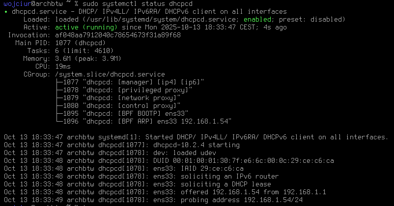

[Instrukcje](https://wiki.archlinux.org/title/Installation_guide_(Polski)#Po_instalacji)

## Tworzenie użytkowników i grup

`passwd -Sa` informacje o wszystkich użytkownikach systemu (jako root trzeba odpalić)

Dodawanie usera:

```
useradd -m -G wheel -s /bin/zsh wojciur
```

-m - home folder w /home/username
-G wheel - dodanie do grupy wheel (ma dostęp do sudo)
-s  path - powłoka dla usera

Odpalenie sudo dla grupy wheel:

```
EDITOR=vim visudo
```

Tam wyszukać `%wheel ALL=(ALL:ALL) ALL` - odkomentować to trzeba

Teraz można test sudo zrobić, przelogowanie się na mojego usera:

```
su - <username>
```

I teraz np `sudo ls -la /root`

Zmiana shell na root z bash na zsh `bashchsh -s $(which zsh)`


## JAK NIE MA NETA

`sudo ip link set interfejs up`

tu kombinować z tym:

```
sudo systemctl restart dhcpcd
sudo systemctl start dhcpcd
sudo systemctl status dhcpcd
```



status taki powinien być

DALEJ DODANIE DNS

```
sudo rm -f /etc/resolv.conf
echo "nameserver 1.1.1.1" | sudo tee /etc/resolv.conf
echo "nameserver 8.8.8.8" | sudo tee -a /etc/resolv.conf
```

Dalej zarządzanie DNS poprzez NetworkManagera

```
sudo pacman -S networkmanager
sudo systemctl enable --now NetworkManager
ls -l /etc/resolv.conf
```

To ls powinno pokazać coś takiego : `/etc/resolv.conf -> /run/NetworkManager/resolv.conf`

Jak nie ma czegoś takiego to: 

```
sudo rm /etc/resolv.conf
sudo ln -s /run/NetworkManager/resolv.conf /etc/resolv.conf
sudo systemctl restart NetworkManager
```

dalej trzeba wyłączyć `dhcpcd`

```
sudo systemctl disable --now dhcpcd
```

## Instalacja Desktop environment

### KDE

Sterowniki:
```
sudo pacman -S xorg xorg-xinit mesa
```

I kolejne DLA VMWARE TYLKO:

```
sudo pacman -S open-vm-tools xf86-video-vmware
sudo systemctl enable --now vmtoolsd.service
```

Tam jeszcze jakieś cuda były 

Dalej `SDDM` - graphical login srcreen

```
sudo pacman -S sddm
sudo systemctl enable --now sddm
```

Teraz powinna być grafika.