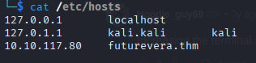

Można wyświetlić pod domeny, które nie są dostępne publicznie w DNS. Odkryć je można za pomocą fuzzingu narzędziem takim jak ffuf.

``` zsh
ffuf -w /usr/share/wordlists/SecLists/Discovery/DNS/namelist.txt -H "Host: FUZZ.acmeitsupport.thm" -u http://MACHINE_IP
```

To zwróci listę pod domen dopasowanych i niedopasowanych. Żeby pozbyć się tych niedopasowanych można zrobić tak:

``` zsh
ffuf -w /usr/share/wordlists/SecLists/Discovery/DNS/namelist.txt -H "Host: FUZZ.acmeitsupport.thm" -u http://MACHINE_IP -fs {size}
```

zamiast size trzeba podać długość tego niedopasowanego, żeby się nie wyświetlało.

# WAŻNE

Jak badam na vhost z jakiejś maszyny to dodawać do `/etc/hosts`


Dodatkowo w takiej sytuacji jak badam te subdomeny to w ffuz:
`ffuf -w /usr/share/wordlists/seclists/Discovery/Web-Content/common.txt -H "Host: FUZZ.futurevera.thm" -u https://10.10.117.80 -fs 4605 -c`
Jako -u parametr daję IP!!
Dalej jak coś odkryję to możliwe jest że trzeba również dodać do `/etc/hosts`

Warto sprawdzać certyfikaty i ich zawartość
