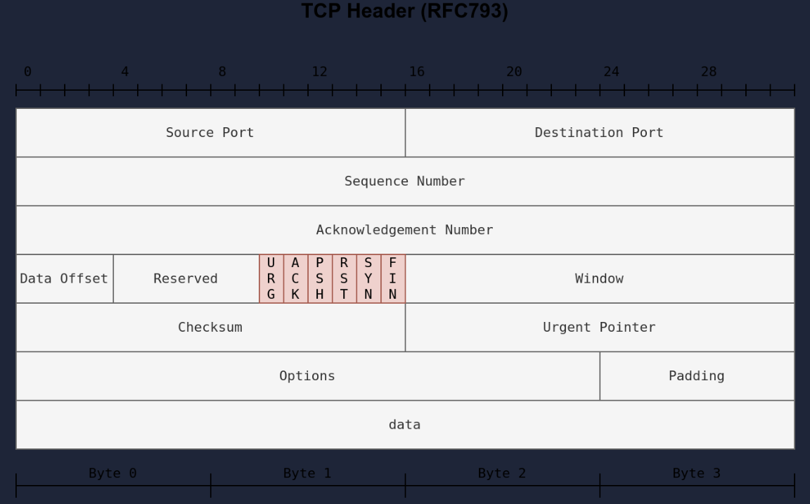

Skanowanie portów na atakowanym/testowanym urządzeniu.

`nmap -Pn -p- --min-rate 2000 -sC -sV -oN nmap_scan.txt IP`

-pn - bez icmp (ping)
-p- - wszystkie 65535 porty
--min-rate 2000 - 2000 pakietów na sekundę (dosyć agresywnie)
-sC - odpala domyślne skrypty nmapa (podatności, misconfiguration)
-sV - pokazuje wersje skanowanych serwisów 
-oN - zapisuje output do pliku

|Scan Type|Example Command|
|---|---|
|ARP Scan|`sudo nmap -PR -sn MACHINE_IP/24`|
|ICMP Echo Scan|`sudo nmap -PE -sn MACHINE_IP/24`|
|ICMP Timestamp Scan|`sudo nmap -PP -sn MACHINE_IP/24`|
|ICMP Address Mask Scan|`sudo nmap -PM -sn MACHINE_IP/24`|
|TCP SYN Ping Scan|`sudo nmap -PS22,80,443 -sn MACHINE_IP/30`|
|TCP ACK Ping Scan|`sudo nmap -PA22,80,443 -sn MACHINE_IP/30`|
|UDP Ping Scan|`sudo nmap -PU53,161,162 -sn MACHINE_IP/30`|

Remember to add `-sn` if you are only interested in host discovery without port-scanning. Omitting `-sn` will let Nmap default to port-scanning the live hosts.

| Option | Purpose                          |
| ------ | -------------------------------- |
| `-n`   | no DNS lookup                    |
| `-R`   | reverse-DNS lookup for all hosts |
| `-sn`  | host discovery only              |

# Stany portów

1. Port otwarty
2. Port zamknięty - nie zablokowany przez firewall
3. Filtered - nie wiadomo czy zamknięty czy otwarty port bo nie jest dostępny. Z reguły firewall blokuje pakiety
4. Unfiltered - nmap nie wie czy port jest otwarty czy zamknięty ale jest dostępny, ten stan występuje przy ACK scan `-sA`
5. Open|Filtered - nmap nie wie czy port jest otwarty czy filtrowany
6. Closed|Filtered 

|Port Scan Type|Example Command|
|---|---|
|TCP Connect Scan|`nmap -sT 10.10.67.141`|
|TCP SYN Scan|`sudo nmap -sS 10.10.67.141`|
|UDP Scan|`sudo nmap -sU 10.10.67.141`|

These scan types should get you started discovering running TCP and UDP services on a target host.

| Option                  | Purpose                                  |
| ----------------------- | ---------------------------------------- |
| `-p-`                   | all ports                                |
| `-p1-1023`              | scan ports 1 to 1023                     |
| `-F`                    | 100 most common ports                    |
| `-r`                    | scan ports in consecutive order          |
| `-T<0-5>`               | -T0 being the slowest and T5 the fastest |
| `--max-rate 50`         | rate <= 50 packets/sec                   |
| `--min-rate 15`         | rate >= 15 packets/sec                   |
| `--min-parallelism 100` | at least 100 probes in parallel          |

# Null scan

Skan bez flag tych ack, syn itp, wszytkie flagi są ustawione na zero. Działa to tak, że jakl port otwarty to nic nie zwróci a jak zamknięty, odpowie flagami rst, ack.

# FIN scan

Podobnie jak null scan. Warto dodać, że niektóre firewalle mogą odrzucić pakiet bez wysłania rst ack.

# Xmas scan

Wysyła jednocześnie fin, psh i urg, podobnie jak wcześniej jak nie ma odpowiedzi to port otwarty a jak jest to zamknięty, Dodatkowo jak flaga rst to port zamkniety a inaczej open|filtered

Powyższe opcje są skuteczne na stateless firewall, statefull zablokuje.

# TCP Maimon

Wysłanie flag fin/ack, otrzymanie rst oznacza że port jest zamknięty lub otwarty. Niektóre systemy BSD odrzucą ten pakiet kiedy port jest otwarty

# TCP ACK

Wysyła ack, otrzymanie rst oznacza że port jest albo otwarty albo zamknięty. Wykorzystywane do wykrywania zasad firewalla, dostając odpowiedź można się dowiedzieć jakie porty nie są przez niego blokowane.

# Window Scan

To samo co tcp ack ale sprawdza pole nagłówka "window" zwróconego pakietu rst. Podobnie skuteczne raczej dopiero jak trzeba wyciagnąć informacje zasad firewalla. Jak stoi firewall to można wykryć serwisy które bez niego nie były widoczne.

# Dodatkowe opcje pod spoofing

|Port Scan Type|Example Command|
|---|---|
|TCP Null Scan|`sudo nmap -sN 10.10.53.126`|
|TCP FIN Scan|`sudo nmap -sF 10.10.53.126`|
|TCP Xmas Scan|`sudo nmap -sX 10.10.53.126`|
|TCP Maimon Scan|`sudo nmap -sM 10.10.53.126`|
|TCP ACK Scan|`sudo nmap -sA 10.10.53.126`|
|TCP Window Scan|`sudo nmap -sW 10.10.53.126`|
|Custom TCP Scan|`sudo nmap --scanflags URGACKPSHRSTSYNFIN 10.10.53.126`|
|Spoofed Source IP|`sudo nmap -S SPOOFED_IP 10.10.53.126`|
|Spoofed MAC Address|`--spoof-mac SPOOFED_MAC`|
|Decoy Scan|`nmap -D DECOY_IP,ME 10.10.53.126`|
|Idle (Zombie) Scan|`sudo nmap -sI ZOMBIE_IP 10.10.53.126`|
|Fragment IP data into 8 bytes|`-f`|
|Fragment IP data into 16 bytes|`-ff`|

|Option|Purpose|
|---|---|
|`--source-port PORT_NUM`|specify source port number|
|`--data-length NUM`|append random data to reach given length|

These scan types rely on setting TCP flags in unexpected ways to prompt ports for a reply. Null, FIN, and Xmas scan provoke a response from closed ports, while Maimon, ACK, and Window scans provoke a response from open and closed ports.

|Option|Purpose|
|---|---|
|`--reason`|explains how Nmap made its conclusion|
|`-v`|verbose|
|`-vv`|very verbose|
|`-d`|debugging|
|`-dd`|more details for debugging|

# Skrypty

|Script Category|Description|
|---|---|
|`auth`|Authentication related scripts|
|`broadcast`|Discover hosts by sending broadcast messages|
|`brute`|Performs brute-force password auditing against logins|
|`default`|Default scripts, same as `-sC`|
|`discovery`|Retrieve accessible information, such as database tables and DNS names|
|`dos`|Detects servers vulnerable to Denial of Service (DoS)|
|`exploit`|Attempts to exploit various vulnerable services|
|`external`|Checks using a third-party service, such as Geoplugin and Virustotal|
|`fuzzer`|Launch fuzzing attacks|
|`intrusive`|Intrusive scripts such as brute-force attacks and exploitation|
|`malware`|Scans for backdoors|
|`safe`|Safe scripts that won’t crash the target|
|`version`|Retrieve service versions|
|`vuln`|Checks for vulnerabilities or exploit vulnerable services|

|Option|Meaning|
|---|---|
|`-sV`|determine service/version info on open ports|
|`-sV --version-light`|try the most likely probes (2)|
|`-sV --version-all`|try all available probes (9)|
|`-O`|detect OS|
|`--traceroute`|run traceroute to target|
|`--script=SCRIPTS`|Nmap scripts to run|
|`-sC` or `--script=default`|run default scripts|
|`-A`|equivalent to `-sV -O -sC --traceroute`|
|`-oN`|save output in normal format|
|`-oG`|save output in grepable format|
|`-oX`|save output in XML format|
|`-oA`|save output in normal, XML and Grepable formats|
