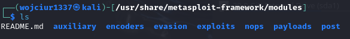

Metasploit posiada moduły i kategorie odpowiadające konkretnym celom:

- Auxiliary - skanery, crawlery i fuzzery.
- Encoders - pozwalają zakodować exploit i payload
- Evasion - celem jest ukrycie przed antywirusem
- Exploits - eksploity
- NOPs (NoOperation) - Nic nie rób - wykorzystywane jako buffor w celu osiąfnięcia stałej wielkości payloada
- Post - post-exploitation - po ataku/teście
- Payloads - kod który ma działać na docelowym/testowanym systemie

Payloads posiada 4 kategorie: 
- Adapters - zmieniają format payloadu na inny np. payload może sostać opakowany w powershell adapter, który pozwoli na wykonanie payloadu jednym poleceniem w powershellu.
- Singles - Samodzielne payloady nie wymagające pobrania dodatkowych komponentów.
- Stagers - Odpowiadają za połączenie (kanał) pomiędzy Metasploit a docelowym systemem.
- Stages - powierane przez stager, pozwalają na wykorzystanie większego rozmiaru payloadów.

`msfconsole` - uruchomienie metasploit

Będąc w aplikacji można wykonywać polecenia jak w normalnym shellu z pewnymi wyjątkami.

W celu wybrania exploitu: 
- `use exploit/....` np. `use exploit/windows/smb/ms17_010_eternalblu`
Wybranie exploitu nie przenosi do folderu gdzie on się znajduje, wpisanie polecenia ls dalej pokaże folder w którym wcześniej znajdował się użytkownik.

`show options` - pokazuje opcje związane z wybranym eksploitem.

Można wykorzystać `show` z modułami (auxiliary, payloads, etc.), to pokaże listę kompatybilnych z wybranym exploitem modułów.

`back` - pozwala na "wyjście" z wybranego exploita.
`info` - kiedy wybrano eksploit/moduł pokazuje dodatkowe informacje.

`search` - pozwala wyszukać moduł z bazy dostępnych modułów, można wykorzystać do tego numer CVE, nazwę eksploita (heartbleed), lub docelowy system.

`use` - można dodakowo po search wybrać exploit nie wpisując jego nazwy a numer pod którym jest on indeksowany po wyszukaniu. np. `use 4`

Można wyszukiwać po typie i platformie np. `search type:auxiliary telnet`

W celu wykorzystania exploitu po wpisaniu `show options` widać możliwe zmienne do dostosowania. Np dostosowanie zmiennej RHOSTS będzie wyglądało po wybraniu exploitu 
`set rhosts ip`
W polu ip może być jedno ip, zakres z maską, zakres bez maski, plik z adresami ip.
`unset` - czyści ustawione pole. Z parametrem `all` czyści wszystko

`setg, unsetg` - ustawienie globalnie danej zmiennej, np LHOST - ip atakującej maszyny

`run` - uruchomienie exploitu.
`exploit` - uruchomi exploit. Z parametrem `-z` eksploit zostanie uruchomiony w tle.

`check` - niektóre moduły posiadają tę opcję, pozwala ona na sprawdzenie czy atakowany system jest podatny bez exploitowania go.

Sesja:
- kiedy podatniość zostanie wykorzystana to zostanie stworzona sejsa (komunikacja między docelowym systemem a metasploit). 
- `background` - sesja przechodzi w tło, to samo co `ctrl+z`.
- `sessions` - wyświetli sesje
- `sessions -i numer_sesji` - pozwala na wrzucenie sesji z tła na terminal.