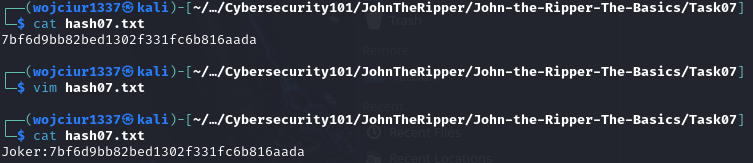
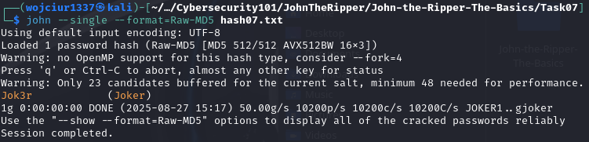
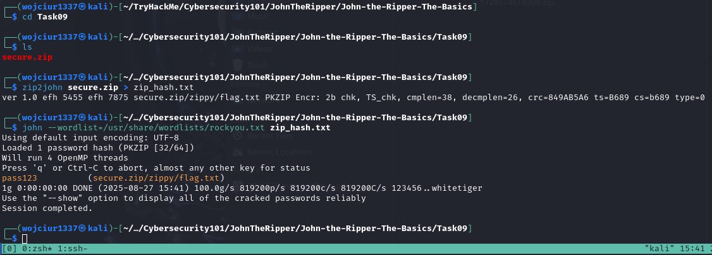
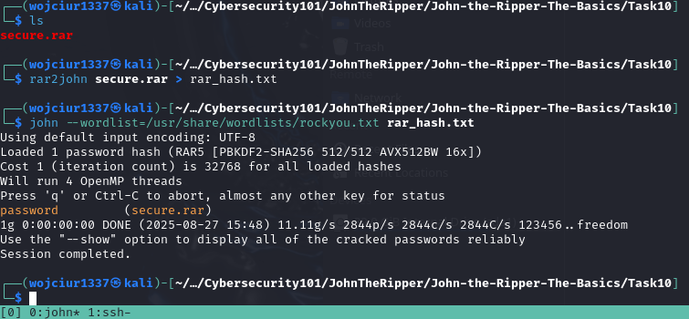
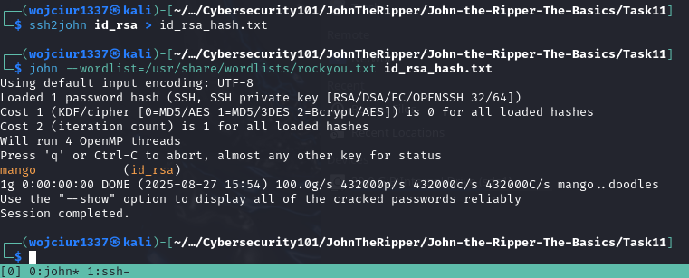

Narzędzie do łamania hashy.

Przykład: 
```
john --format=raw-md5 --wordlist=/usr/share/wordlist/rockyou.txt hash.txt
```

Można złamać hash z pliku /etc/shadow za pomocą narzędzia "unshadow". W tym celu należy mieć dostęp do pliku shadow i passwd.

Przykład:
```
unshadow local_passwd local_shadow > unshadowed.txt
```

Output z tego polecenia można podać do John w celu złamania hashu. Format będzie "--format=sha512crypt".



W celu złamania hasła można wykorzystać technikę "word mangling", polega ona na modyfikacji danego wyrażenia na podobne, np. mając username "Wojtek", potencjalne hasła mogą być: "Wojtek1, !Wojtek4, W0Jt3K@" itp. Tutaj nie przyda się słownik a zastosowanie tej metody może okazać się skuteczne.

Użycie John w trybie single crack: 
```
john --single --format[format] [path]
```

Dodatkowo w tym trybie hash powinien posiadać jeszcze na początku informację do kogo on należy (np.username):
```
wojtek:hash
```

Dla John można tworzyć własne zasady jeżeli chodzi o "word mangling". Znajdują się one w pliku /etc/john/john.conf

Inną funkcją tego narzędzia jest możliwość łamania archiwów zip i rar które są zabezpieczone hasłem. Dla zip nalezy wykorzystać "zip2john".

```
zip2john [options] [zip file] > [output file]
```



Podobnie istnieje rar2john

```
rar2john [options] [zip file] > [output file]
```



Identycznie można wykorzystać John do złamania hasła klucza prywatnego SSH plików id_rsa.

```
ssh2john [id_rsa private key file] > [output file]
```



