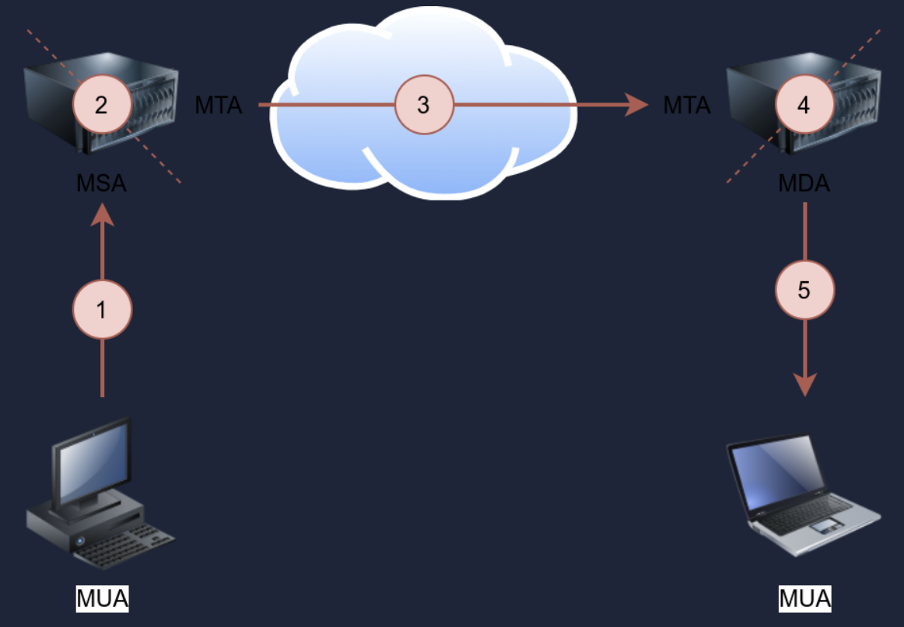
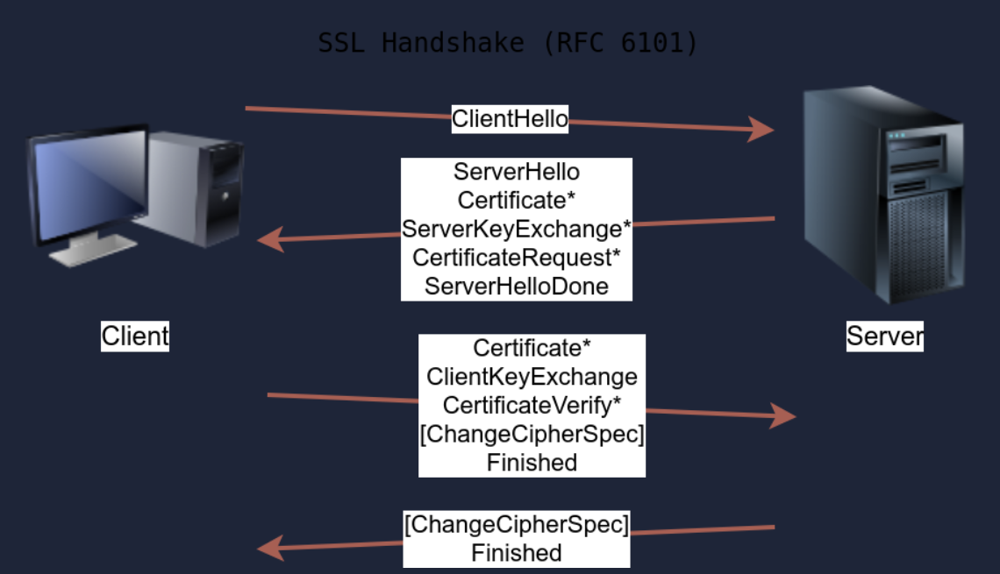

# Telnet

Port TCP/23 - to co ssh tylko nie szyfrowane. Można łączyć się do różnych serverów (nie korzystających z szyfrowania) jak http czy smtp.

# HTTP

Port TCP/80

Popularne servery:
- Apache
- Internet Information Services(ISS)
- nginx

# FTP

 Port TCP/21 - do przesyłania danych (jawnie) Może działać w dwóch trybach:
 - Active - dane są wysyłane prez inny kanał z portu 20 serwera
 - Passive - dane są wysyłane przez inny kanał zaczynając od portu ftp klienta powyżej 1023.
Wysyłanie plików to nowe połączenie. Dane idą innym kanałem niż "control channel", który jest na porcie TCP/21

Serwery FTP:
- [vsftpd](https://security.appspot.com/vsftpd.html)
- [ProFTPD](http://www.proftpd.org/)
- [uFTP](https://www.uftpserver.com/)

# SMTP

TCP/25 - protokół do wysyłania emaili

1. A Mail User Agent (MUA), or simply an email client, has an email message to be sent. The MUA connects to a Mail Submission Agent (MSA) to send its message.
2. The MSA receives the message, checks for any errors before transferring it to the Mail Transfer Agent (MTA) server, commonly hosted on the same server.
3. The MTA will send the email message to the MTA of the recipient. The MTA can also function as a Mail Submission Agent (MSA).
4. A typical setup would have the MTA server also functioning as a Mail Delivery Agent (MDA).
5. The recipient will collect its email from the MDA using their email client.

SMTP jest wykorzystywane w celu połączenia się z serverem MTA. Nie szyfruje danych.

# POP3

Port TCP/110 - Wykorzystywany do pobierania emaili z serwera MDA (mail delivery agent), może też uwierzytelniać i usuwać wiadomości. Typowy klient email. Nie szyfruje danych

# IMAP

Port TCP/143 - bardziej skomplikowany niż POP3, pozwala na synchronizację emaili na różnych urządzeniach i klientach email. Innymi słowy np. oznaczy email jako przeczytany na komputerze jak odczytam go na telefonie. Nie szyfruje danych

# Wersje z TLS

|Protocol|Default Port|Secured Protocol|Default Port with TLS|
|---|---|---|---|
|HTTP|80|HTTPS|443|
|FTP|21|FTPS|990|
|SMTP|25|SMTPS|465|
|POP3|110|POP3S|995|
|IMAP|143|IMAPS|993|

# SSL/TLS Handshake:

1. Klient wysyła ClientHello do servera by przedstawić swoje zdolności jak np. wspierany algorytm
2. Server odpowiada ServerHello wskazując wybrane parametry połączenia, dodatkowo zapewnia swój certyfikat jeżeli uwierzytelnianie serwera jest wymagane. Certyfikat to cyfrowy plik do legitymowania się, z reguły podpisany cyfrowo przez kogoś innego. dodatkowo może wysłać dodatkowe informacje potrzebne do wygenerowania master key w ServerKeyExchange message zanim wyśle ServerHelloDone wskazując na zakończenie negocjacji
3. Klient wysyła ClientKeyExchange, które zawiera dodatkowe informacje wymagane to wygenerowania master key. Dodatkowo zmienia połączenie na szyfrowane i informuje o tym server za pomocą ChangeCipherSpec.
4. Serwer zmienia połączenie na szyfrowane i też wysyła o tym informacje do klienta w ChangeCipherSpec.

| Protocol | TCP Port | Application(s)                  | Data Security |
| -------- | -------- | ------------------------------- | ------------- |
| FTP      | 21       | File Transfer                   | Cleartext     |
| FTPS     | 990      | File Transfer                   | Encrypted     |
| HTTP     | 80       | Worldwide Web                   | Cleartext     |
| HTTPS    | 443      | Worldwide Web                   | Encrypted     |
| IMAP     | 143      | Email (MDA)                     | Cleartext     |
| IMAPS    | 993      | Email (MDA)                     | Encrypted     |
| POP3     | 110      | Email (MDA)                     | Cleartext     |
| POP3S    | 995      | Email (MDA)                     | Encrypted     |
| SFTP     | 22       | File Transfer                   | Encrypted     |
| SSH      | 22       | Remote Access and File Transfer | Encrypted     |
| SMTP     | 25       | Email (MTA)                     | Cleartext     |
| SMTPS    | 465      | Email (MTA)                     | Encrypted     |
| Telnet   | 23       | Remote Access                   | Cleartext     |