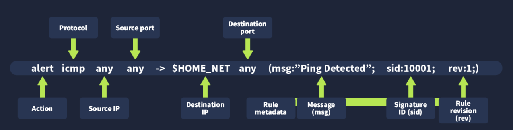

Format dodawania zasad snort:

- Action - jaka akcja ma zostać wywołana po zadziałaniu zasady
- Protocol - jaki protokół dotyczy zasady
- source IP - adres źródłowy
- source Port - port źródłowy
- Destination IP - ip celu
- Destination Port - port celu
- Rule metadata - metadane reguły - wiadomość, id sygnatury, rule revision (ile razy poprawiono/zmieniono zasadę)

Zadsady dodaje się w /etc/snort/rules