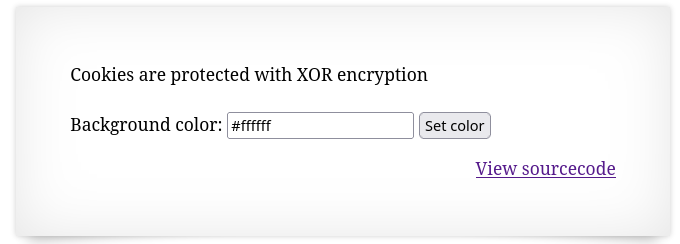
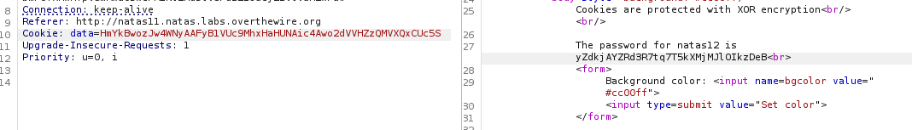

Strona przyjmuje wartość rgb, która odpowiada za zmianę koloru jej tła.

Kod źródłowy:
```php
$defaultdata = array( "showpassword"=>"no", "bgcolor"=>"#ffffff");

function xor_encrypt($in) {
    $key = '<censored>';
    $text = $in;
    $outText = '';

    // Iterate through each character
    for($i=0;$i<strlen($text);$i++) {
    $outText .= $text[$i] ^ $key[$i % strlen($key)];
    }

    return $outText;
}

function loadData($def) {
    global $_COOKIE;
    $mydata = $def;
    if(array_key_exists("data", $_COOKIE)) {
    $tempdata = json_decode(xor_encrypt(base64_decode($_COOKIE["data"])), true);
    if(is_array($tempdata) && array_key_exists("showpassword", $tempdata) && array_key_exists("bgcolor", $tempdata)) {
        if (preg_match('/^#(?:[a-f\d]{6})$/i', $tempdata['bgcolor'])) {
        $mydata['showpassword'] = $tempdata['showpassword'];
        $mydata['bgcolor'] = $tempdata['bgcolor'];
        }
    }
    }
    return $mydata;
}

function saveData($d) {
    setcookie("data", base64_encode(xor_encrypt(json_encode($d))));
}

$data = loadData($defaultdata);

if(array_key_exists("bgcolor",$_REQUEST)) {
    if (preg_match('/^#(?:[a-f\d]{6})$/i', $_REQUEST['bgcolor'])) {
        $data['bgcolor'] = $_REQUEST['bgcolor'];
    }
}

saveData($data);

?>

<h1>natas11</h1>
<div id="content">
<body style="background: <?=$data['bgcolor']?>;">
Cookies are protected with XOR encryption<br/><br/>

<?
if($data["showpassword"] == "yes") {
    print "The password for natas12 is <censored><br>";
}

?>
```

Z kodu można wyczytać, że ciasteczko jest tablicą zawierającą informację o kolorze tła strony oraz wartość showpassword, która domyślnie jest ustawiona na no, ale gdy zmieni sie ją na yes to pojawi się na stronie hasło.

W celu zdobycia hasła należy zmienić tę wartość w ciasteczku, które jest zakodowane do base64 i zaszyfrowane przy pomocy XOR z tajnym kluczem.

Znając ciasteczko i informacje z których to ciasteczko się składa można zdobyć ten klucz i stworzyć ciasteczko które będzie miało showpassword=yes.

Wartości przechowywane przez ciasteczko to:
```php
$defaultdata = array( "showpassword"=>"no", "bgcolor"=>"#ffffff");
```
a samo ciasteczko po zakodowaniu to:
```
HmYkBwozJw4WNyAAFyB1VUcqOE1JZjUIBis7ABdmbU1GIjEJAyIxTRg=
```

Znając działanie operacji xor wiadomo,że :
tekst_jawny ^ klucz = ciasteczko
klucz = ciasteczko ^ tekst_jawny

Wykorzystując podany kod można go edytować, żeby zdobyć klucz.

```php
<?php
$defaultData = array( "showpassword"=>"no", "bgcolor"=>"#ffffff");
$cookie = "HmYkBwozJw4WNyAAFyB1VUcqOE1JZjUIBis7ABdmbU1GIjEJAyIxTRg=";//"showpassword"=>"no", "bgcolor"=>"#ffffff"

// $cookie = $defaultData ^ $key
// $key = $defaultData ^ $cookie
function xor_encrypt($in) {
    $key = base64_decode("HmYkBwozJw4WNyAAFyB1VUcqOE1JZjUIBis7ABdmbU1GIjEJAyIxTRg="); //"showpassword"=>"no", "bgcolor"=>"#ffffff"
    $text = $in;
    $outText = '';

    // Iterate through each character
    for($i=0;$i<strlen($text);$i++) {
    $outText .= $text[$i] ^ $key[$i % strlen($key)];
    }

    return $outText;
}

function keyData($d) {
	$key = xor_encrypt(json_encode($d));
	echo '<pre>'; print_r($key); echo '</pre>';;
}
keyData($defaultData);
```

Wynik:
<pre>eDWoeDWoeDWoeDWoeDWoeDWoeDWoeDWoeDWoeDWoe</pre>
Powtarzający się ciąg znaków "eDWo" to nasz klucz.

Podstawiając ten ciąg pod klucz można stworzyć ciasteczko z wartością showpassword=yes i wysłać je przy pomocy narzędzia burp_suite.
```php
$yesData = array( "showpassword"=>"yes", "bgcolor"=>"#cc00ff");

function encData($d) {
	$code = base64_encode(xor_encrypt(json_encode($d)));
	print_r($code);
}

encData($yesData);
```

Wynik:
```
HmYkBwozJw4WNyAAFyB1VUc9MhxHaHUNAic4Awo2dVVHZzQMVXQxCUc5
```

Po przesłaniu ciasteczka otrzymujemy hasło do następnego poziomu.
