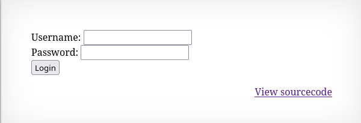

Ten poziom zawiera formularz logowania


Kod źródłowy:
```php
<?php
if(array_key_exists("username", $_REQUEST)) {
    $link = mysqli_connect('localhost', 'natas14', '<censored>');
    mysqli_select_db($link, 'natas14');

    $query = "SELECT * from users where username=\"".$_REQUEST["username"]."\" and password=\"".$_REQUEST["password"]."\"";
    if(array_key_exists("debug", $_GET)) {
        echo "Executing query: $query<br>";
    }

    if(mysqli_num_rows(mysqli_query($link, $query)) > 0) {
            echo "Successful login! The password for natas15 is <censored><br>";
    } else {
            echo "Access denied!<br>";
    }
    mysqli_close($link);
} else {
?>

<form action="index.php" method="POST">
Username: <input name="username"><br>
Password: <input name="password"><br>
<input type="submit" value="Login" />
</form>
<?php } ?>
```

W celu zdobycia hasła należy zastosować sqlinjection. W kodzie widać, że do żądania bezpośrednio są przekazywane dane do zapytania sql, nie ma tu mechanizmów takich jak escaping albo parametryzacja zapytań.

Podanie ciągu
```
" OR 1=1 #
```
daje hasło.

