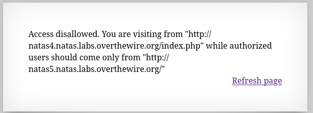
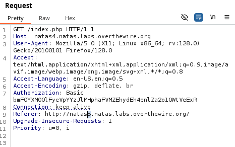

Strona nie pozwala na dostęp z powodu na brak autoryzacji, wiadomo, że strona przyjmie tylko użytkowników ze strony natas5.

Przy pomocy burp suite repeater można zmienić nagłówek referer ze strony natas4 na natas5 co spowoduje, że strona będzie myślała, że użytkownik przychodzi z witryny natas5.

Po wysłaniu zapytania otrzymujemy hasło do konta natan5.