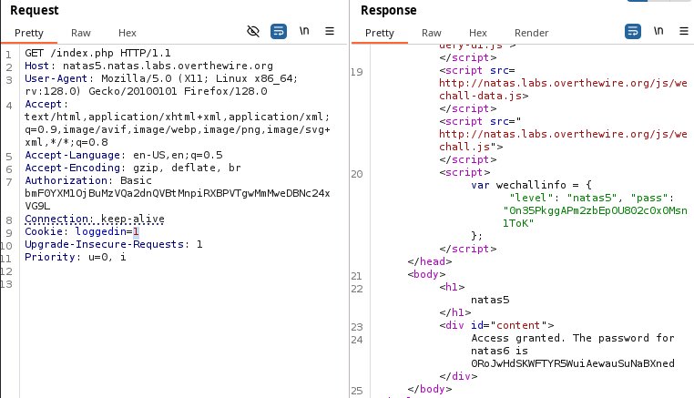

Na stronie jest informacja: "Access disallowed. You are not logged in". 

W narzędziu burp suite po przechwyceniu żądania widać ciasteczko z wartością loggedin=0

Po zmianie tej wartości na 1 i wysłaniu żądania otrzymujemy hasło do kolejnego poziomu.
