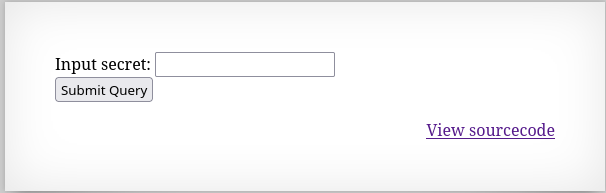

Ten poziom zawiera input field, które oczekuje hasła (secret). 



Dodatkowo na stronie jest link do kodu źródłowego, gdzie najważniejszy jest poniższy fragment:

``` php
<?
include "includes/secret.inc";

    if(array_key_exists("submit", $_POST)) {
        if($secret == $_POST['secret']) {
        print "Access granted. The password for natas7 is <censored>";
    } else {
        print "Wrong secret";
    }
    }
?>
```

Kod porównuje podany kod (secret) z tym co jest w "includes/secret.inc". Po wpisaniu tej ścieżki w url, w HTML pojawia się jako komentarz zmienna secret

```
<?
$secret = "FOEIUWGHFEEUHOFUOIU";
?>
```

Po wpisaniu tego kodu w pole secret wyświetla się hasło do kolejnego poziomu.