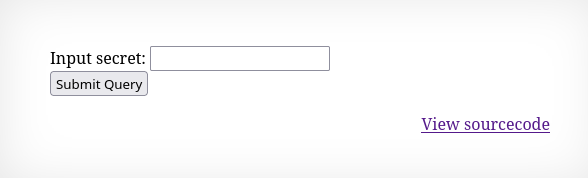

Ten poziom wygląda podobnie jak Natas6,

z tym, że w kodzie źródłowym wykonywana jest inna funkcja:
``` PHP
<?
$encodedSecret = "3d3d516343746d4d6d6c315669563362";

function encodeSecret($secret) {
    return bin2hex(strrev(base64_encode($secret)));
}

if(array_key_exists("submit", $_POST)) {
    if(encodeSecret($_POST['secret']) == $encodedSecret) {
    print "Access granted. The password for natas9 is <censored>";
    } else {
    print "Wrong secret";
    }
}
?>
```

Kluczowa jest tutaj funkcja encodeSecret, która zwraca secret. Dodatkowo w kodzie znajduje się już zakodowany secret. Z tej funkcji można wyczytać, że klucz jest kodowany do base64, następnie zakodowany ciąg znaków jest odwracany i potem zmieniany z reperzentacji binarnej na hexadecymalną.

W celu odczytania hasła z encoded secret trzeba zrobić to samo co ta funkcja ale w odwrotnej kolejności.

```php
<?php
$encodedSecret = "3d3d516343746d4d6d6c315669563362";

$bin = hex2bin($encodedSecret);

$rev = strrev($bin);

$secret = base64_decode($rev);

echo $secret;
?>
```
Wynik: oubWYf2kBq

Po wpisaniu wyniku w imput field dostajemy hasło do kolejnego poziomu.