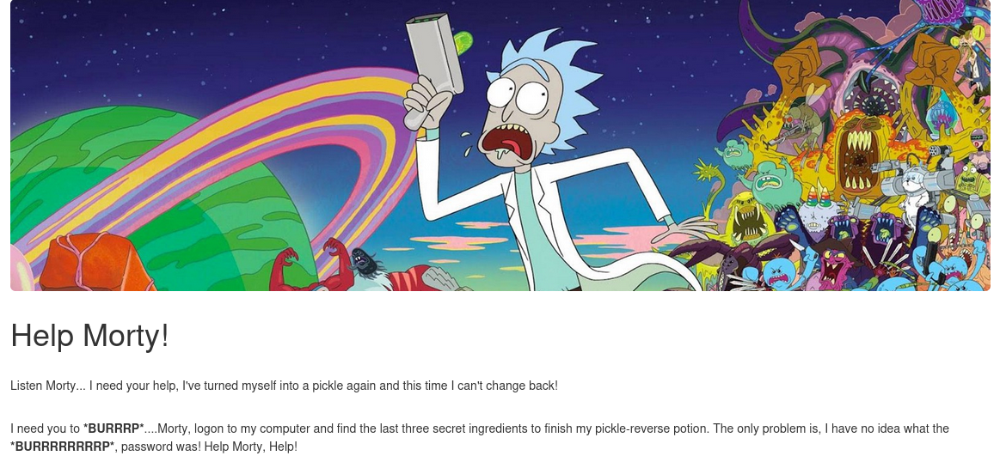
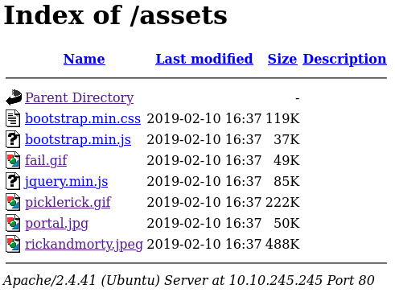
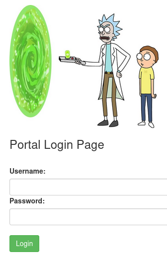
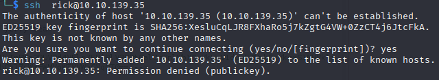
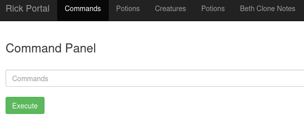
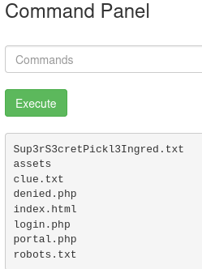
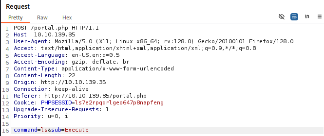
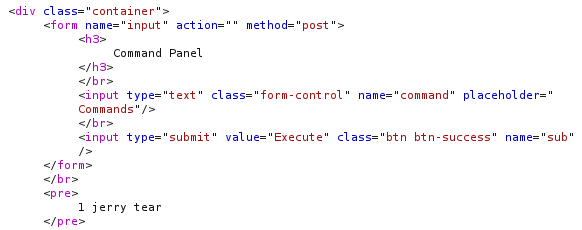
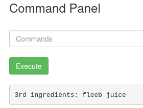

# **Nmap Results**
```text
# Nmap 7.95 scan initiated Tue Sep  9 12:01:51 2025 as: /usr/lib/nmap/nmap --privileged -Pn -p- --min-rate 2000 -sC -sV -oN nmap_scan.txt 10.10.245.245
Nmap scan report for 10.10.245.245
Host is up (0.044s latency).
Not shown: 65533 closed tcp ports (reset)
PORT   STATE SERVICE VERSION
22/tcp open  ssh     OpenSSH 8.2p1 Ubuntu 4ubuntu0.11 (Ubuntu Linux; protocol 2.0)
| ssh-hostkey: 
|   3072 b7:75:b5:89:f0:24:2a:b2:70:88:08:32:99:d3:85:26 (RSA)
|   256 94:1c:86:4e:9e:7a:11:86:20:d0:c2:82:19:c5:7f:2b (ECDSA)
|_  256 28:64:a0:e9:e9:f9:db:c8:b9:0d:79:4e:b8:a5:f5:cd (ED25519)
80/tcp open  http    Apache httpd 2.4.41 ((Ubuntu))
|_http-title: Rick is sup4r cool
|_http-server-header: Apache/2.4.41 (Ubuntu)
Service Info: OS: Linux; CPE: cpe:/o:linux:linux_kernel

Service detection performed. Please report any incorrect results at https://nmap.org/submit/ .
# Nmap done at Tue Sep  9 12:02:24 2025 -- 1 IP address (1 host up) scanned in 32.79 seconds
```

<br>
# **Service Enumeration**

## **TCP/80 - HTTP**
Wygląd strony głównej

W HTML strony znajduje się komentarz z nazwą użytkownika komputera (ssh)
```
<!--
    Note to self, remember username!
    Username: R1ckRul3s
  -->
```
<br>
Na serwerze zbajduje się folder `/assets` z następującymi plikami


Obrazy zostały przeskanowane pod kątem steganografi, metadanych oraz typu pliku za pomocą poleceń `file, binwalk, exiftool` i nie wykryto niczego podejrzanego.

W pliku `robots.txt` znajduje się tylko napis "Wubbalubbadubdub"

Skan popularnych plików na serwerze za pomocą słownika /dirb/common.txt


Widać, że jest plik login.php




## **TCP/22 - SSH**  

SSH nie działa, występuje błąd odmowy dostępu podczas próby jakiegokolwiek połączenia.

<br>
# **Exploit**

Za pomocą danych logowania "R1ckRul3s:Wubbalubbadubdub" udało się zalogować do portalu.



W HTML tego ekranu znajduje się komentarz w base64 `"Vm1wR1UxTnRWa2RUV0d4VFlrZFNjRlV3V2t0alJsWnlWbXQwVkUxV1duaFZNakExVkcxS1NHVkliRmhoTVhCb1ZsWmFWMVpWTVVWaGVqQT0=="`
 Po 7-krotnym odkodowaniu okazuje się że jest to napis "rabbit hole"

W command panel znajduje się input field, który pozwala na wykonanie poleceń i otrzymanie odpowiedzi
**Wykonanie ls**

**Żądanie w burp**: 


Polecenie `cat` nie działa, ale można wyświetlić pliki wpisując je w url.

Sup3rS3cretPickl3Ingred.txt - `mr. meeseek hair`


Druga flaga znajduje się w folderze home użytkownika rick. Z racji, że polecenie `cat` nie działa można spróbować wykorzystać polecenie `ul < plik`, które domyślnie podkreśla słowa, ale można wykorzystać przekierowanie i wypisać dzięki niemu zawartość pliku.


``` payload
command=ul+<+..%2F..%2F..%2Fhome/rick/second\+ingredients&sub=Execute
```
Wynik


Ostatnia flaga znajduje się w folderze root, ale nie da się jej odczytać za pomocą `ul` w folderze root. Z racji na posiadane prawa do sudo, można skopiować plik do folderu gdzie hostowana jest aplikacja internetowa i tam odczytać plik.


# **Post-Exploit Enumeration**
## **Operating Environment**
### OS & Kernel

```text
Linux ip-10-10-139-35 5.15.0-1064-aws #70~20.04.1-Ubuntu SMP Fri Jun 14 15:42:13 UTC 2024 x86_64 x86_64 x86_64 GNU/Linux

NAME="Ubuntu"
VERSION="20.04.6 LTS (Focal Fossa)"
ID=ubuntu
ID_LIKE=debian
PRETTY_NAME="Ubuntu 20.04.6 LTS"
VERSION_ID="20.04"
HOME_URL="https://www.ubuntu.com/"
SUPPORT_URL="https://help.ubuntu.com/"
BUG_REPORT_URL="https://bugs.launchpad.net/ubuntu/"
PRIVACY_POLICY_URL="https://www.ubuntu.com/legal/terms-and-policies/privacy-policy"
VERSION_CODENAME=focal
UBUNTU_CODENAME=focal
```


### Current User

```text
uid=33(www-data) gid=33(www-data) groups=33(www-data)

Matching Defaults entries for www-data on ip-10-10-139-35:
    env_reset, mail_badpass, secure_path=/usr/local/sbin\:/usr/local/bin\:/usr/sbin\:/usr/bin\:/sbin\:/bin\:/snap/bin

User www-data may run the following commands on ip-10-10-139-35:
    (ALL) NOPASSWD: ALL
```
Użytkownik może używać poleceń jako każdy użytkownik, nie musi podwać hasła do tego i nie ma żadnych ograniczeń.
## **Users and Groups**

### Local Users

```text
gnats:x:41:41:Gnats Bug-Reporting System (admin):/var/lib/gnats:/usr/sbin/nologin
ubuntu:x:1000:1000:Ubuntu:/home/ubuntu:/bin/bash
```
Mimo, że w folderze home jest folder "rick" to na systemie istnieje tylko użytkownik ubuntu.

### Local Groups

```text
adm:x:4:syslog,ubuntu
dialout:x:20:ubuntu
cdrom:x:24:ubuntu
floppy:x:25:ubuntu
sudo:x:27:ubuntu
audio:x:29:ubuntu
dip:x:30:ubuntu
video:x:44:ubuntu
plugdev:x:46:ubuntu
netdev:x:109:ubuntu
lxd:x:110:ubuntu
ubuntu:x:1000:
```


## **Network Configurations**

### Network Interfaces

```text
1: lo:  mtu 65536 qdisc noqueue state UNKNOWN group default qlen 1000
    link/loopback 00:00:00:00:00:00 brd 00:00:00:00:00:00
    inet 127.0.0.1/8 scope host lo
       valid_lft forever preferred_lft forever
    inet6 ::1/128 scope host 
       valid_lft forever preferred_lft forever
2: ens5:  mtu 9001 qdisc mq state UP group default qlen 1000
    link/ether 02:ed:7c:64:1d:ed brd ff:ff:ff:ff:ff:ff
    altname enp0s5
    inet 10.10.139.35/16 brd 10.10.255.255 scope global dynamic ens5
       valid_lft 3593sec preferred_lft 3593sec
    inet6 fe80::ed:7cff:fe64:1ded/64 scope link 
       valid_lft forever preferred_lft forever
```

# **Flags**

```text
First ingredient: mr. meeseek hair
Second ingredient: 1 jerry tear
Last ingredient: fleeb juice
```
