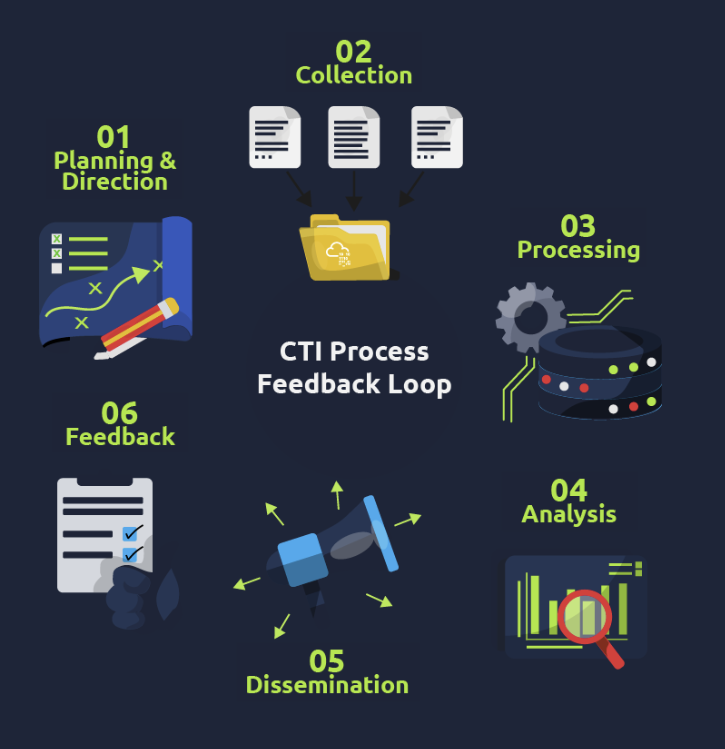

Cyber Threat Intelligence skupia się na tym który z wielu logów jest niebezpieczny bazując na 3 pytaniach:
1. Kto lub co jest po drugiej stronie tego indykatora (logu?)
2. Jak wcześniej się to zachowywało
3. Jak inne organizacje na to reagowały i co powinno się z tym zrobić

W information security skupia się na 3 filarach z surowych danych:

| Layer            | Definition                                  | Alert-queue example                                         | SOC L1 action         |
| ---------------- | ------------------------------------------- | ----------------------------------------------------------- | --------------------- |
| **Data**         | An unprocessed observable                   | `45.155.205.3 :443`                                         | Capture the artefact. |
| **Information**  | Data plus factual annotation                | _IP registered to Hetzner, first seen 2023-07-14_           | Record attributes.    |
| **Intelligence** | Analysed information that answers _so-what_ | _IP belongs to the current BumbleBee C2; block immediately_ | Escalate or suppress. |
Podczas wyciągania dodatkowych inforamcji jeszcze są 3 ważne pojęcia:
- **Indicator of Compromise (IOC)**: Evidence of a breach, such as a C2 address in the logs.
- **Indicator of Attack (IOA)**: A malicious action, such as PowerShell launching an unknown service, is underway.
- **Tactics, Techniques, and Procedures (TTP)**: An adversary's detailed methodologies expressed in MITRE ATT&CK IDs and descriptions.

Typy indykatorów kluczowe na soc-l1:

| Indicator          | Example                                | First Resources                                                                       | Associated IOA or TTP Examples                               |
| ------------------ | -------------------------------------- | ------------------------------------------------------------------------------------- | ------------------------------------------------------------ |
| **IPv4 / IPv6**    | `45.155.205.3`                         | • WHOIS (ASN, allocation date) · VirusTotal Relations· Shodan banner scan             | IOA: Repeated SSH failures TTP: `T1110.003`Password Guessing |
| **Domain / FQDN**  | `malicious-updates[.]net`              | • WHOIS age · RiskIQ or SecurityTrails passive-DNS · urlscan.io                       | IOA: surge of DNS queries to a 24-hour-old domain            |
| **URL**            | `hxxp://malicious-updates[.]net/login` | • URLhaus reputation · urlscan.io behaviour graph · Any.Run dynamic run (network off) | IOA: Browser POST to /gateway.php with payload               |
| **File hash**      | `e99a18c428cb38d5…`                    | • VirusTotal static & dynamic · Hybrid-Analysis · MalShare corpus                     | TTP: T1055 Process Injection into regsvr32.exe               |
| **E-mail address** | `billing@evil-corp.com`                | • MXToolbox header analysis • Have I Been Pwned                                       | IOA: SPF failure plus recent domain registration             |
| **Local artefact** | `HKCU\Software\Run\updater.exe`        | • Sigma rules · EDR prevalence query · Vendor knowledge bas                           | TTP: T1060.001 Registry Run Keys                             |

Feed - określony strunień indykatorów zazwyczaj dostarczony w CSV czy JSON.
Platform - Ustrukturyzowane repo które prezchowuje indykatory, mapuje relacje itp. Przykładami są OpenCTI i MISP.

Źródła CTI:
- **Internal telemetry:** SIEM logs, EDR detections, phishing-mailbox submissions provide the highest immediate relevance.
- **Commercial services:** Vendor premium feeds, paid sandboxes and closed-source analytics. These provide high fidelity, but may have export and sharing limits based on licensing.
- **Open-source intelligence (OSINT):** AbuseIPDB, URLhaus, public blogs with IOCs, and academic research. Before applying, information from these sources will need to be cross-confirmed.
- **Communities & ISACs:** Sector-specific lists marked with labels and rich context (e.g., FS-ISAC)

## Threat intelligence Classifications

Threat intelligence jest bardziej stworzone do zrozumienia relacji między moim systemem (chronionym) a hackerem. Można podzielić ten threat intel na:
- Strategic intel - wysokopoziomowa analiza która skupia się na organizacji i mapuje miejsca ryzyka, patterny albo powstające zagrożenia które mogą wpłynąć na business. Przykładem jest coroczny raport o ransomware.
- Tactical intel - Ocena zachowań hackerów, TTP.
- Operational intel - Szczegółowe informacje dotyczące konkretnej kampanii, motywów i zamiarów przeprowadzenia ataku. Jest to przydatne do zrozumienia, jakie kluczowe zasoby organizacji (ludzie, procesy i technologie) mogą stać się celem ataku.
- Technical Intel - atomiczne wskaźniki i artefakty jak ip i hashe związane z atakiem.

CTI skupia się na przetwarzaniu surowych danych w dane połączone z kontekstem ataku, celu.

## Traffic Light Protocol (TLP)—A Primer for Proper Sharing
Jest to czworo-kolorowy schemat etykietowania który zarządza jak szeroko wywiad może zostać dzielony (shared)

| TLP label      | Sharing boundary                                                   | Typical SOC L1 behaviour                                                           |
| -------------- | ------------------------------------------------------------------ | ---------------------------------------------------------------------------------- |
| **TLP: CLEAR** | No restriction                                                     | Post to the internal wiki or platform.                                             |
| **TLP: GREEN** | Share with peer community but not publicly                         | Upload to MISP/Slack workspace restricted to partner SOCs.                         |
| **TLP: AMBER** | Organisation-wide, external sharing only with need-to-know clients | Keep within the company CTI platform; reference, do not copy, in tickets.          |
| **TLP: RED**   | Named recipients only                                              | Store in an encrypted note; do not post to the ticketing system without clearance. |

## CTI standards and frameworks:

MITRE D3FEND, MITRE ATT&CK, Cyber Kill Chain
CVEs, CVSS, and the NVD:
- **CVE (Common Vulnerabilities and Exposures)** — provides a catalogue number for discovered vulnerabilities, e.g., _CVE-2023-4863_.
- **CVSS (Common Vulnerability Scoring System)** — a 0–10 severity scale with temporal and environmental modifiers for vulnerabilities.
- **NVD (National Vulnerability Database)** — the canonical repository that links CVE numbers to CVSS scores, exploits, and affected products.

## Sharing and Processing Intel
- **STIX**: the structured JSON schema for describing threat information.
- **TAXII**: The Trusted Automated eXchange of Indicator Information is a set of secure APIs used to exchange threat intelligence in near real-time for detection, prevention, and mitigation of threats. It supports two sharing models: **Collection**, which ensures threat intel is collected and hosted by a producer, and **Channel**, which publishes threat intel to users from a central server.

### VirusTotal na co zwracać uwagę

|Section|Key Question|Red Flags|Analyst Considerations|
|---|---|---|---|
|Detection Score and Threat Labels|How many vendors detect this file as malicious?|- Five or more solid vendors flag it - Conflicting classifications (e.g., "Trojan" vs "PUA") - No consensus among the top 3 vendors|- New malware often has low initial detection - Recheck after 24h for updated results - Look at the classification of the malware family name or capability name|
|Upload Time|When was the file first submitted?|- Uploaded seven days ago with more than 10 detections - Sudden detection spike after days/weeks|- Vendors need 48-72 hours for full analysis - Historical detection growth indicates malware ageing|
|Signatures|Is the file properly signed?|- Invalid/missing certificate - Certificate issued to an unrelated entity|- Even valid certs can be stolen/abused - Check cert chain expiration dates|
|Properties|Are there anomalies in the file data?|- Compile timestamp at odd hours (e.g., 3 AM) - High entropy (>7.5) in non-media files|- Some legitimate packers (UPX) increase entropy - Compare with known-good versions|
|Relations|What infrastructure does the malware connect to?|- Known-bad IPs in VirusTotal's graph - DGA-like domains (e.g., xk8f92.xyz)|- Legitimate CDNs may host malware - Check IPs in Shodan for open ports|
|Behavioral|What post-execution actions occur?|- Modifies critical registry keys - Attempts process injection|- Some admin tools modify registries legitimately - Correlate with endpoint logs|

### Metody ataków na DNS

- **Fast Flux Hosting**: Adversaries rotate many IPs quickly with short cache times to avoid simple blocks. We need to record and escalate when we identify a domain that resolves to changing IPs within a short period and across different providers.
- **CDN Abuse**: Legitimate CDNs like Cloudflare or Akamai change IPs too, but done within their ASN ecosystem. If the A record points to a major CDN and other values are normal, take note and carry reputation and ownership checks,
- **Typosquatting**: Domains like paypa1[.]com or micros0ft[.]net trick users visually. If a name looks like a brand clone, treat it as high risk and escalate it.
- **IDN (Internationalised Domain Names)**: Attackers exploit Unicode, creating look-alike domains. Decode Punycode, for example xn--ppaypal-3ya[.]com, and compare to known brands using simple online decoder.

Jak się bronić jako SoC analyst:

- **Snapshot Current DNS**: Capture A, NS, MX, TXT, SOA, and TTL values for the domain in question using a single page view and simple.
- **Basic Ownership Check**: Use WHOIS to note registrat, creation date and contact pattern, which supports a light ownership picture of the ticket.
- **Interpret Patterns**: Assess whether the DNS behaviour aligns with benign CDN activity or indicates malicious throwaway domain, noting down the details of the changing IPs.
- **Log Evidence**: Save screenshots or JSON extracts DNS and reputation pages to the case file for audit and escalation.
- **Recommend Action**: Based on findings, advise blocking if high risk, monitor if suspicious but inconclusive, or close if determined benign.

### RDAP

**Registration Data Access Protocol (RDAP)** - do sprawdzania czyje jest dane IP, pokazuje dokładne informacje, takie jak:
- **NetRange**: The range of addresses delegated.
- **Organisation**: The registered holder (e.g., Amazon, Vodafone, TryHackMe).
- **Remarks**: Often include whether the block is used for hosting, broadband, or mobile.
- **Abuse Contact**: The official mailbox for incident reporting.

### ASN

**Autonomous System (AS)** is a collection of IP prefixes under a single organisation’s control. Each AS is assigned a unique 16 or 32-bit number (ASN), only required for external communications.

- **Hosting ASNs**: Many small netblocks, often with diverse tenants. Suspicious domains are frequently hosted here.
- **Residential ISPs**: These have huge ranges covering millions of users. Alerts on these may indicate compromised home routers or consumer devices.
- **Cloud/CDN ASNs**: Global anycast, dozens of prefixes, shared edges. Blocking whole ranges here causes collateral damage.

Some heuristic examples of ASN classification include:

- **AS32934 - Facebook/Meta**: Traffic from here is based on the social media infrastructure. Malicious use may likely indicate an account issue, and not malicious hosting.
- **AS16509 - Amazon AWS**: This would cover a massive cloud space, and attackers would often abuse it for short-lived servers. Blocking the entire ASN would be catastrophic, so we scope to the FQDN or narrow the CIDR.
- **AS124888 - Vodafone**: This covers an ISP. Malicious activity would likely be from a compromised customer device.

Workflow:

- **Start with RDAP**: Confirm netrange, org, ASN, and abuse contacts.
- **Add ASN Context**: Check bgpview.io or ipinfo.io for ASN details and role.
- **Check Geolocation**: Capture country from at least two sources. Record mismatches.
- **Look for rDNS Patterns**: Reverse DNS can hint at hosting type (e.g., *[.]btcentralplus[.]com = UK broadband). Do not base decisions solely on rDNS.
- **Consult Internal Logs**: Has this IP appeared in the last 30 days? If yes, in what context?
- **Classify Role**: Hosting, residential, CDN, or cloud. Record reasoning.
- **Plan Outreach**: If confirmed malicious and in a cooperative ASN, prepare a report for the abuse contact.

### Service expousure

Workflow:

- **Check [shodan.io](https://www.shodan.io)/[Censys.io](https://search.censys.io)banners**: Identify exposed services and possible misconfigurations.
- **Review TLS certificates**: Ensure to record issuer, SANs, and validity period. [crt.sh](https://crt.sh)
- **Look for anomalies**: Instances of multiple SANs, brand look-alikes or sudden bursts of issuance.
- **Pivot**: Utilise the certificate or banner artefacts to uncover related infrastructure. [Censys.io](https://search.censys.io)
- **Assess blast radius**:
    - RDP/SSH on residential ASN → shows a likelihood of a compromised endpoint.
    - TLS with many unrelated SANs on CDN ASN → shared infrastructure, avoid IP block.
    - Self-signed TLS on small ranges → shows likelihood of attacker panels or proxies.

### Reputation Checks and Passive DNS

VirusTotal albo cisco talos intelligence do sprawdzanai reputacji ip, ip2proxy do sprawdzania czy ip to vpn, proxy czy tor, ogólny workflow:

- **Check VirusTotal**: Record detection ratio, First Seen, Last Seen, and any community notes.
- **Check Cisco Talos**: Record reputation score and category, noting any changes in the last 30 days.
- **Check IP2Proxy**: Flag if VPN/proxy/Tor; adjust severity accordingly.
- **Check Passive DNS**: Record First Seen, Last Seen, number of IPs in the last 7 days, and ASN spread.
- **Check CT Logs**: Note certificate bursts, suspicious SANs.
- **Cross-Reference with Wayback**: Identify content shifts (benign → phishing).
- **Decision**: Block, monitor, or close, with expiry tied to observed activity.