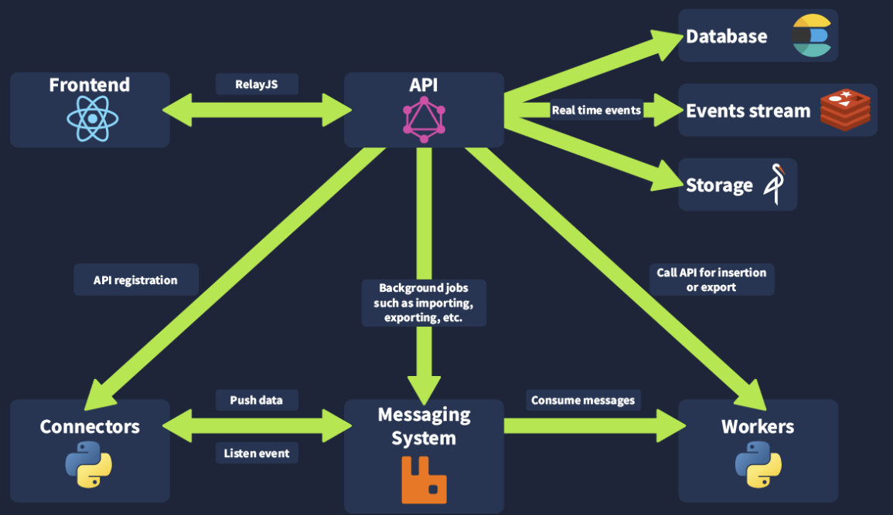

[OpenCTI](https://github.com/OpenCTI-Platform/opencti) - platforma open-source zaprojektowana w celu zapewnienia organizacjom środków do zarządzania CTI (Cyber Threat Intelligence) poprzez przechowywanie, analizę, wizualizację i prezentację kampanii zagrożeń, złośliwego oprogramowania i wskaźników IOC (indicator of compromise).

Platforma może korzystać z MITTRE ATT&CK to structure data.

Data model:

