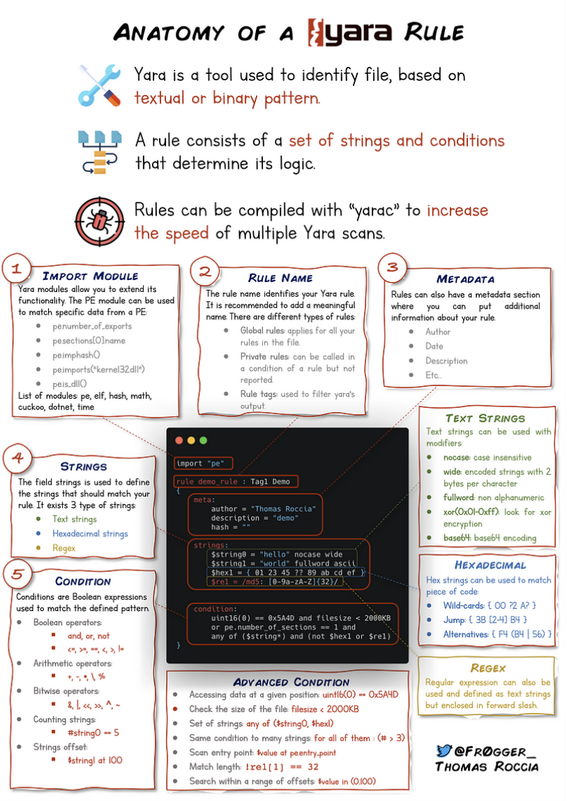

Yara - (Yet Another Ridiculous Acronym) - pattern matching tool. Może wykrywać binary i textual patterns.

## Tworzenie zasad yara

`yara` przyjmuje dwa argumenty:
1. zasada którą tworzę (rozszerzenie .yar)
2. nazwa pliku albo folderu ablo process id na którym zasada ma działać.

Przykład:
`yara myrule.yar somefile`

Najpierw trzeba stworzyć ten plik i folder, `myrule.yar` i `somefile` musi istnieć

w pliku myrule.yar:
``` yar
rule examplerule {
        condition: true
}
```

Tutaj nazwa zasady to `examplerule` a warunek to `condition`

Zastosowanie zasady:
`yara myfirstrule.yar somefile`

[dokumentacja pisania zasad w yara](https://yara.readthedocs.io/en/stable/writingrules.html)



## Yara i inne frameworki

**Cuckoo** - sandbox do automatycznej alalizy malware, może generować zasady yara na podstawie działania malware.

**Python PE** - moduł pozwalający na tworzenie zasad yara na elementach struktury windows portable executable (wszystkie exe i dll na windows.)

**LOKI** - open-source IoC (Indicator of compromise) scanner

**THOR** - wersja lite jest free i to multi-platform IoC i YARA scanner.

**FENRIR** - to co wyżej ale w bashu.

**YAYA** - zarządzanie wieloma repo z zasadami YARA.

Te narzędzia nie są niezawodne i może się zdarzyć że i tak ręcznie trzeba będzie dodać regułę.

**yarGen** - generator zasad yara - "The main principle is the creation of yara rules from strings found in malware files while removing all strings that also appear in goodware files. Therefore yarGen includes a big goodware strings and opcode database as ZIP archives that have to be extracted before the first use."

[Valhalla](https://valhalla.nextron-systems.com) - zasady yara online, można je wyszukać pod tagami technik ATT&CK, sha256, nazwie zasady.

Wypisywanie hashy plików:
`sha256sum plik` - tutaj zawsze nazwa hasha i sum razem a potem plik.