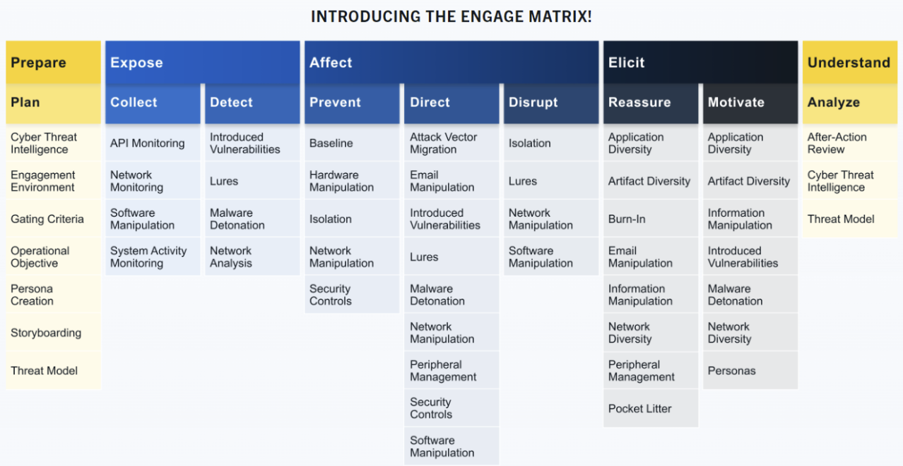

Firma/organizacja prowadząca research w dziedzinach bezpieczeństwa nie tylko sieciowego/komputerowego.

Najpopularniejsze frameworki:
- ATT&CK _®_  ( A dversarial  T actics,  T echniques,  and   C ommon  K nowledge) Framework
- CAR ( C yber  A nalytics  R epository) Knowledge Base
- ENGAGE  
- D3FEND ( D etection,  D enial, and  D isruption  F ramework  E mpowering  N etwork  D efense)
- AEP ( A TT&CK  E mulation  P lans)

APT - Advanced Persistent Threat - organizacje/grupy prowadzące najbardziej zaawansowane ataki hackerskie.

TTP - Tactics, Techniques, Procedures:
- The  Tactic  is the adversary's goal or objective.
- The  Technique  is how the adversary achieves the goal or objective.
- The  Procedure  is how the technique is executed.

## MITRE ATT&CK®
Publicznie dostępna wiedza/baza TTP wykorzystywanych przez APT. Pomocne do stworzenia i opisania wektoru ataku.

## MITRE Cyber Analytics Repository (CAR)
Baza wiedzy analitycznej opracowana przez MITRE w oparciu o ATT&CK. CAR definiuje model danych, który jest wykorzystywany w jego reprezentacjach pseudokodu, ale obejmuje również implementacje skierowane bezpośrednio do konkretnych narzędzi (np. Splunk, EQL) w jego analizach.

## MITRE Engage
to platforma służąca do planowania i omawiania działań związanych z przeciwdziałaniem zagrożeniom, która umożliwia walkę z przeciwnikami i osiągnięcie celów w zakresie cyberbezpieczeństwa. 
To stosuje metodę Adversary Engagement Approach która polega na implementacji Cyber Denial i Cyber Deception.
Cyber Denial zapobiega atakującemu możliwość wykonywania działań a Cyber Deception intencjonalnie umieszcza artefakty żeby wprowadzić atakującego w błąd.

- Prepare  the set of operational actions that will lead to your desired outcome (input)
- Expose  adversaries when they trigger your deployed deception activities 
- Affect  adversaries by performing actions that will have a negative impact on their operations
- Elicit  information by observing the adversary and learn more about their modus operandi (TTPs)
- Understand  the outcomes of the operational actions (output)

## MITRE D3FEND
Wykres wiedzy dotyczący środków przeciwdziałania zagrożeniom cyberbezpieczeństwa.