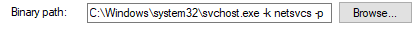

## System 

### Normalne zachowanie

**Image Path**:  N/A
**Parent Process**:  None
**Number of Instances**:  One
**User Account**:  Local System
**Start Time**:  At boot time

Działa na PID4 i w trybie kernala. Zawsze jest jedna isntancja, parent process to System Idle process (0), nie działa w Session 0

## smss.exe

**smss.exe** (**Session Manager Subsystem**) inaczej **Windows Session Manager** - Odpowiedzialny za tworzenie nowych sesji. Pierwszu process w trybie user rozpoczęty przez kernel.

Smss.exe starts csrss.exe (Windows subsystem) and wininit.exe in Session 0, an isolated Windows session for the operating system, and csrss.exe and winlogon.exe for Session 1, which is the user session. The first child instance creates child instances in new sessions, done by smss.exe copying itself into the new session and self-terminating.
Dodatkowo proces odpali każdy inny subsystem w `Required` value of `HKLM\System\CurrentControlSet\Control\Session Manager\Subsystems`

SMSS też tworzy zmienne środowiskowe, virtual memory paging files i zaczyna winlogon.exe

### Normalne 

**Image Path**:  %SystemRoot%\System32\smss.exe
**Parent Process**:  System
**Number of Instances**:  One master instance and child instance per session. The child instance exits after creating the session.
**User Account**:  Local System
**Start Time**:  Within seconds of boot time for the master instance

### Nienormalne

A different parent process other than System (4)
The image path is different from C:\Windows\System32
More than one running process. (children self-terminate and exit after each new session)
The running User is not the SYSTEM user
Unexpected registry entries for Subsystem

## csrss.exe

**csrss.exe** (**Client Server Runtime Process**) - Działa w user-mode, działa cały czas i jest kluczowy do działania systemu. Jest odpowiedzialny za Win32 console window i za process thread creation and deletion. For each instance, csrsrv.dll, basesrv.dll, and winsrv.dll are loaded (along with others). This process is also responsible for making the Windows API available to other processes, mapping drive letters, and handling the Windows shutdown process.

### Normalne

**Image Path**:  %SystemRoot%\System32\csrss.exe
**Parent Process**:  Created by an instance of smss.exe
**Number of Instances**:  Two or more
**User Account**:  Local System
**Start Time**:  Within seconds of boot time for the first two instances (for Session 0 and 1). Start times for additional instances occur as new sessions are created, although only Sessions 0 and 1 are often created.

### Nienormanle

An actual parent process. (smss.exe calls this process and self-terminates)
Image file path other than C:\Windows\System32
Subtle misspellings to hide rogue processes masquerading as csrss.exe in plain sight
The user is not the SYSTEM user.

### wininit.exe

The **Windows Initialization Process**, **wininit.exe**, is responsible for launching services.exe (Service Control Manager), lsass.exe (Local Security Authority), and lsaiso.exe within Session 0. It is another critical Windows process that runs in the background, along with its child processes.

### Normalne

**Image Path**:  %SystemRoot%\System32\wininit.exe
**Parent Process**:  Created by an instance of smss.exe
**Number of Instances**:  One
**User Account**:  Local System
**Start Time**:  Within seconds of boot time

### Nienormalne

An actual parent process. (smss.exe calls this process and self-terminates)
Image file path other than C:\Windows\System32
Subtle misspellings to hide rogue processes in plain sight
Multiple running instances
Not running as SYSTEM

### services.exe

**Service Control Manager** (SCM) or **services.exe** - głównie do zarządzania usługami - ładownanie, startowanie, zamykanie i interakcja. Zawiera bazę danych do której w PowerShell jest dostęp z `sc.exe`. Też ładuje sterowniki które są w auto-start

Informacje o procesach są w rejestrach tutaj `HKLM\System\CurrentControlSet\Services`

Jak użytkownik się zaloguje to dodatkowo rejestrach zmienia się wartość Last Known Good control set (Last Known Good Configuration), `HKLM\System\Select\LastKnownGood`, to that of the CurrentControlSet.

### Normalne

**Image Path**:  %SystemRoot%\System32\services.exe
**Parent Process**:  wininit.exe
**Number of Instances**:  One
**User Account**:  Local System
**Start Time**:  Within seconds of boot time

### Nienormalne

A parent process other than wininit.exe
Image file path other than C:\Windows\System32
Subtle misspellings to hide rogue processes in plain sight
Multiple running instances
Not running as SYSTEM

## **svchost.exe**

**Service Host** (Host Process for Windows Services), or **svchost.exe**, is responsible for hosting and managing Windows services.

usługi w svchost.exe są implementowane jako DLL. The DLL to implement is stored in the registry for the service under the `Parameters` subkey in `ServiceDLL`. The full path is `HKLM\SYSTEM\CurrentControlSet\Services\SERVICE NAME\Parameters`.

### Normalne

**Image Path**: %SystemRoot%\System32\svchost.exe
**Parent Process**: services.exe
**Number of Instances**: Many
**User Account**: Varies (SYSTEM, Network Service, Local Service) depending on the svchost.exe instance. In Windows 10, some instances run as the logged-in user.
**Start Time**: Typically within seconds of boot time. Other instances of svchost.exe can be started after boot.

### Nienormanle

A parent process other than services.exe
Image file path other than C:\Windows\System32
Subtle misspellings to hide rogue processes in plain sight
The absence of the -k parameter (svchost.exe services has always -k flag in binary path in all services connected to svchost)

## lsass.exe

Local Security Authority Subsystem Service (**LSASS**) - process odpowiedzialny za wymuszenie działania secutiry policy na systemie. It verifies users logging on to a Windows computer or server, handles password changes, and creates access tokens. It also writes to the Windows Security Log.

It creates security tokens for SAM (Security Account Manager), AD (Active Directory), and NETLOGON. It uses authentication packages specified in `HKLM\System\CurrentControlSet\Control\Lsa`

### Normalne

**Image Path**:  %SystemRoot%\System32\lsass.exe
**Parent Process**:  wininit.exe
**Number of Instances**:  One
**User Account**:  Local System
**Start Time**:  Within seconds of boot time

### Nienormalne

A parent process other than wininit.exe
Image file path other than C:\Windows\System32
Subtle misspellings to hide rogue processes in plain sight
Multiple running instances
Not running as SYSTEM

## winlogon.exe

The **Windows Logon**, **winlogon.exe**, is responsible for handling the **Secure Attention Sequence**(SAS). It is the ALT+CTRL+DELETE key combination users press to enter their username & password. This process is also responsible for loading the user profile. It loads the user's NTUSER.DAT into HKCU, and userinit.exe loads the user's shell. Jeszcze odpowiedzialne ze locking screen i screen saver.

### Normalne

**Image Path**:  %SystemRoot%\System32\winlogon.exe
**Parent Process**:  Created by an instance of smss.exe that exits, so analysis tools usually do not provide the parent process name.
**Number of Instances**:  One or more
**User Account**:  Local System
**Start Time**:  Within seconds of boot time for the first instance (for Session 1). Additional instances occur as new sessions are created, typically through Remote Desktop or Fast User Switching logons.

### Nienormalne

An actual parent process. (smss.exe calls this process and self-terminates)
Image file path other than C:\Windows\System32
Subtle misspellings to hide rogue processes in plain sight
Not running as SYSTEM
Shell value in the registry other than explorer.exe

## explorer.exe

**Windows Explorer**, **explorer.exe** - daje dostęp do folderów i plików, paska zadań i menu start.
Winlogon process runs userinit.exe, which launches the value in `HKLM\Software\Microsoft\Windows NT\CurrentVersion\Winlogon\Shell`. Userinit.exe exits after spawning explorer.exe. Because of this, the parent process is non-existent.

### Normalne

**Image Path**:  %SystemRoot%\explorer.exe
**Parent Process**:  Created by userinit.exe and exits
**Number of Instances**:  One or more per interactively logged-in user
**User Account**:  Logged-in user(s)
**Start Tim**e:  First instance when the first interactive user logon session begins

### Nienormalne

An actual parent process. (userinit.exe calls this process and exits)
Image file path other than C:\Windows
Running as an unknown user
Subtle misspellings to hide rogue processes in plain sight
Outbound TCP/IP connections