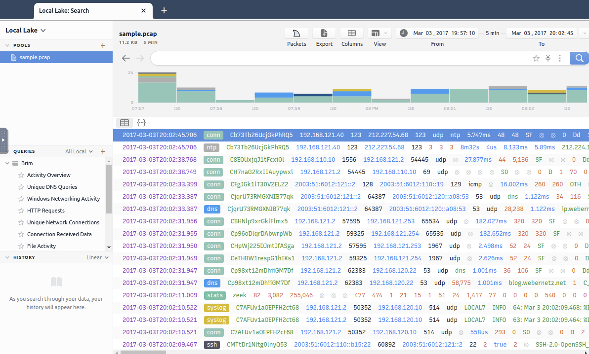
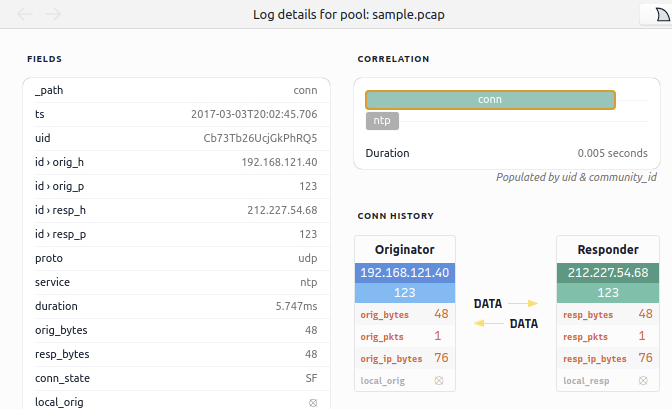
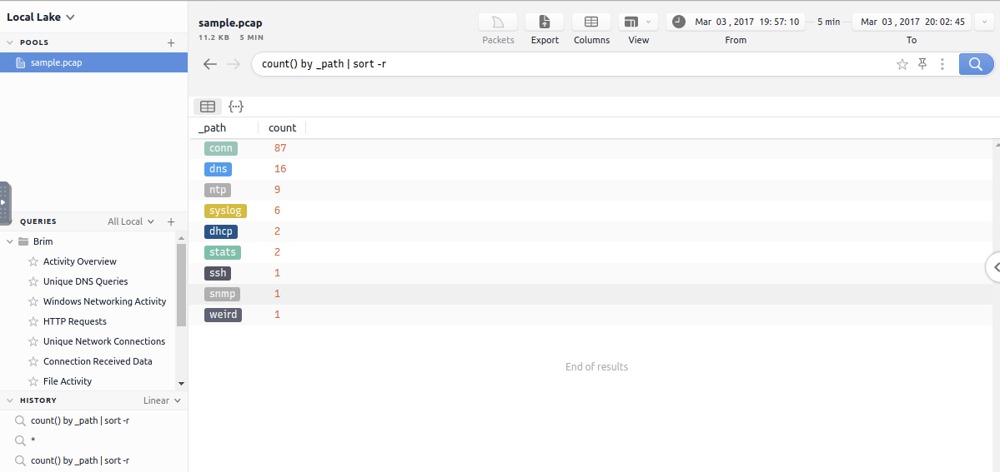

Brim to open-source tool do przeglądania plików `.pcap` i logów takich jak z `zeek`.

Brim jest dobry jak np. plik .pcap ma gigabajt albo więcej. W takim przypadku wireshark sobie nie radzi a Zeek działa ale wymaga czasu i wysiłku. Brim tutaj jest git bo posiada proste GUI.

**The common best practice is handling medium-sized pcaps with Wireshark, creating logs and correlating events with Zeek, and processing multiple logs in Brim.** 

|   |   |   |   |
|---|---|---|---|
||Brim|Wireshark|Zeek|
|Purpose|Pcap processing; event/stream and log investigation.|Traffic sniffing. Pcap processing; packet and stream investigation.|Pcap processing; event/stream and log investigation.|
|GUI|✔|✔|✖|
|Sniffing|✖|✔|✔|
|Pcap processing|✔|✔|✔|
|Log processing|✔|✖|✔|
|Packet decoding|✖|✔|✔|
|Filtering|✔|✔|✔|
|Scripting|✖|✖|✔|
|Signature Support|✔|✖|✔|
|Statistics|✔|✔|✔|
|File Extraction|✖|✔|✔|
|Handling  pcaps over 1GB|Medium performance|Low performance|Good performance|
|Ease of Management|4/5|4/5|3/5|

## GUI

Po wybraniu pakietu można kliknąć na niego dwa razy i pokażą się korelacje i kistoria i inne pola

Jeszcze kliknięcie w packets (ta płetwa na pierwszym ss) po wybraniu loga odpali w wiresharku te połączenie i może jeszcze sprawdzić w virusTotal i Whois.

Dodatkowo można sortować i segregować te logi klikając na queries z lewej strony są autonatyczne filtry. Po kliknięciu w Activity Overview po lewej w queries:

## Customowe zapytania

|                                    |                                              |                                                                                                                                                        |
| ---------------------------------- | -------------------------------------------- | ------------------------------------------------------------------------------------------------------------------------------------------------------ |
| **Purpose**                        | **Syntax**                                   | **Example Query**                                                                                                                                      |
| Basic search                       | You can search any string and numeric value. | Find logs containing an IP address or any value.  `10.0.0.1`                                                                                     |
| Logical operators                  | Or, And, Not.                                | Find logs contain three digits of an IP AND NTP keyword.  `192 and NTP`                                                                          |
| Filter values                      | "field name" == "value"                      | Filter source IP.  `id.orig_h==192.168.121.40`                                                                                                   |
| List specific log file contents    | _path=="log name"                            | List the contents of the conn log file.  `_path=="conn"`                                                                                         |
| Count field values                 | count () by "field"                          | Count the number of the available log files.  `count () by _path`                                                                                |
| Sort findings                      | sort                                         | Count the number of the available log files and sort recursively.  `count () by _path \| sort -r`                                                |
| Cut specific field from a log file | _path=="conn" \| cut "field name"            | Cut the source IP, destination port and destination IP addresses from the conn log file.  `_path=="conn" \| cut id.orig_h, id.resp_p, id.resp_h` |
| List unique values                 | uniq                                         | Show the unique network connections.   `_path=="conn" \| cut id.orig_h, id.resp_p, id.resp_h \| sort \| uniq`                                    |

|   |   |
|---|---|
|Communicated Hosts|Identifying the list of communicated hosts is the first step of the investigation. Security analysts need to know which hosts are actively communicating on the network to detect any suspicious and abnormal activity in the first place. This approach will help analysts to detect possible access violations, exploitation attempts and malware infections.  Query: `_path=="conn" \| cut id.orig_h, id.resp_h \| sort \| uniq`|
|Frequently Communicated Hosts|After having the list of communicated hosts, it is important to identify which hosts communicate with each other most frequently. This will help security analysts to detect possible data exfiltration, exploitation and backdooring activities.  Query: `_path=="conn" \| cut id.orig_h, id.resp_h \| sort \| uniq -c \| sort -r`|
|Most Active Ports|Suspicious activities are not always detectable in the first place. Attackers use multiple ways of hiding and bypassing methods to avoid detection. However, since the data is evidence, it is impossible to hide the packet traces. Investigating the most active ports will help analysts to detect silent and well-hidden anomalies by focusing on the data bus and used services.   **Query:** `_path=="conn" \| cut id.resp_p, service \| sort \| uniq -c \| sort -r count`    Query:  `_path=="conn" \| cut id.orig_h, id.resp_h, id.resp_p, service \| sort id.resp_p \| uniq -c \| sort -r`|
|Long Connections|For security analysts, the long connections could be the first anomaly indicator. If the client is not designed to serve a continuous service, investigating the connection duration between two IP addresses can reveal possible anomalies like backdoors.  Query: `_path=="conn" \| cut id.orig_h, id.resp_p, id.resp_h, duration \| sort -r duration`|
|Transferred Data|Another essential point is calculating the transferred data size. If the client is not designed to serve and receive files and act as a file server, it is important to investigate the total bytes for each connection. Thus, analysts can distinguish possible data exfiltration or suspicious file actions like malware downloading and spreading.  Query: `_path=="conn" \| put total_bytes := orig_bytes + resp_bytes \| sort -r total_bytes \| cut uid, id, orig_bytes, resp_bytes, total_bytes`|
|DNS and HTTP Queries|Identifying suspicious and out of ordinary domain connections and requests is another significant point for a security analyst. Abnormal connections can help detect C2 communications and possible compromised/infected hosts. Identifying the suspicious DNS queries and HTTP requests help security analysts to detect malware C2 channels and support the investigation hypothesis.    Query: `_path=="dns" \| count () by query \| sort -r`    Query: `_path=="http" \| count () by uri \| sort -r`|
|Suspicious Hostnames|Identifying suspicious and out of ordinary hostnames helps analysts to detect rogue hosts. Investigating the DHCP logs provides the hostname and domain information.  Query: `_path=="dhcp" \| cut host_name, domain`|
|Suspicious IP Addresses|For security analysts, identifying suspicious and out of ordinary IP addresses is essential as identifying weird domain addresses. Since the connection logs are stored in one single log file (conn), filtering IP addresses is more manageable and provides more reliable results.  Query: `_path=="conn" \| put classnet := network_of(id.resp_h) \| cut classnet \| count() by classnet \| sort -r`|
|Detect Files|Investigating transferred files is another important point of traffic investigation. Performing this hunt will help security analysts to detect the transfer of malware or infected files by correlating the hash values. This act is also valuable for detecting transferring of sensitive files.  Query: `filename!=null`|
|SMB Activity|Another significant point is investigating the SMB activity. This will help analysts to detect possible malicious activities like exploitation, lateral movement and malicious file sharing. When running an investigation, it is suggested to ask, "What is going on in SMB?".  Query: `_path=="dce_rpc" OR _path=="smb_mapping" OR _path=="smb_files"`|
|Known Patterns|Known patterns represent alerts generated by security solutions. These alerts are generated against the common attack/threat/malware patterns and known by endpoint security products, firewalls and IDS/IPS solutions. This data source highly relies on available signatures, attacks and anomaly patterns. Investigating available log sources containing alerts is vital for a security analyst.  Brim supports the Zeek and Suricata logs, so any anomaly detected by these products will create a log file. Investigating these log files can provide a clue where the analyst should focus.  Query: `event_type=="alert" or _path=="notice" or _path=="signatures"`|

W tych zapytaniach można normalnie jak w bashu polecenia cut coś tam.