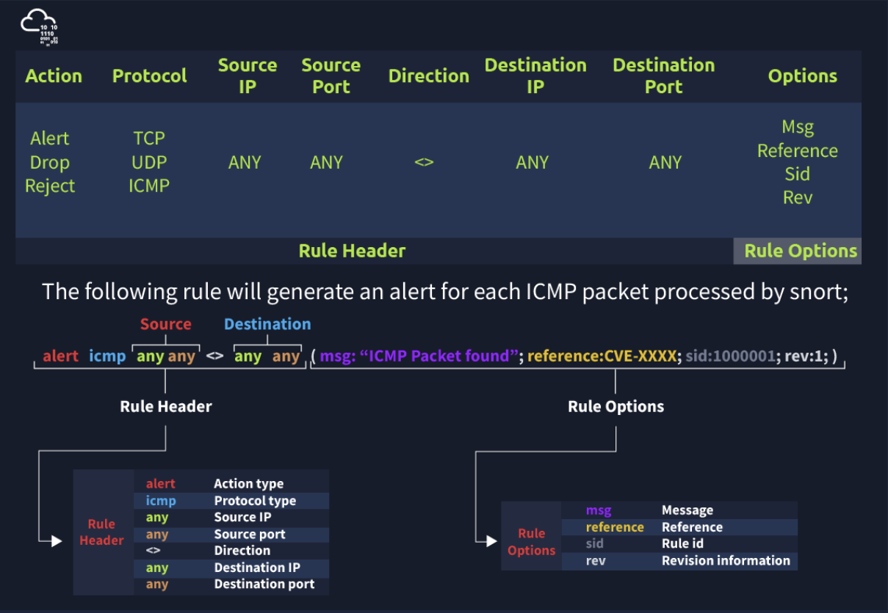
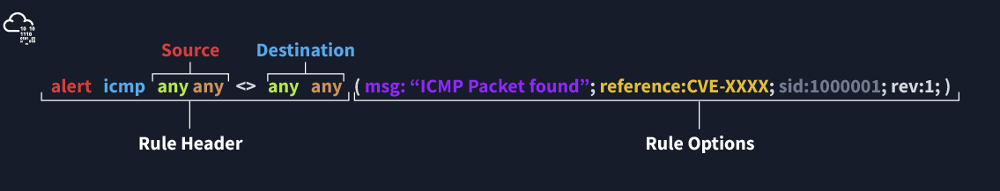

SNORT is an **open-source, rule-based** Network Intrusion Detection and Prevention System **(NIDS/NIPS)** - jest to IDS/IPS działający na określonych przez administratora zasadach (rules)

## Intrusion detection system (IDS)

Są dwa rodzaje: 
- **NIDS** - network intrusion detection system - monitorują ruch z różnych obszarów sieci, jak coś wykryje to daje alert
- **HIDS** - host-based intrusion detection system - monitorują ruch z pojedynczego endpointu, jak coś wykryje to daje alert

## Intrusion Prevention system (IPS)

Są cztery rodzaje:
- **NIPS** - network intrusion prevention system - też działa różnych miejscach w sieci i jak wykryje coś to ucina połączenie
- **Behaviour-based Intrusion Prevention System (Network Behaviour Analysis - NBA)** - działa różnych miejscach w sieci. Celem jest ochrona na całej podsieci. Jak anomalia do stop połączenia. Różnica z NIPS jest taka że ten rodzaj musi się nauczyć "normalnego" ruchu i potem na tej podstawie wykrywa nienormalny ruch.
- **Wireless Intrusion Prevention System (WIPS)** - wykrywa z sieci bezprzewodowej
- **Host-based Intrusion Prevention System (HIPS)** - to samo ale z endpointa jednego.

## Snort rules

Format dodawania zasad snort:

- Action - jaka akcja ma zostać wywołana po zadziałaniu zasady
- Protocol - jaki protokół dotyczy zasady
- source IP - adres źródłowy
- source Port - port źródłowy
- Destination IP - ip celu
- Destination Port - port celu
- Rule metadata - metadane reguły - wiadomość, id sygnatury, rule revision (ile razy poprawiono/zmieniono zasadę)

## **IP and Port Numbers**

These parameters identify the source and destination IP addresses and associated port numbers filtered for the rule.

|                              |                                                                                                                                                                                                                                                                                                                              |
| ---------------------------- | ---------------------------------------------------------------------------------------------------------------------------------------------------------------------------------------------------------------------------------------------------------------------------------------------------------------------------- |
| IP Filtering                 | alert icmp 192.168.1.56 any <> any any  (msg: "ICMP Packet From "; sid: 100001; rev:1;)  This rule will create an alert for each ICMP packet originating from the 192.168.1.56 IP address.                                                                                                                             |
| Filter an IP range           | alert icmp 192.168.1.0/24 any <> any any  (msg: "ICMP Packet Found"; sid: 100001; rev:1;)  This rule will create an alert for each ICMP packet originating from the 192.168.1.0/24 subnet.                                                                                                                             |
| Filter multiple IP ranges    | alert icmp [192.168.1.0/24, 10.1.1.0/24] any <> any any  (msg: "ICMP Packet Found"; sid: 100001; rev:1;)  This rule will create an alert for each ICMP packet originating from the 192.168.1.0/24 and 10.1.1.0/24 subnets.                                                                                             |
| Exclude IP addresses/ranges  | "negation operator" is used for excluding specific addresses and ports. Negation operator is indicated with "!"  alert icmp !192.168.1.0/24 any <> any any  (msg: "ICMP Packet Found"; sid: 100001; rev:1;)  This rule will create an alert for each ICMP packet not originating from the 192.168.1.0/24 subnet. |
| Port Filtering               | alert tcp any any <> any 21  (msg: "FTP Port 21 Command Activity Detected"; sid: 100001; rev:1;)  This rule will create an alert for each TCP packet sent to port 21.                                                                                                                                                  |
| Exclude a specific port      | alert tcp any any <> any !21  (msg: "Traffic Activity Without FTP Port 21 Command Channel"; sid: 100001; rev:1;)  This rule will create an alert for each TCP packet not sent to port 21.                                                                                                                              |
| Filter a port range (Type 1) | alert tcp any any <> any 1:1024   (msg: "TCP 1-1024 System Port Activity"; sid: 100001; rev:1;)  This rule will create an alert for each TCP packet sent to ports between 1-1024.                                                                                                                                      |
| Filter a port range (Type 2) | alert tcp any any <> any :1024   (msg: "TCP 0-1024 System Port Activity"; sid: 100001; rev:1;)  This rule will create an alert for each TCP packet sent to ports less than or equal to 1024.                                                                                                                           |
| Filter a port range (Type 3) | alert tcp any any <> any 1025: (msg: "TCP Non-System Port Activity"; sid: 100001; rev:1;)  This rule will create an alert for each TCP packet sent to source port higher than or equal to 1025.                                                                                                                        |
| Filter a port range (Type 4) | alert tcp any any <> any [21,23] (msg: "FTP and Telnet Port 21-23 Activity Detected"; sid: 100001; rev:1;)  This rule will create an alert for each TCP packet sent to port 21 and 23.                                                                                                                                 |

## Kierunki

- **->** Source to destination flow.
- **<>** Bidirectional flow

Nie ma "<-"

Są trzy główne opcje zasad w SNORT:
- General Rule Options - Fundamental rule options for Snort. 
- Payload Rule Options - Rule options that help to investigate the payload data. These options are helpful to detect specific payload patterns.
- Non-Payload Rule Options - Rule options that focus on non-payload data. These options will help create specific patterns and identify network issues.

## **General Rule Options**

|   |   |
|---|---|
|Msg|The message field is a basic prompt and quick identifier of the rule. Once the rule is triggered, the message filed will appear in the console or log. Usually, the message part is a one-liner that summarises the event.|
|Sid|Snort rule IDs (SID) come with a pre-defined scope, and each rule must have a SID in a proper format. There are three different scopes for SIDs shown below.  - <100: Reserved rules - 100-999,999: Rules came with the build. - >=1,000,000: Rules created by user.  Briefly, the rules we will create should have sid greater than 100.000.000. Another important point is; SIDs should not overlap, and each id must be unique.|
|Reference|Each rule can have additional information or reference to explain the purpose of the rule or threat pattern. That could be a Common Vulnerabilities and Exposures (CVE) id or external information. Having references for the rules will always help analysts during the alert and incident investigation.|
|Rev|Snort rules can be modified and updated for performance and efficiency issues. Rev option help analysts to have the revision information of each rule. Therefore, it will be easy to understand rule improvements. Each rule has its unique rev number, and there is no auto-backup feature on the rule history. Analysts should keep the rule history themselves. Rev option is only an indicator of how many times the rule had revisions.  alert icmp any any <> any any (msg: "ICMP Packet Found"; sid: 100001; reference:cve,CVE-XXXX; rev:1;)|

## Payload Detection Rule Options

|   |   |
|---|---|
|Content|Payload data. It matches specific payload data by ASCII, HEX or both. It is possible to use this option multiple times in a single rule. However, the more you create specific pattern match features, the more it takes time to investigate a packet.  Following rules will create an alert for each HTTP packet containing the keyword "GET". This rule option is case sensitive!  - ASCII mode - alert tcp any any <> any 80  (msg: "GET Request Found"; content:"GET"; sid: 100001; rev:1;) - HEX mode - alert tcp any any <> any 80  (msg: "GET Request Found"; content:"\|47 45 54\|"; sid: 100001; rev:1;)|
|Nocase|Disabling case sensitivity. Used for enhancing the content searches.  alert tcp any any <> any 80  (msg: "GET Request Found"; content:"GET"; nocase; sid: 100001; rev:1;)|
|Fast_pattern|Prioritise content search to speed up the payload search operation. By default, Snort uses the biggest content and evaluates it against the rules. "fast_pattern" option helps you select the initial packet match with the specific value for further investigation. This option always works case insensitive and can be used once per rule. Note that this option is required when using multiple "content" options.   The following rule has two content options, and the fast_pattern option tells to snort to use the first content option (in this case, "GET") for the initial packet match.  alert tcp any any <> any 80  (msg: "GET Request Found"; content:"GET"; fast_pattern; content:"www";  sid:100001; rev:1;)|

## Non-Payload Detection Rule Options

There are rule options that focus on non-payload data. These options will help create specific patterns and identify network issues.

|        |                                                                                                                                                                                                  |
| ------ | ------------------------------------------------------------------------------------------------------------------------------------------------------------------------------------------------ |
| ID     | Filtering the IP id field.  alert tcp any any <> any any (msg: "ID TEST"; id:123456; sid: 100001; rev:1;)                                                                                  |
| Flags  | Filtering the TCP flags.  - F - FIN - S - SYN - R - RST - P - PSH - A - ACK - U - URG  alert tcp any any <> any any (msg: "FLAG TEST"; flags:S;  sid: 100001; rev:1;) |
| Dsize  | Filtering the packet payload size.  - dsize:min<>max; - dsize:>100 - dsize:<100  alert ip any any <> any any (msg: "SEQ TEST"; dsize:100<>300;  sid: 100001; rev:1;)           |
| Sameip | Filtering the source and destination IP addresses for duplication.  alert ip any any <> any any (msg: "SAME-IP TEST";  sameip; sid: 100001; rev:1;)                                        |
Zadsady dodaje się w /etc/snort/rules i tam np. "local.rules" 

## Konfiguracja snort.conf

`/etc/snort/snort.conf` - główny plik konfiguracyjny

Step1:

|   |   |   |
|---|---|---|
|**TAG NAME**|**INFO**|**EXAMPLE**|
|HOME_NET|That is where we are protecting.|'any' OR '192.168.1.1/24'|
|EXTERNAL_NET|This field is the external network, so we need to keep it as 'any' or '!$HOME_NET'.|'any' OR '!$HOME_NET'|
|RULE_PATH|Hardcoded rule path.|/etc/snort/rules|
|SO_RULE_PATH|_These rules come with registered and subscriber rules._|$RULE_PATH/so_rules|
|PREPROC_RULE_PATH|_These rules come with registered and subscriber rules._|$RULE_PATH/plugin_rules|
Step:2

|                         |                             |                 |
| ----------------------- | --------------------------- | --------------- |
| **TAG NAME**            | **INFO**                    | **EXAMPLE**     |
| **`#config daq:`**      | IPS mode selection.         | afpacket        |
| **`#config daq_mode:`** | Activating the inline mode  | inline          |
| **`#config logdir:`**   | Hardcoded default log path. | /var/logs/snort |
There are six DAQ modules available in Snort;

- **Pcap:** Default mode, known as Sniffer mode.
- **Afpacket:** Inline mode, known as IPS mode.
- **Ipq:** Inline mode on Linux by using Netfilter. It replaces the snort_inline patch.  
- **Nfq:** Inline mode on Linux.
- **Ipfw:** Inline on OpenBSD and FreeBSD by using divert sockets, with the pf and ipfw firewalls.  
- **Dump:** Testing mode of inline and normalisation.

Step6:

|                           |                                                |                                |
| ------------------------- | ---------------------------------------------- | ------------------------------ |
| **TAG NAME**              | **INFO**                                       | **EXAMPLE**                    |
| **# site specific rules** | Hardcoded local and user-generated rules path. | include $RULE_PATH/local.rules |
| **# include $RULE_PATH/** | Hardcoded default/downloaded rules path.       | include $RULE_PATH/rulename    |
znak `#` to komentarz.