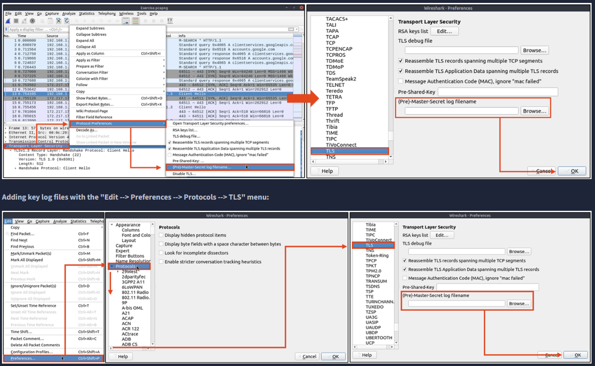
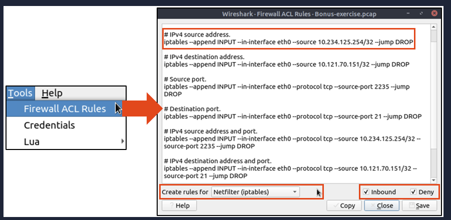

## Nmap Scans

**TCP flags in a nutshell.**

|                                                                                          |                                                                                |
| ---------------------------------------------------------------------------------------- | ------------------------------------------------------------------------------ |
| **Notes**                                                                                | **Wireshark Filters**                                                          |
| Global search.                                                                           | - `tcp`  - `udp`                                                         |
| - Only SYN flag. - SYN flag is set. The rest of the bits are not important.           | - `tcp.flags == 2`  - `tcp.flags.syn == 1`                               |
| - Only ACK flag. - ACK flag is set. The rest of the bits are not important.           | - `tcp.flags == 16`  - `tcp.flags.ack == 1`                              |
| - Only SYN, ACK flags. - SYN and ACK are set. The rest of the bits are not important. | - `tcp.flags == 18`  - `(tcp.flags.syn == 1) and (tcp.flags.ack == 1)`   |
| - Only RST flag. - RST flag is set. The rest of the bits are not important.           | - `tcp.flags == 4`  - `tcp.flags.reset == 1`                             |
| - Only RST, ACK flags. - RST and ACK are set. The rest of the bits are not important. | - `tcp.flags == 20`  - `(tcp.flags.reset == 1) and (tcp.flags.ack == 1)` |
| - Only FIN flag - FIN flag is set. The rest of the bits are not important.            | - `tcp.flags == 1`  - `tcp.flags.fin == 1`                               |

### TCP Connect Scans  

**TCP Connect Scan in a nutshell:**

- Relies on the three-way handshake (needs to finish the handshake process).
- Usually conducted with `nmap -sT` command.
- Used by non-privileged users (only option for a non-root user).
- Usually has a windows size larger than 1024 bytes as the request expects some data due to the nature of the protocol.

|   |   |   |
|---|---|---|
|**Open TCP Port**|**Open TCP Port   **|**Closed TCP Port**|
|- SYN --> - <-- SYN, ACK - ACK -->|- SYN --> - <-- SYN, ACK - ACK --> - RST, ACK -->|- SYN --> - <-- RST, ACK|
`tcp.flags.syn==1 and tcp.flags.ack==0 and tcp.window_size > 1024`
### TCP SYN Scan in a nutshell:

- Doesn't rely on the three-way handshake (no need to finish the handshake process).
- Usually conducted with `nmap -sS` command.
- Used by privileged users.
- Usually have a size less than or equal to 1024 bytes as the request is not finished and it doesn't expect to receive data.

|   |   |
|---|---|
|**Open TCP Port**|**Close TCP Port**|
|- SYN --> - <-- SYN,ACK - RST-->|- SYN --> - <-- RST,ACK|

### UDP Scans  

UDP Scan in a nutshell:

- Doesn't require a handshake process
- No prompt for open ports
- ICMP error message for close ports
- Usually conducted with `nmap -sU` command.

|   |   |
|---|---|
|Open UDP Port|Closed UDP Port|
|- UDP packet -->|- UDP packet --> - ICMP Type 3, Code 3 message. (Destination unreachable, port unreachable)|
UDP close port: `icmp.type==3 and icmp.code==3`

## ARP Poisoning/Spoofing (A.K.A. Man In The Middle Attack)

**ARP analysis in a nutshell:**

- Works on the local network
- Enables the communication between MAC addresses
- Not a secure protocol
- Not a routable protocol
- It doesn't have an authentication function
- Common patterns are request & response, announcement and gratuitous packets.

|                                                                                                                                                                                                                                                    |                                                                                                                                                                                                                                                        |
| -------------------------------------------------------------------------------------------------------------------------------------------------------------------------------------------------------------------------------------------------- | ------------------------------------------------------------------------------------------------------------------------------------------------------------------------------------------------------------------------------------------------------ |
| **Notes**                                                                                                                                                                                                                                          | **Wireshark filter**                                                                                                                                                                                                                                   |
| Global search                                                                                                                                                                                                                                      | - `arp`                                                                                                                                                                                                                                                |
| "ARP" options for grabbing the low-hanging fruits:  - Opcode 1: ARP requests. - Opcode 2: ARP responses. - **Hunt:** Arp scanning - **Hunt:** Possible ARP poisoning detection - **Hunt:** Possible ARP flooding from detection: | - `arp.opcode == 1`  - `arp.opcode == 2`  - `arp.dst.hw_mac==00:00:00:00:00:00`  - `arp.duplicate-address-detected or arp.duplicate-address-frame`  - `((arp) && (arp.opcode == 1)) && (arp.src.hw_mac == target-mac-address)` |

|                                |                                                                                                                              |                                                                                                                                         |
| ------------------------------ | ---------------------------------------------------------------------------------------------------------------------------- | --------------------------------------------------------------------------------------------------------------------------------------- |
| **Notes**                      | Detection Notes                                                                                                              | **Findings**                                                                                                                            |
| Possible IP address match.     | 1 IP address announced from a MAC address.                                                                                   | - MAC: 00:0c:29:e2:18:b4 - IP: 192.168.1.25                                                                                          |
| Possible ARP spoofing attempt. | 2 MAC addresses claimed the same IP address (192.168.1.1).   The " 192.168.1.1" IP address is a possible gateway address. | - MAC1: 50:78:b3:f3:cd:f4 - MAC 2: 00:0c:29:e2:18:b4                                                                                 |
| Possible ARP flooding attempt. | The MAC address that ends with "b4" claims to have a different/new IP address.                                               | - MAC: 00:0c:29:e2:18:b4 - IP: 192.168.1.1                                                                                           |

|                                |                                                                                                                              |                                                                                                                                         |
| ------------------------------ | ---------------------------------------------------------------------------------------------------------------------------- | --------------------------------------------------------------------------------------------------------------------------------------- |
| **Notes**                      | Detection Notes                                                                                                              | **Findings**                                                                                                                            |
| IP to MAC matches.             | 3  IP to MAC address matches.                                                                                                | - MAC: 00:0c:29:e2:18:b4 = IP: 192.168.1.25 - MAC: 50:78:b3:f3:cd:f4 = IP: 192.1681.1 - MAC: 00:0c:29:98:c7:a8 = IP: 192.168.1.12 |
| Attacker                       | The attacker created noise with ARP packets.                                                                                 | - MAC: 00:0c:29:e2:18:b4 = IP: 192.168.1.25                                                                                             |
| Router/gateway                 | Gateway address.                                                                                                             | - MAC: 50:78:b3:f3:cd:f4 = IP: 192.1681.1                                                                                               |
| Victim                         | The attacker sniffed all traffic of the victim.                                                                              | - MAC: 50:78:b3:f3:cd:f4 = IP: 192.1681.12                                                                                              |

##  Identifying Hosts

Protocols that can be used in Host and User identification:

- Dynamic Host Configuration Protocol (DHCP) traffic
- NetBIOS (NBNS) traffic 
- Kerberos traffic

### DHCP Analysis

**DHCP investigation in a nutshell:**

|   |   |
|---|---|
|**Notes**|**Wireshark Filter**|
|Global search.|- `dhcp` or `bootp`|
|Filtering the proper DHCP packet options is vital to finding an event of interest.        - **"DHCP Request"** packets contain the hostname information - **"DHCP ACK"** packets represent the accepted requests - **"DHCP NAK"** packets represent denied requests  Due to the nature of the protocol, only "Option 53" ( request type) has predefined static values. You should filter the packet type first, and then you can filter the rest of the options by "applying as column" or use the advanced filters like "contains" and "matches".|- Request: `dhcp.option.dhcp == 3`  - ACK: `dhcp.option.dhcp == 5`  - NAK: `dhcp.option.dhcp == 6`|
|**"DHCP Request"** options for grabbing the low-hanging fruits:  - **Option 12:** Hostname. - **Option 50:** Requested IP address. - **Option 51:** Requested IP lease time. - **Option 61:** Client's MAC address.|- `dhcp.option.hostname contains "keyword"`|
|**"DHCP ACK"** options for grabbing the low-hanging fruits:  - **Option 15:** Domain name. - **Option 51:** Assigned IP lease time.|- `dhcp.option.domain_name contains "keyword"`|
|**"DHCP NAK"** options for grabbing the low-hanging fruits:  - **Option 56:** Message (rejection details/reason).|As the message could be unique according to the case/situation, It is suggested to read the message instead of filtering it. Thus, the analyst could create a more reliable hypothesis/result by understanding the event circumstances.|
### NetBIOS (NBNS) Analysis

**NetBIOS** or **Net**work **B**asic **I**nput/**O**utput **S**ystem is the technology responsible for allowing applications on different hosts to communicate with each other. 

**NBNS investigation in a nutshell:**

|                                                                                                                                                                                 |                                  |
| ------------------------------------------------------------------------------------------------------------------------------------------------------------------------------- | -------------------------------- |
| **Notes**                                                                                                                                                                       | **Wireshark Filter**             |
| Global search.                                                                                                                                                                  | - `nbns`                         |
| "NBNS" options for grabbing the low-hanging fruits:  - **Queries:** Query details. - Query details could contain **"name, Time to live (TTL) and IP address details"** | - `nbns.name contains "keyword"` |

### Kerberos Analysis  

**Kerberos** is the default authentication service for Microsoft Windows domains. It is responsible for authenticating service requests between two or more computers over the untrusted network. The ultimate aim is to prove identity securely.  

**Kerberos investigation in a nutshell:**

|                                                                                                                                                                                                                                                                                                                                                                                     |                                                                                                                    |
| ----------------------------------------------------------------------------------------------------------------------------------------------------------------------------------------------------------------------------------------------------------------------------------------------------------------------------------------------------------------------------------- | ------------------------------------------------------------------------------------------------------------------ |
| **Notes**                                                                                                                                                                                                                                                                                                                                                                           | **Wireshark Filter**                                                                                               |
| Global search.                                                                                                                                                                                                                                                                                                                                                                      | - `kerberos`                                                                                                       |
| User account search:  - **CNameString:** The username.  **Note:** Some packets could provide hostname information in this field. To avoid this confusion, filter the **"$"** value. The values end with **"$"** are hostnames, and the ones without it are user names.                                                                                                  | - `kerberos.CNameString contains "keyword"`  - `kerberos.CNameString and !(kerberos.CNameString contains "$" )` |
| "Kerberos" options for grabbing the low-hanging fruits:  - **pvno:** Protocol version. - **realm:** Domain name for the generated ticket.        - **sname:** Service and domain name for the generated ticket. - **addresses:** Client IP address and NetBIOS name.         **Note:** the "addresses" information is only available in request packets. | - `kerberos.pvno == 5`  - `kerberos.realm contains ".org"`   - `kerberos.SNameString == "krbtg"`       |

## Tunnelling Traffic: ICMP and DNS   

Traffic tunnelling is (also known as **"port forwarding"**) transferring the data/resources in a secure method to network segments and zones. It can be used for "internet to private networks" and "private networks to internet" flow/direction. There is an encapsulation process to hide the data, so the transferred data appear natural for the case, but it contains private data packets and transfers them to the final destination securely.

### ICMP Analysis

|                                                                                                                                                                          |                            |
| ------------------------------------------------------------------------------------------------------------------------------------------------------------------------ | -------------------------- |
| **Notes**                                                                                                                                                                | **Wireshark filters**      |
| Global search                                                                                                                                                            | - `icmp`                   |
| "ICMP" options for grabbing the low-hanging fruits:  - Packet length. - ICMP destination addresses.        - Encapsulated protocol signs in ICMP payload. | - `data.len > 64 and icmp` |

## DNS Analysis

|                                                                                                                                                                                                                                                                                                                                                                                           |                                                                      |
| ----------------------------------------------------------------------------------------------------------------------------------------------------------------------------------------------------------------------------------------------------------------------------------------------------------------------------------------------------------------------------------------- | -------------------------------------------------------------------- |
| **Notes**                                                                                                                                                                                                                                                                                                                                                                                 | **Wireshark Filter**                                                 |
| Global search                                                                                                                                                                                                                                                                                                                                                                             | - `dns`                                                              |
| "DNS" options for grabbing the low-hanging fruits:  - Query length. - Anomalous and non-regular names in DNS addresses. - Long DNS addresses with encoded subdomain addresses. - Known patterns like dnscat and dns2tcp. - Statistical analysis like the anomalous volume of DNS requests for a particular target.  **!mdns:** Disable local link device queries. | - `dns contains "dnscat"`  - `dns.qry.name.len > 15 and !mdns` |

## FTP Analysis   

File Transfer Protocol (FTP) is designed to transfer files with ease, so it focuses on simplicity rather than security. As a result of this, using this protocol in unsecured environments could create security issues like:

- MITM attacks
- Credential stealing and unauthorised access
- Phishing
- Malware planting
- Data exfiltration

**FTP analysis in a nutshell:**

|                                                                                                                                                                                                                                                         |                                                                                                                                                                                               |
| ------------------------------------------------------------------------------------------------------------------------------------------------------------------------------------------------------------------------------------------------------- | --------------------------------------------------------------------------------------------------------------------------------------------------------------------------------------------- |
| **Notes**                                                                                                                                                                                                                                               | **Wireshark Filter**                                                                                                                                                                          |
| Global search                                                                                                                                                                                                                                           | - `ftp`                                                                                                                                                                                       |
| **"FTP"** options for grabbing the low-hanging fruits:  - **x1x series:** Information request responses. - **x2x series:** Connection messages. - **x3x series:** Authentication messages.  **Note:** "200" means command successful. | **---**                                                                                                                                                                                       |
| "x1x" series options for grabbing the low-hanging fruits:  - **211:** System status. - **212:** Directory status. - **213:** File status                                                                                                    | - `ftp.response.code == 211`                                                                                                                                                                  |
| "x2x" series options for grabbing the low-hanging fruits:  - **220:** Service ready. - **227:** Entering passive mode. - **228:** Long passive mode. - **229:** Extended passive mode.                                                   | - `ftp.response.code == 227`                                                                                                                                                                  |
| "x3x" series options for grabbing the low-hanging fruits:  - **230:** User login. - **231:** User logout. - **331:** Valid username. - **430:** Invalid username or password - **530:** No login, invalid password.                   | - `ftp.response.code == 230`                                                                                                                                                                  |
| "FTP" commands for grabbing the low-hanging fruits:  - **USER:** Username. - **PASS:** Password. - **CWD:** Current work directory. - **LIST:** List.                                                                                    | - `ftp.request.command == "USER"`  - `ftp.request.command == "PASS"`  - `ftp.request.arg == "password"`                                                                           |
| Advanced usages examples for grabbing low-hanging fruits:  - **Bruteforce signal:** List failed login attempts. - **Bruteforce signal:** List target username. - **Password spray signal:** List targets for a static password.             | - `ftp.response.code == 530`  - `(ftp.response.code == 530) and (ftp.response.arg contains "username")`  - `(ftp.request.command == "PASS" ) and (ftp.request.arg == "password")` |

## HTTP Analysis

Analizą można wykryć:
- Phishing pages
- Web attacks
- Data exfiltration
- Command and control traffic (C2)

|   |   |
|---|---|
|**Notes**|**Wireshark Filter**|
|Global search  **Note:** HTTP2 is a revision of the HTTP protocol for better performance and security. It supports binary data transfer and request&response multiplexing.|- `http`  - `http2`|
|"HTTP **Request Methods"** for grabbing the low-hanging fruits:  - GET - POST - Request: Listing all requests|- `http.request.method == "GET"`  - `http.request.method == "POST"`  - `http.request`|
|"HTTP Response Status Codes" for grabbing the low-hanging fruits:  - **200 OK:** Request successful. - **301 Moved Permanently:** Resource is moved to a new URL/path (permanently). - **302 Moved Temporarily:** Resource is moved to a new URL/path (temporarily). - **400 Bad Request:** Server didn't understand the request. - **401 Unauthorised:** URL needs authorisation (login, etc.). - **403 Forbidden:** No access to the requested URL.  - **404 Not Found:** Server can't find the requested URL. - **405 Method Not Allowed:** Used method is not suitable or blocked. - **408 Request Timeout:**  Request look longer than server wait time. - **500 Internal Server Error:** Request not completed, unexpected error. - **503 Service Unavailable:** Request not completed server or service is down.|- `http.response.code == 200`  - `http.response.code == 401`  - `http.response.code == 403`  - `http.response.code == 404`  - `http.response.code == 405`  - `http.response.code == 503`|
|"HTTP Parameters" for grabbing the low-hanging fruits:  - **User agent:** Browser and operating system identification to a web server application. - **Request URI:** Points the requested resource from the server.        - **Full *URI:** Complete URI information.  ***URI:** Uniform Resource Identifier.|- `http.user_agent contains "nmap"`  - `http.request.uri contains "admin"`  - `http.request.full_uri contains "admin"`|
|"HTTP Parameters" for grabbing the low-hanging fruits:  - **Server:** Server service name.        - **Host:** Hostname of the server - **Connection:** Connection status.        - **Line-based text data:** Cleartext data provided by the server. - **HTML Form URL Encoded:** Web form information.|- `http.server contains "apache"`  - `http.host contains "keyword"`  - `http.host == "keyword"`  - `http.connection == "Keep-Alive"`  - `data-text-lines contains "keyword"`|

## User Agent Analysis

[Lista user-agentów](https://explore.whatismybrowser.com/useragents/explore/)

|                                                                                                                                                                                                                                                                                                                                                                                                                      |                                                                                                                                                          |
| -------------------------------------------------------------------------------------------------------------------------------------------------------------------------------------------------------------------------------------------------------------------------------------------------------------------------------------------------------------------------------------------------------------------- | -------------------------------------------------------------------------------------------------------------------------------------------------------- |
| **Notes**                                                                                                                                                                                                                                                                                                                                                                                                            | **Wireshark Filter**                                                                                                                                     |
| Global search.                                                                                                                                                                                                                                                                                                                                                                                                       | - `http.user_agent`                                                                                                                                      |
| Research outcomes for grabbing the low-hanging fruits:  - Different user agent information from the same host in a short time notice. - Non-standard and custom user agent info. - Subtle spelling differences. **("Mozilla" is not the same as  "Mozlilla" or "Mozlila")** - Audit tools info like Nmap, Nikto, Wfuzz and sqlmap in the user agent field. - Payload data in the user agent field. | - `(http.user_agent contains "sqlmap") or (http.user_agent contains "Nmap") or (http.user_agent contains "Wfuzz") or (http.user_agent contains "Nikto")` |

## Log4j Analysis

|                                                                                                                                                                                               |                                                                                                                                                                                                                                              |
| --------------------------------------------------------------------------------------------------------------------------------------------------------------------------------------------- | -------------------------------------------------------------------------------------------------------------------------------------------------------------------------------------------------------------------------------------------- |
| **Notes**                                                                                                                                                                                     | **Wireshark Filters**                                                                                                                                                                                                                        |
| **Research outcomes** for grabbing the low-hanging fruits:  - The attack starts with a "POST" request - There are known cleartext patterns: "**jndi:ldap**" and "**Exploit.class**". | - `http.request.method == "POST"`  - `(ip contains "jndi") or ( ip contains "Exploit")`  - `(frame contains "jndi") or ( frame contains "Exploit")`  - `(http.user_agent contains "$") or (http.user_agent contains "==")` |

## HTTPS

|   |   |
|---|---|
|Notes|Wireshark Filter|
|"HTTPS Parameters" for grabbing the low-hanging fruits:  - **Request:** Listing all requests        - **TLS:** Global TLS search - TLS Client Request - TLS Server response - Local Simple Service Discovery Protocol (SSDP)  **Note:** SSDP is a network protocol that provides advertisement and discovery of network services.|- `http.request`  - `tls`  - `tls.handshake.type == 1`  - `tls.handshake.type == 2`  - `ssdp`|

HTTPS korzysta z TLS, które ma też "handshake". Pierwsze dwa kroki to 
- Client Hello: `(http.request or tls.handshake.type == 1) and !(ssdp)` 
- Server Hello: `(http.request or tls.handshake.type == 2) and !(ssdp)`'

Żeby analizować ruch HTTPS trzeba go odszyfrować i to robi się pobierając z przeglądarki key log file.

Dodawanie klucza do wireshark:

Dalej ruch będzie widziany jako HTTP2 protocol.

W zakładce tools można wyciągnąć hasła

Wireshark może tworzyć zasady ACL dla:
- Netfilter (iptables)
- Cisco IOS (standard/extended)
- IP Filter (ipfilter)
- IPFirewall (ipfw)
- Packet filter (pf)
- Windows Firewall (netsh new/old format)

