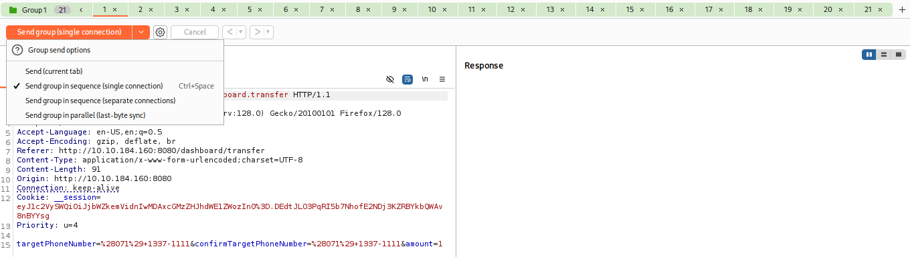

Występuje jak w tym samym czasie np. dwie osoby chcą wypłacić pieniądze z tego samego konta w banku. Jak będzie wykonywał się proces wypłaty z jednego konta ale nie zostanie jeszcze zaktualizowany w systemie to druga osoba wypłacając pieniądze zobaczy balans konta jakby nie było tej wypłaty drugiej osoby.

Konto 100zł
Osoba A wypłaca 30zł
Osoba B wypłaca 50zł
Balans konta zostaje 50zł bo nie zarejestrowano tej pierwszej wypłaty podczas wypłaty drugiej.

Jest to podatność "Time-of-Check to Time-of-Use (TOCTOU)"

W Burp można stworzyć grupę requestów w repeterze, żeby wysłać x zapytań jednocześnie lub po sobie

Wysyłanie w grupie może być z jednego połączenia lub z osobnych.

Wsysłanie grupowe z jednego połączenia - tworzy jedno połączenie z serwerem i wysyła wszystkie żądania z grupy zanim zamknie połączenie. Użyteczne w testowaniu client-side desync vulnerabilities.

Wysyłanie grupowe z osobnch połączeń:
Tworzy połączenia TCP i wysyła żądania po czym zamyka połączenie nim zrobi to ponownie dla kolejnych.

Jest jeszce wysyłanie równoległe które wyśle wszystkie żądania w bardzo krótkim odstępie czasu. Może tam zajść wysłanie dodatkowych pakietów w zależności od wersji HTTP.
- HTTP/2+ - repeater stara się wysłać całą grupę jako jeden pakiet - jeden pakiet TCP może mieścić wiele żądań
- HTTP/1 - repeater korzysta z last-byte synchronization. Polega to na wstrzymaniu ostatniego bajtu z każdego żądania. Tylko jak wyszystkie pakiety zostaną wysłane bez tego ostatniego bajtu to te ostatnie bajty są wysyłane.

Tym równoległym udało mi się zrobić zadanie na THM.

Wykrycie:
Ważne jest zrozumienie systemu. Często będą na systemie mechanizmy kontroli takie jak umożliwienie tylko jednego zakupu, głosowania, limit na koncie, limit na jedno żądanie na 5 min itp. Dalej można próbować obejść te limity za pomocą np. burp repeater.

Zapobieganie:
- mechanizmy synchronizacji - nowoczesne języki programowania blokują dostęp do zasobów podczas pracy jednego wątku. Inni nie mają dostępu
- atomowe operacje - odnoszą się do niepodzielnych jednostek wykonawczych, zestawu instrukcji zgrupowanych razem i wykonywanych bez przerwy. Takie podejście gwarantuje, że operacja może zostać zakończona bez przerywania przez inny wątek. 
- Transakcje baz danych: Transakcje grupują mniejsze operacje w jedną grupę i pomyślne wykonanie transakcji jest tylko jak cała grupa jest w porządku.