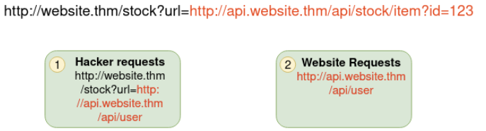
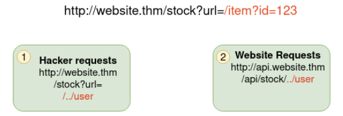
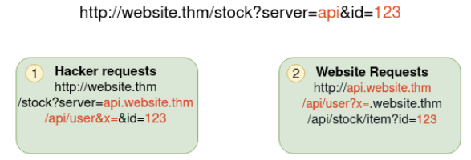
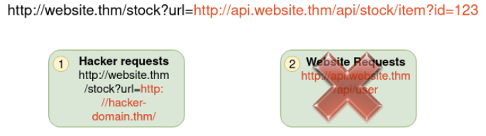

Server-side request forgery - istnieją dwie wersje:
- regular - dane są zwracane na ekran atakujacego
- blind - podatność występuje ale informacja nie jest zwracana do atakującego.

Podatność może prowadzić do:
- dostęp do nieautoryzowanych miejsc
- dostęp do danych innych użytkowników
- możliwość skalowania się w sieci wewnętrznej
- odkrycie tokenów uwierzytelniania/danych logowania.

Przykład: 

Serwer korzysta z jakiegoś api (ADRES NA GÓRZE TO OCZEKIWANY REQUEST)

Dalej hacker zmienia to żądanie (pomarańczowe) na `/../user` co przekierowuje na /api/user/
 (ADRES NA GÓRZE TO OCZEKIWANY REQUEST)

Następnie na końcu żądania (payloadu) dodaje `&x=` żeby reszta żądania nie została dodana do url, zamiast tego będzie w url (?x=)  (ADRES NA GÓRZE TO OCZEKIWANY REQUEST)

Ogólnie hacker może zamiast adresu do API dać w url swój adres żeby wyciągnąć klucze API albo inne dane logowania.  (ADRES NA GÓRZE TO OCZEKIWANY REQUEST)

Przykład:
To jest standardowy url co zwraca dane:
`https://website.thm/item/2?server=api`
Od servera wygląda to tak: `Server Requesting: https://api.website.thm/api/item?id=2`

Teraz modyfikując url to server=api zmieniamy początek żądania serwera (to ://api.)
Wpisując to:
`https://website.thm/item/2?server=server.website.thm/flag?id=9&x=` 
Dostaniemy to:
`https://server.website.thm/flag?id=9`
a żadanie serwera będzie:
`Server Requesting: https://server.website.thm/flag?id=9&x=.website.thm/api/item?id=2`

# Gdzie takie podatności

- Parametr w URL to inny URL
- parametr w URL to jakaś nazwa hosta np. `https://cos.com/form?server=api`
- parametr w URL to jakiś path `https://cis.com/form?dst=/forms/contact`

Jak wynik podatności się nie wyświetla to warto korzystać z burp i patrzeć na logi http.

Metody przeciwdziałania to:
- Deny list - blokowanie domen i subdomen oraz nawiązań do localhosta: `0, 0.0.0.0, 0000, 127.1, 127.*.*.*, 2130706433, 017700000001` albo subdomen które mają DNS taki jak `127.0.0.1.nip.io`, dodatkowo w chmurowych systemach adres `169.254.169.254` który zawiera metadane servera
- allow list - url musi się zaczynać np od `https://cos.tam`
- open redirect - jest link: `https://cos.com/link?url=https://inne.com`, przekierowuje on usera gdzieś indziej. Endpoint ma wpisane że url musi zaczynać się np. `https://cos.com/` to można wykorzystać to do przekierowania ruchu wewnętrznego na domenę atakującego.