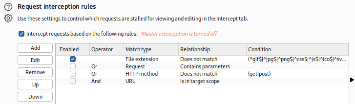
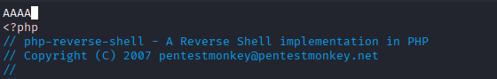
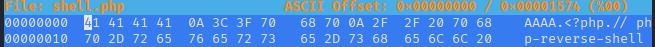
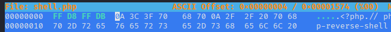
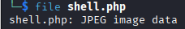

## Bypassing Client-Side Filtering

Można ominąć filtrowanie po froncie uploadów (np. zdjęć) na kilka sposobów:
1. wyłączenie w przeglądarce JS
2. przechwycenie zapytanie w burp intercep i usunięcie filtra js
3. przechwycenie w burp zapytania i edycja uploadu tak żeby przeszedł
4. wysłanie bezpośrednio do celu uploadu za pomocą np. `curl`, coś jak `curl -X POST -F "submit:<value>" -F "<file-parameter>:@<path-to-file>" <site>`

Ważne - burp domyślnie nie przechwytuje JS i trzeba w opcje i pod "Intercept Client Requests" i trzeba pod pierwszą linią usunąć wpis `^js$|`

## Bypassing Server-Side Filtering: File Extensions

Można próbować wgrywać różne rozszerzenia plików. Np. jest blacklista na .php i .phtml. PHP akceptuje też inne rozszerzenia jak: `.php3`, `.php4`, `.php5`, `.php7`, `.phps`, `.php-s`, `.pht` i podanie owego ominie ten filtr na rozszerzenia. Może też być tak że np. działa tylko jpg to można próbować wysłać `plik.jpg.php`, kod wychwyci że jest `.jpg` i przepuści.

## Bypassing Server-Side Filtering: Magic Numbers

Magic numbers to ciąg znaków na początku pliku określający jego rozszerzenie
[Lista rozszerzeń (sygnatur)](https://en.wikipedia.org/wiki/List_of_file_signatures)
Prosty sposób na oszukanie filtra:
1. Mamy plik z np. reverse shell i go odpalamy w vim i dodajemy na samym początku `AAAA`

Dalej w hexeditor edytujemy te pierwsze 4 bajty
Przed edycją:
Po edycji (sygnatura JPEG):

Po edycji:

Wrzucenie tego da reverse shell.